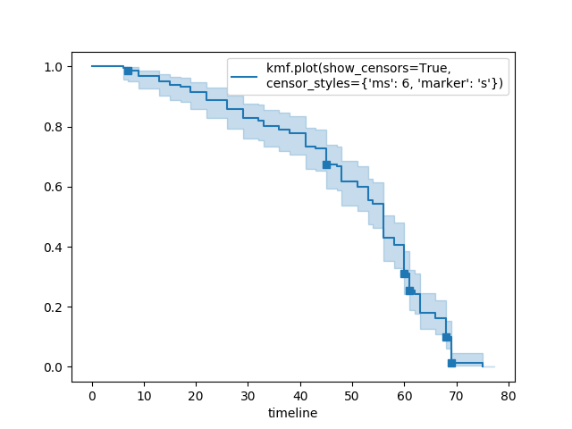

.. image:: http://i.imgur.com/EOowdSD.png

-------------------------------------

More Examples and Recipes
==================================

This section goes through some examples and recipes to help you use lifelines.

Statistically compare two populations
##############################################

Often researchers want to compare survival-ness between different populations. Here are some techniques to do that:

Subtraction and division between survival curves
^^^^^^^^^^^^^^^^^^^^^^^^^^^^^^^^^^^^^^^^^^^^^^^

If you are interested in taking the difference between two survival curves, simply trying to
subtract the ``survival_function_`` will likely fail if the DataFrame's indexes are not equal. Fortunately,
the ``KaplanMeierFitter`` and ``NelsonAalenFitter`` have a built-in ``subtract`` method:

.. code-block:: python

    kmf1.subtract(kmf2)

will produce the difference at every relevant time point. A similar function exists for division: ``divide``. However, for rigorous testing of differences, lifelines comes with a statistics library. See below. 

Logrank test
^^^^^^^^^^^^^^^^^^^^^^^^^^^^^^^^^^^^^^^^^^^^^^^

.. note:: The logrank test has maximum power when the assumption of proportional hazards is true. As a consquence, if the survival 
    curves cross, the logrank test will give an inaccurate assessment of differences. 

The ``lifelines.statistics.logrank_test`` function compares whether the "death" generation process of the two populations are equal:

.. code-block:: python

    from lifelines.statistics import logrank_test

    results = logrank_test(T1, T2, event_observed_A=E1, event_observed_B=E2)
    results.print_summary()

    """
                  t_0 = -1
                alpha = 0.95
    null_distribution = chi squared
                   df = 1
       use_bonferroni = True

    ---
    test_statistic        p
             3.528  0.00034  **

    ---
    Signif. codes:  0 '***' 0.001 '**' 0.01 '*' 0.05 '.' 0.1 ' ' 1
    """

    print(results.p_value)        # 0.46759
    print(results.test_statistic) # 0.528

If you have more than two populations, you can use ``pairwise_logrank_test`` (which compares
each pair in the same manner as above), or ``multivariate_logrank_test`` (which tests the
hypothesis that all the populations have the same "death" generation process).

.. code-block:: python

    from lifelines.statistics import multivariate_logrank_test

    df = pd.DataFrame({
        'durations': [5, 3, 9, 8, 7, 4, 4, 3, 2, 5, 6, 7],
        'groups': [0, 0, 0, 0, 1, 1, 1, 1, 1, 2, 2, 2], # could be strings too
        'events': [1, 1, 1, 1, 1, 1, 0, 0, 1, 1, 1, 0],
    })

    results = multivariate_logrank_test(df['durations'], df['groups'], df['events'])
    results.print_summary()

    """
                  t_0 = -1
                alpha = 0.95
    null_distribution = chi squared
                   df = 2

    ---
    test_statistic      p
            1.0800 0.5827
    ---
    Signif. codes: 0 '***' 0.0001 '**' 0.001 '*' 0.01 '.' 0.05 ' ' 1
    """

Survival differences at a point in time
^^^^^^^^^^^^^^^^^^^^^^^^^^^^^^^^^^^^^^^^^^^^^^^

Often analysts want to compare the survival-ness of groups at specific times, rather than comparing the entire survival curves against each other.  For example, analysts may be interested in 5-year survival. Statistically comparing the naive Kaplan-Meier points at a specific time
actually has reduced power. By transforming the Kaplan-Meier curve, we can recover more power. The function ``statistics.survival_difference_at_fixed_point_in_time_test`` uses 
the log(-log) transformation implicitly and compares the survival-ness of populations at a specific point in time. 

.. code-block:: python

    from lifelines.statistics import survival_difference_at_fixed_point_in_time_test

    results = survival_difference_at_fixed_point_in_time_test(T1, T2, event_observed_A=E1, event_observed_B=E2)
    results.print_summary()

Model selection using lifelines
#####################################################

If using *lifelines* for prediction work, it's ideal that you perform some type of cross-validation scheme. This cross-validation allows you to be confident that your out-of-sample predictions will work well in practice. It also allows you to choose between multiple models.

*lifelines* has a built-in k-fold cross-validation function. For example, consider the following example:

.. code-block:: python

    from lifelines import AalenAdditiveFitter, CoxPHFitter
    from lifelines.datasets import load_regression_dataset
    from lifelines.utils import k_fold_cross_validation

    df = load_regression_dataset()

    #create the three models we'd like to compare.
    aaf_1 = AalenAdditiveFitter(coef_penalizer=0.5)
    aaf_2 = AalenAdditiveFitter(coef_penalizer=10)
    cph = CoxPHFitter()

    print(np.mean(k_fold_cross_validation(cph, df, duration_col='T', event_col='E')))
    print(np.mean(k_fold_cross_validation(aaf_1, df, duration_col='T', event_col='E')))
    print(np.mean(k_fold_cross_validation(aaf_2, df, duration_col='T', event_col='E')))

From these results, Aalen's Additive model with a penalizer of 10 is best model of predicting future survival times.

Plotting multiple figures on a plot
##############################################

When `.plot` is called, an `axis` object is returned which can be passed into future calls of `.plot`:

.. code-block:: python

    kmf.fit(data1)
    ax = kmf.plot()

    kmf.fit(data2)
    ax = kmf.plot(ax=ax)

If you have a pandas `DataFrame` with columns "group", "T", and "E", then something like the following would work:

.. code-block:: python

    from lifelines import KaplanMeierFitter
    from matplotlib import pyplot as plt

    ax = plt.subplot(111)

    kmf = KaplanMeierFitter()

    for name, grouped_df in df.groupby('group'):
        kmf.fit(grouped_df["T"], grouped_df["E"], label=name)
        kmf.plot(ax=ax)

Plotting options and styles
##############################################

Let's load some data

.. code-block:: python

    from lifelines.datasets import load_waltons

    waltons = load_waltons()
    T = waltons['T']
    E = waltons['E']

Standard
^^^^^^^^^^^^^^^^^^^^^^^^^^^^^^^^^^^^^^^^^^^^^^^

.. code-block:: python

    
    kmf = KaplanMeierFitter()
    kmf.fit(T, E, label="kmf.plot()")
    kmf.plot()

.. image:: /images/normal_plot.png

Show censors and edit markers
^^^^^^^^^^^^^^^^^^^^^^^^^^^^^^^^^^^^^^^^^^^^^^^

.. code-block:: python

    kmf.fit(T, E, label="kmf.plot(show_censors=True, \ncensor_styles={'ms': 6, 'marker': 's'})")
    kmf.plot(show_censors=True, censor_styles={'ms': 6, 'marker': 's'})

Hide confidence intervals
^^^^^^^^^^^^^^^^^^^^^^^^^^^^^^^^^^^^^^^^^^^^^^^

.. code-block:: python

    kmf.fit(T, E, label="kmf.plot(ci_show=False)")
    kmf.plot(ci_show=False)

.. image:: /images/ci_show_plot.png

Invert axis
^^^^^^^^^^^^^^^^^^^^^^^^^^^^^^^^^^^^^^^^^^^^^^^

.. code-block:: python

    kmf.fit(T, E, label="kmf.plot(invert_y_axis=True)")
    kmf.plot(invert_y_axis=True)

.. image:: /images/invert_y_axis.png

Displaying at-risk counts below plots
^^^^^^^^^^^^^^^^^^^^^^^^^^^^^^^^^^^^^^^^^^^^^^^

.. code-block:: python

    kmf.fit(T, E, label="label name")
    kmf.plot(at_risk_counts=True)

.. image:: /images/single_at_risk_plots.png

Displaying multiple at-risk counts below plots
^^^^^^^^^^^^^^^^^^^^^^^^^^^^^^^^^^^^^^^^^^^^^^^

The function ``add_at_risk_counts`` in ``lifelines.plotting`` allows you to add At-Risk counts at the bottom of your figures. For example:

.. code-block:: python
    
    from lifelines import KaplanMeierFitter
    
    ix = waltons['group'] == 'control'

    ax = plt.subplot(111)

    kmf_control = KaplanMeierFitter()
    ax = kmf_control.fit(waltons.loc[ix]['T'], waltons.loc[ix]['E'], label='control').plot(ax=ax)

    kmf_exp = KaplanMeierFitter()
    ax = kmf_exp.fit(waltons.loc[~ix]['T'], waltons.loc[~ix]['E'], label='exp').plot(ax=ax)

    from lifelines.plotting import add_at_risk_counts
    add_at_risk_counts(kmf_exp, kmf_control, ax=ax)

will display

.. image:: /images/add_at_risk.png

Transforming survival-table data into lifelines format
######################################################

Some lifelines classes are designed for lists or arrays that represent one individual per row. If you instead have data in a *survival table* format, there exists a utility method to get it into lifelines format.

**Example:** Suppose you have a csv file with data that looks like this:

=========================   ==================    ============
time (months, days, ...)      observed deaths       censored
=========================   ==================    ============
0                               7                    0
1                               1                    1
2                               2                    0
3                               1                    2
4                               5                    2
...                             ...                 ...
=========================   ==================    ============

.. code-block:: python

    import pandas as pd
    from lifelines.utils import survival_events_from_table

    df = pd.read_csv('file.csv', columns = ['observed deaths', 'censored'])

    T, E = survival_events_from_table(df, observed_deaths_col='observed deaths', censored_col='censored')

    print(T) # array([0,0,0,0,0,0,0,1,...])
    print(E) # array([1,1,1,1,1,1,1,0,...])

Transforming observational data into survival-table format
##########################################################

Perhaps you are interested in viewing the survival table given some durations and censorship vectors.

.. code:: python

    from lifelines.utils import survival_table_from_events

    table = survival_table_from_events(T, E)
    print(table.head())

    """
              removed  observed  censored  entrance  at_risk
    event_at
    0               0         0         0        60       60
    2               2         1         1         0       60
    3               3         1         2         0       58
    4               5         3         2         0       55
    5              12         6         6         0       50
    """

Set the index/timeline of a estimate
##############################################

Suppose your dataset has lifetimes grouped near time 60, thus after fitting
`KaplanMeierFitter`, you survival function might look something like:

.. code-block:: python

    print(kmf.survival_function_)

        KM-estimate
    0          1.00
    47         0.99
    49         0.97
    50         0.96
    51         0.95
    52         0.91
    53         0.86
    54         0.84
    55         0.79
    56         0.74
    57         0.71
    58         0.67
    59         0.58
    60         0.49
    61         0.41
    62         0.31
    63         0.24
    64         0.19
    65         0.14
    66         0.10
    68         0.07
    69         0.04
    70         0.02
    71         0.01
    74         0.00

What you would like is to have a predictable and full index from 40 to 75. (Notice that
in the above index, the last two time points are not adjacent --  the cause is observing no lifetimes
existing for times 72 or 73). This is especially useful for comparing multiple survival functions at specific time points. To do this, all fitter methods accept a `timeline` argument:

.. code-block:: python

    kmf.fit(T, timeline=range(40,75))
    print(kmf.survival_function_)

        KM-estimate
    40         1.00
    41         1.00
    42         1.00
    43         1.00
    44         1.00
    45         1.00
    46         1.00
    47         0.99
    48         0.99
    49         0.97
    50         0.96
    51         0.95
    52         0.91
    53         0.86
    54         0.84
    55         0.79
    56         0.74
    57         0.71
    58         0.67
    59         0.58
    60         0.49
    61         0.41
    62         0.31
    63         0.24
    64         0.19
    65         0.14
    66         0.10
    67         0.10
    68         0.07
    69         0.04
    70         0.02
    71         0.01
    72         0.01
    73         0.01
    74         0.00

Lifelines will intelligently forward-fill the estimates to unseen time points.

Example SQL query to get survival data from a table
#####################################################

Below is a way to get an example dataset from a relational database (this may vary depending on your database):

.. code-block:: mysql

    SELECT
      id,
      DATEDIFF('dd', started_at, COALESCE(ended_at, CURRENT_DATE)) AS "T",
      (ended_at IS NOT NULL) AS "E"
    FROM table

Explanation
^^^^^^^^^^^^^^^^^^^^^^^^^^^^^^^^^^^^^^^^^^^^^^^

Each row is an `id`, a duration, and a boolean indicating whether the event occurred or not. Recall that we denote a
"True" if the event *did* occur, that is, `ended_at` is filled in (we observed the `ended_at`). Ex:

==================   ============   ============
id                   T                      E
==================   ============   ============
10                   40                 True
11                   42                 False
12                   42                 False
13                   36                 True
14                   33                 True
==================   ============   ============

Example SQL queries and transformations to get time varying data
####################################################################

For Cox time-varying models, we discussed what the dataset should look like in :ref:`Dataset creation for time-varying regression`. Typically we have a base dataset, and then we fold in the covariate datasets. Below are some SQL queries and Python transformations from end-to-end.

Base dataset: ``base_df``
^^^^^^^^^^^^^^^^^^^^^^^^^^^^^^^^^^^^^^^^^^^^^^^

.. code-block:: mysql

    SELECT
      id,
      group,
      DATEDIFF('dd', dt.started_at, COALESCE(dt.ended_at, CURRENT_DATE)) AS "T",
      (ended_at IS NOT NULL) AS "E"
    FROM dimension_table dt

Time-varying variables: ``cv``
^^^^^^^^^^^^^^^^^^^^^^^^^^^^^^^^^^^^^^^^^^^^^^^

.. code-block:: mysql

    -- this could produce more than 1 row per subject
    SELECT
      id,
      DATEDIFF('dd', dt.started_at, ft.event_at) AS "time",
      ft.var1
    FROM fact_table ft
    JOIN dimension_table dt
       USING(id)

.. code-block:: python

    from lifelines.utils import to_long_format
    from lifelines.utils import add_covariate_to_timeline

    base_df = to_long_format(base_df, duration_col="T")
    df = add_covariate_to_timeline(base_df, cv, duration_col="time", id_col="id", event_col="E")

Event variables: ``event_df``
^^^^^^^^^^^^^^^^^^^^^^^^^^^^^^^^^^^^^^^^^^^^^^^

Another very common operation is to add event data to our time-varying dataset. For example, a dataset/SQL table that contains information about the dates of an event (and NULLS if the event didn't occur). An example SQL query may look like:

.. code-block:: mysql

    SELECT
      id,
      DATEDIFF('dd', dt.started_at, ft.event1_at) AS "E1",
      DATEDIFF('dd', dt.started_at, ft.event2_at) AS "E2",
      DATEDIFF('dd', dt.started_at, ft.event3_at) AS "E3"
      ...
    FROM dimension_table dt

In Pandas, this may look like:

.. code-block:: python

        id    E1      E2     E3
    0   1     1.0     NaN    2.0
    1   2     NaN     5.0    NaN
    2   3     3.0     5.0    7.0
    ...

Initially, this can't be added to our baseline time-varying dataset. Using ``utils.covariates_from_event_matrix`` we can convert a dataframe like this into one that can be easily added.

.. code-block:: python

    from lifelines.utils import covariates_from_event_matrix

    cv = covariates_from_event_matrix(event_df, id_col='id')
    print(cv)

.. code-block:: python

           id  duration  E1  E2  E3
    0       1       1.0   1   0   0
    1       1       2.0   0   1   0
    2       2       5.0   0   1   0
    3       3       3.0   1   0   0
    4       3       5.0   0   1   0
    5       3       7.0   0   0   1

.. code-block:: python

    base_df = add_covariate_to_timeline(base_df, cv, duration_col="time", id_col="id", event_col="E")

Example cumulative sums over time-varying covariates
############################################################

Often we have either transactional covariate datasets or state covariate datasets. In a transactional dataset, it may make sense to sum up the covariates to represent administration of a treatment over time. For example, in the risky world of start-ups, we may want to sum up the funding amount recieved at a certain time. We also may be interested in the amount of the last round of funding. Below is an example to do just that:

Suppose we have an initial DataFrame of start-ups like:

.. code-block:: python

    seed_df = pd.DataFrame([
        {'id': 'FB', 'E': True, 'T': 12, 'funding': 0},
        {'id': 'SU', 'E': True, 'T': 10, 'funding': 0},
    ])

And a covariate dataframe representing funding rounds like:

.. code-block:: python

    cv = pd.DataFrame([
        {'id': 'FB', 'funding': 30, 't': 5},
        {'id': 'FB', 'funding': 15, 't': 10},
        {'id': 'FB', 'funding': 50, 't': 15},
        {'id': 'SU', 'funding': 10, 't': 6},
        {'id': 'SU', 'funding': 9,  't':  10},
    ])

We can do the following to get both the cumulative funding recieved and the latest round of funding:

.. code-block:: python

    from lifelines.utils import to_long_format
    from lifelines.utils import add_covariate_to_timeline

    df = seed_df.pipe(to_long_format, 'T')\
                .pipe(add_covariate_to_timeline, cv, 'id', 't', 'E', cumulative_sum=True)\
                .pipe(add_covariate_to_timeline, cv, 'id', 't', 'E', cumulative_sum=False)

    """
       start  cumsum_funding  funding  stop  id      E
    0      0             0.0      0.0   5.0  FB  False
    1      5            30.0     30.0  10.0  FB  False
    2     10            45.0     15.0  12.0  FB   True
    3      0             0.0      0.0   6.0  SU  False
    4      6            10.0     10.0  10.0  SU  False
    5     10            19.0      9.0  10.0  SU   True
    """

Sample size determination under a CoxPH model
##############################################

Suppose you wish to measure the hazard ratio between two populations under the CoxPH model. That is, we want to evaluate the hypothesis
H0: relative hazard ratio = 1 vs H1: relative hazard ratio != 1, where the relative hazard ratio is :math:`\exp{\left(\beta\right)}` for the experiment group vs the control group. Apriori, we are interested in the sample sizes of the two groups necessary to achieve a certain statistical power. To do this in lifelines, there is the ``lifelines.statistics.sample_size_necessary_under_cph`` function. For example:

.. code-block:: python

    from lifelines.statistics import sample_size_necessary_under_cph

    desired_power = 0.8
    ratio_of_participants = 1.
    p_exp = 0.25
    p_con = 0.35
    postulated_hazard_ratio = 0.7
    n_exp, n_con = sample_size_necessary_under_cph(desired_power, ratio_of_participants, p_exp, p_con, postulated_hazard_ratio)
    # (421, 421)

This assumes you have estimates of the probability of event occuring for both the experiment and control group. This could be determined from previous experiments.

Power determination under a CoxPH model
##############################################

Suppose you wish to measure the hazard ratio between two populations under the CoxPH model. To determine the statistical power of a hazard ratio hypothesis test, under the CoxPH model, we can use ``lifelines.statistics.power_under_cph``. That is, suppose we want to know the probability that we reject the null hypothesis that the relative hazard ratio is 1, assuming the relative hazard ratio is truely different from 1. This function will give you that probability.

.. code-block:: python

    from lifelines.statistics import power_under_cph

    n_exp = 50
    n_con = 100
    p_exp = 0.25
    p_con = 0.35
    postulated_hazard_ratio = 0.5
    power = power_under_cph(n_exp, n_con, p_exp, p_con, postulated_hazard_ratio)
    # 0.4957

Problems with convergence in the Cox Proportional Hazard Model
################################################################
Since the estimation of the coefficients in the Cox proportional hazard model is done using the Newton-Raphson algorithm, there is sometimes a problem with convergence. Here are some common symptoms and possible resolutions:

 0. First diagnostic: look for ``ConvergenceWarning`` in the output. Most often problems in convergence are the result of problems in the dataset. Lifelines has diagnostic checks it runs against the dataset before fitting and warnings are outputted to the user.

 1. ``delta contains nan value(s). Convergence halted.``: First try adding ``show_progress=True`` in the ``fit`` function. If the values in ``delta`` grow unboundedly, it's possible the ``step_size`` is too large. Try setting it to a small value (0.1-0.5).

 2. ``LinAlgError: Singular matrix``: This means that there is a linear combination in your dataset. That is, a column is equal to the linear combination of 1 or more other columns. Try to find the relationship by looking at the correlation matrix of your dataset.

 3. Some coefficients are many orders of magnitude larger than others, and the standard error of the coefficient is equally as large. __Or__ there are nan's in the results. This can be seen using the ``summary`` method on a fitted ``CoxPHFitter`` object.

    1. Look for a ``ConvergenceWarning`` about variances being too small. The dataset may contain a constant column, which provides no information for the regression (Cox model doesn't have a traditional "intercept" term like other regression models).
    2. The data is completely separable, which means that there exists a covariate the completely determines whether an event occurred or not. For example, for all "death" events in the dataset, there exists a covariate that is constant amongst all of them. Look for a ``ConvergenceWarning`` after the ``fit`` call.
    3. Related to above, the relationship between a covariate and the duration may be completely determined. For example, if the rank correlation between a covariate and the duration is very close to 1 or -1, then the log-likelihood can be increased arbitrarly using just that covariate. Look for a ``ConvergenceWarning`` after the ``fit`` call.
    4. Another problem may be a co-linear relationship in your dataset. See point 2. above.

 4. If adding a very small ``penalizer`` significantly changes the results (``CoxPHFitter(penalizer=0.0001)``), then this probably means that the step size in the iterative algorithm is too large. Try decreasing it (``.fit(..., step_size=0.50)`` or smaller), and returning the ``penalizer`` term to 0.

 5. If using the ``strata`` arugment, make sure your stratification group sizes are not too small. Try ``df.groupby(strata).size()``.

Adding weights to observations in a Cox model
##############################################

There are two common uses for weights in a model. The first is as a data size reduction technique (known as case weights). If the dataset has more than one subjects with identical attributes, including duration and event, then their likelihood contribution is the same as well. Thus, instead of computing the log-likelihood for each individual, we can compute it once and multiple it by the count of users with identical attributes. In practice, this involves first grouping subjects by covariates and counting. For example, using the Rossi dataset, we will use Pandas to group by the attributes (but other data processing tools, like Spark, could do this as well):

.. code-block:: python

    from lifelines.datasets import load_rossi

    rossi = load_rossi()

    rossi_weights = rossi.copy()
    rossi_weights['weights'] = 1.
    rossi_weights = rossi_weights.groupby(rossi.columns.tolist())['weights'].sum()\
                                 .reset_index()

The original dataset has 432 rows, while the grouped dataset has 387 rows plus an additional `weights` column. ``CoxPHFitter`` has an additional parameter to specify which column is the weight column.

.. code-block:: python

    from lifelines import CoxPHFitter

    cph = CoxPHFitter()
    cph.fit(rossi_weights, 'week', 'arrest', weights_col='weights')

The fitting should be faster, and the results identical to the unweighted dataset. This option is also available in the `CoxTimeVaryingFitter`.

The second use of weights is sampling weights. These are typically positive, non-integer weights that represent some artifical under/over sampling of observations (ex: inverse probability of treatment weights). It is recommened to set ``robust=True`` in the call to the ``fit`` as the usual standard error is incorrect for sampling weights. The ``robust`` flag will use the sandwich estimator for the standard error.

.. warning:: The implementation of the sandwich estimator does not handle ties correctly (under the Efron handling of ties), and will give slightly or significantly different results from other software depending on the frequeny of ties.

Correlations between subjects in a Cox model
###################################################

There are cases when your dataset contains correlated subjects, which breaks the independent-and-identically-distributed assumption. What are some cases when this may happen?

1. If a subject appears more than once in the dataset (common when subjects can have the event more than once)
2. If using a matching technique, like prospensity-score matching, there is a correlation between pairs.

In both cases, the reported standard errors from a unadjusted Cox model will be wrong. In order to adjust for these correlations, there is a ``cluster_col`` keyword in `CoxPHFitter.fit` that allows you to specify the column in the dataframe that contains designations for correlated subjects. For example, if subjects in rows 1 & 2 are correlated, but no other subjects are correlated, then ``cluster_col`` column should have the same value for rows 1 & 2, and all others unique. Another example: for matched pairs, each subject in the pair should have the same value.

.. code-block:: python

    from lifelines.datasets import load_rossi
    from lifelines import CoxPHFitter

    rossi = load_rossi()

    # this may come from a database, or other libaries that specialize in matching
    mathed_pairs = [
        (156, 230),
        (275, 228),
        (61, 252),
        (364, 201),
        (54, 340),
        (130, 33),
        (183, 145),
        (268, 140),
        (332, 259),
        (314, 413),
        (330, 211),
        (372, 255),
        # ...
    ]

    rossi['id'] = None  # we will populate this column

    for i, pair in enumerate(matched_pairs):
        subjectA, subjectB = pair
        rossi.loc[subjectA, 'id'] = i
        rossi.loc[subjectB, 'id'] = i

    rossi = rossi.dropna(subset=['id'])

    cph = CoxPHFitter()
    cph.fit(rossi, 'week', 'arrest', cluster_col='id')

Specifying ``cluster_col`` will handle correlations, and invoke the robust sandwich estimator for standard errors (the same as setting `robust=True`).
