Introduction to using *lifelines*
=====================================

In the :doc:`section</Survival Analysis intro>`.
we introduced how survival analysis is used, and needed, and the
mathematical objects that it relies on. In this notebook, we will work
with real data and *lifelines* to estimate these mathematical objects.

Estimating the Survival function using Kaplan-Meier
''''''''''''''''''''''''''''''''''''''''''''''''''''''''''''''

For this example, we will be investigating the lifetimes of political
regimes around the world. A regime in this case is defined by a single
individual's time in office who controls the regime. This could be an
elected president, unelected dictator, monarch, etc. The birth event is
the start of the regime, and the death event is the retirement of the
individual. Censorship can occur if they are a) still in offices are the
time of dataset complilation (2008), or b) die while in office (this
includes assassinations).

For example, the Bush regime began in 2000 and officially ended in 2008
upon his retirement, thus this regime's lifespan was 8 years and the
"death" event was observed. On the other hand, the JFK regime lasted 2
years, from 1961 and 1963, and the regime's official death event *was
not* observed -- JFK died before his official retirement.

(This is an example that has gladly redefined the birth and death
events, and infact completely flips the idea upside down by using deaths
as the censorship event. This is also an example where the current time
is not the impeidment for complete observation -- there are alternative
events (eg: death in office) that can end a regime.)

To estimate the survival function, we use the `Kaplan-Meier
Estimate <http://en.wikipedia.org/wiki/Kaplan%E2%80%93Meier_estimator>`__,
defined:

.. math:: \hat{S}(t) = \prod_{t_i \lt t} \frac{n_i - d_i}{n_i}

where :math:`d_i` are the number of death events at time :math:`t` and
:math:`n_i` is the number of subjects at risk of death at time
:math:`t`.

.. code:: python

    import pandas as pd
    data = pd.read_csv('datasets/dd.csv', header = 0, index_col=0 )
.. code:: python

    data.head()
    #the boolean columns `observed` refers to whether the death (leaving office)
    #was observed or not.


.. raw:: html

    <div style="max-height:1000px;max-width:1500px;overflow:auto;">
    <table border="1" class="dataframe">
      <thead>
        <tr style="text-align: right;">
          <th></th>
          <th>ctryname</th>
          <th>cowcode2</th>
          <th>politycode</th>
          <th>un_region_name</th>
          <th>un_continent_name</th>
          <th>ehead</th>
          <th>leaderspellreg</th>
          <th>democracy</th>
          <th>regime</th>
          <th>start_year</th>
          <th>duration</th>
          <th>observed</th>
        </tr>
      </thead>
      <tbody>
        <tr>
          <th>1</th>
          <td> Afghanistan</td>
          <td> 700</td>
          <td> 700</td>
          <td> Southern Asia</td>
          <td> Asia</td>
          <td>   Mohammad Zahir Shah</td>
          <td> Mohammad Zahir Shah.Afghanistan.1946.1952.Mona...</td>
          <td> Non-democracy</td>
          <td>      Monarchy</td>
          <td> 1946</td>
          <td>  7</td>
          <td> 1</td>
        </tr>
        <tr>
          <th>2</th>
          <td> Afghanistan</td>
          <td> 700</td>
          <td> 700</td>
          <td> Southern Asia</td>
          <td> Asia</td>
          <td> Sardar Mohammad Daoud</td>
          <td> Sardar Mohammad Daoud.Afghanistan.1953.1962.Ci...</td>
          <td> Non-democracy</td>
          <td> Civilian Dict</td>
          <td> 1953</td>
          <td> 10</td>
          <td> 1</td>
        </tr>
        <tr>
          <th>3</th>
          <td> Afghanistan</td>
          <td> 700</td>
          <td> 700</td>
          <td> Southern Asia</td>
          <td> Asia</td>
          <td>   Mohammad Zahir Shah</td>
          <td> Mohammad Zahir Shah.Afghanistan.1963.1972.Mona...</td>
          <td> Non-democracy</td>
          <td>      Monarchy</td>
          <td> 1963</td>
          <td> 10</td>
          <td> 1</td>
        </tr>
        <tr>
          <th>4</th>
          <td> Afghanistan</td>
          <td> 700</td>
          <td> 700</td>
          <td> Southern Asia</td>
          <td> Asia</td>
          <td> Sardar Mohammad Daoud</td>
          <td> Sardar Mohammad Daoud.Afghanistan.1973.1977.Ci...</td>
          <td> Non-democracy</td>
          <td> Civilian Dict</td>
          <td> 1973</td>
          <td>  5</td>
          <td> 0</td>
        </tr>
        <tr>
          <th>5</th>
          <td> Afghanistan</td>
          <td> 700</td>
          <td> 700</td>
          <td> Southern Asia</td>
          <td> Asia</td>
          <td>   Nur Mohammad Taraki</td>
          <td> Nur Mohammad Taraki.Afghanistan.1978.1978.Civi...</td>
          <td> Non-democracy</td>
          <td> Civilian Dict</td>
          <td> 1978</td>
          <td>  1</td>
          <td> 0</td>
        </tr>
      </tbody>
    </table>
    <p>5 rows × 12 columns</p>
    </div>


From the ``1ifelines`` library, we'll need the
``KaplanMeierFitter`` for this exercise:

.. code:: python

    from lifelines import KaplanMeierFitter
    kmf = KaplanMeierFitter()

For this estimation, we need the duration each leader was/has been in
office, and whether or not they were observed to have left office
(leaders who died in office or were in office in 2008, the latest date
this data was record at, do not have observed death events)

We next use the ``KaplanMeierFitter`` method ``fit`` to fit the model to
the data. (This is similar to, and was inspired by, another popular
Python library `scikit-learn's <http://scikit-learn.org/stable/>`__
fit/predict API)

.. code:: 

  KaplanMeierFitter.fit(event_times, censorship=None, timeline=None, columns=['KM-estimate'], alpha=None, insert_0=True)
  Docstring:
  Parameters:
    event_times: an array, or pd.Series, of length n of times that the death event occured at
    timeline: return the best estimate at the values in timelines (postively increasing)
    censorship: an array, or pd.Series, of length n -- True if the the death was observed, False if the event
       was lost (right-censored). Defaults all True if censorship==None
    columns: a length-1 array to name the column of the estimate.
    alpha: the alpha value in the confidence intervals. Overrides the initializing
       alpha for this call to fit only.
    insert_0: add a leading 0 (if not present) in the timeline.

  Returns:
    self, with new properties like 'survival_function_'.


Below we fit our data to the fitter: 


.. code:: python

    T = data["duration"] #measure in years
    C = data["observed"] 

    kmf.fit(T, censorship=C )


.. parsed-literal::

    <lifelines.estimation.KaplanMeierFitter at 0x109199950>


After calling the ``fit`` method, the ``KaplanMeierFitter`` has a field
called ``survival_function_``. (Again, we follow the styling of
scikit-learn, and append an underscore to all estimated properties) The
property is actually a pandas dataframe, so we can call ``plot`` on it:

.. code:: python

    kmf.survival_function_.plot()
    plt.title('Survival function of political regimes');


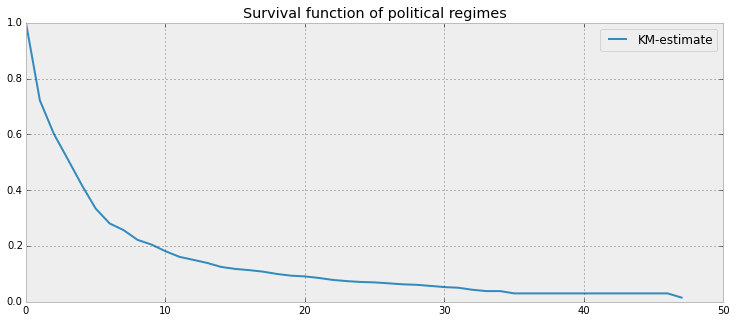


What do we see? The y-axis represents the probability a leader is still
around after :math:`t` years, where :math:`t` years is on the x-axis. We
see that very few leaders make it past 20 years in office. Of course,
like all good stats, we need to report how uncertain we are about these
point estimates, i.e. we need confidence intervals. They are computed on
the call to ``fit``, and are located under the ``confidence_interval_``
property.

Alternativly, we can call ``plot`` on the ``KaplanMeierFitter`` itself
to plot both the KM estimate and it's confidence intervals:

*Note: Don't like the shaded area for confidence intervals? See below
examples on how to change this*

.. code:: python

    kmf.plot()


.. parsed-literal::

    <matplotlib.axes.AxesSubplot at 0x108e49d10>


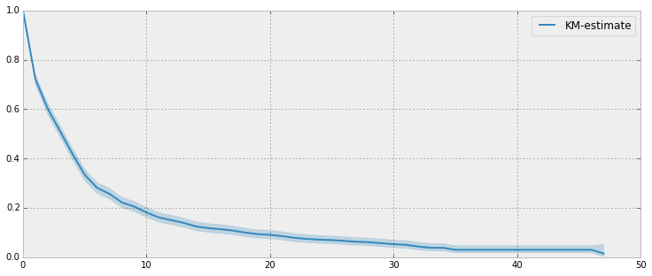


The median time in office, which defines the point in time where on
average 1/2 of the population has expired, is a property:

.. code:: python

    kmf.median_


.. parsed-literal::

    KM-estimate    4
    dtype: float64


Interesting that it is only 3 years. That means, around the world, when
a leader is elected there is a 50% chance he or she will be gone in 3
years!

Let's segment on democratic regimes vs non-democratic regimes. Calling
``plot`` on either the estimate itself or the fitter object will return
an ``axis`` object, that can be used for plotting further estimates:

.. code:: python

    ax = plt.subplot(111)
    
    dem = data["democracy"] == "Democracy"
    kmf.fit(T[dem], censorship=C[dem], columns=["Democratic Regimes"])
    kmf.plot(ax=ax, ci_force_lines=True)
    kmf.fit(T[~dem], censorship=C[~dem], columns=["Non-democratic Regimes"])
    kmf.plot(ax=ax, ci_force_lines=True)
    
    plt.ylim(0,1);
    plt.title("Lifespans of different global regimes");


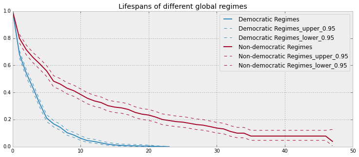


We might be interested in estimating the probabilities in between some
points. We can do that with the ``timeline`` argument. We specify the
times we are interested in, and are returned a DataFrame with the
probabilties of survival at those points:

.. code:: python

    ax = subplot(111)
    
    t = np.linspace(0,50,51)
    kmf.fit(T[dem], censorship=C[dem], timeline=t, columns=["Democratic Regimes"])
    ax = kmf.plot(ax=ax)
    print "Median survival time of democratic:", kmf.median_
    
    kmf.fit(T[~dem], censorship=C[~dem], timeline=t, columns=["Non-democratic Regimes"])
    kmf.plot(ax=ax )
    plt.ylim(0,1);
    plt.title("Lifespans of different global regimes");
    print "Median survival time of non-democratic:", kmf.median_
    print
    print kmf.survival_function_.head()

.. parsed-literal::

    Median survival time of democratic: Democratic Regimes    3
    dtype: float64
    Median survival time of non-democratic: Non-democratic Regimes    6
    dtype: float64
    
       Non-democratic Regimes
    0                1.000000
    1                0.798712
    2                0.715339
    3                0.657841
    4                0.610095
    
    [5 rows x 1 columns]


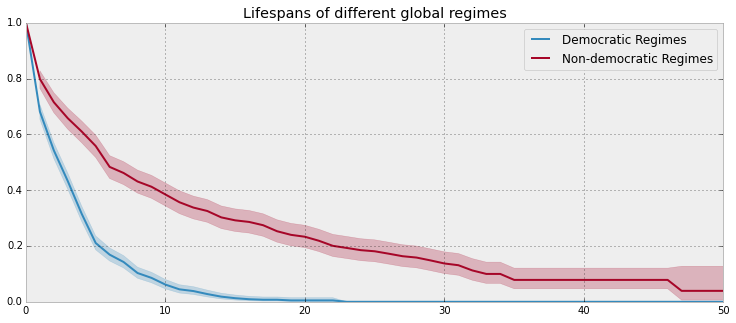


It is incredible how much longer these non-democratic regimes exist for.
A democratic regime does have a natural bias towards death though: both
via elections and natural limits (the US imposes a strict 8 year limit).
The median of a non-democractic is only about twice as large as a
democratic regime, but the difference is really apparent in the tails:
if you're a non-democratic leader, and you've made it past the 10 year
mark, you probably have a long life ahead. Meanwhile, a democratic
leader rarely makes it past 10 years, and then have a very short
lifetime past that.

Here the difference between survival functions is very obvious, and
performing a statistical test seems pendantic. If the curves are more
similar, or we possess less data, we may be interested in performing a
statistical test. In this case, *lifelines* contains routines in
``lifelines.statistics`` to compare two survival curves. Below we
demonstrate this routine. The function ``logrank_test`` is a common
statistical test in survival analysis that compares two event series'
generators. If the value returned exceeds some prespecified value, then
we rule that the series have different generators.

.. code:: python

    from lifelines.statistics import logrank_test
    
    summary, p_value, test_results = logrank_test(T[dem], T[~dem], C[dem], C[~dem], alpha=.99 )
    print summary

.. parsed-literal::

    Results
       df: 1
       alpha: 0.99
       t 0: -1
       test: logrank
       null distribution: chi squared
    
       __ p-value ___|__ test statistic __|__ test results __
             0.00000 |              208.306 |     True   


Lets compare the different *types* of regimes present in the dataset:

.. code:: python

    regime_types = data['regime'].unique()
    
    for i,regime_type in enumerate(regime_types):
        ax = plt.subplot(2,3,i+1)
        ix = data['regime'] == regime_type
        kmf.fit( T[ix], C[ix], columns=[regime_type] )
        kmf.plot(ax=ax, legend=False)
        plt.title(regime_type)
        plt.xlim(0,50)
        if i==0:
            plt.ylabel('Frac. in power after $n$ years')
        if i == 3:
            plt.xlabel("Years in power")
    plt.tight_layout()


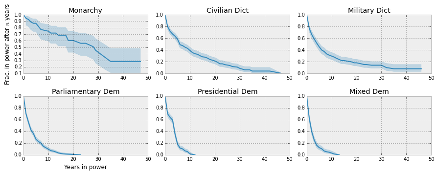


--------------

Getting data into the right format
~~~~~~~~~~~~~~~~~~~~~~~~~~~~~~~~~~

*lifelines* data format is consistent across all estimator class and
functions: an array of individual durations, and the individuals
censorship (if any). These are often denoted ``T`` and ``C``
respectively. For example:

::

    T = [0,3,3,2,1,2]
    C = [1,1,0,0,1,1]
    kmf.fit(T, censorship=C )

The raw data is not always available in this format -- *lifelines*
includes some helper functions to transform data formats to *lifelines*
format. These are located in the ``lifelines.utils`` sublibrary. For
example, the function ``datetime_to_durations`` accepts an arrary or
Pandas object of start times/dates, and an array or Pandas objects of
end times/dates (or ``None`` if not observed):

.. code:: python

    from lifelines.utils import datetimes_to_durations
    
    start_date = ['2013-10-10 0:00:00', '2013-10-09', '2013-10-10']
    end_date = ['2013-10-13', '2013-10-10', None]
    T,C = datetimes_to_durations(start_date, end_date, fill_date='2013-10-15')
    print 'T (durations): ', T
    print 'C (censorship): ',C

.. parsed-literal::

    T (durations):  [ 3.  1.  5.]
    C (censorship):  [ True  True False]


The function ``datetimes_to_durations`` is very flexible, and has many
keywords to tinker with.

Estimating hazard rates using Nelson-Aalen
''''''''''''''''''''''''''''''''''''''''''''''''''''''''''''''

The survival curve is a great way to summarize and visualize the
lifetime data, it is not the only way. We showed the relationship
earlier between the survival function, :math:`S(t)`, and the hazard
function, :math:`\lambda(t)`, repeated here:

.. math:: S(t) = \exp\left( -\int_0^t \lambda(z) dz \right) 

Often we denote the integral simpler:

.. math::  \Lambda(t) =  \int_0^t \lambda(z) \;dz

We call :math:`\Lambda(t)` the cumulative hazard function. From above,
the following relationship should be understood:

.. math::  \frac{d \Lambda(t)}{dt} = \lambda(t)

If we are curious about the hazard function :math:`\lambda(t)` of a
population, we unfortunatly cannot transform the Kaplan Meier estimate
-- statistics doesn't work quite that well. Fortunately, there is a
proper estimator of the *cumulative* hazard function, called the
Nelson-Aalen estimator:

.. math:: \hat{\Lambda}(t) = \sum_{t_i \le t} \frac{d_i}{n_i} 

where :math:`d_i` is the number of deaths at time :math:`t_i` and
:math:`n_i` is the number of susceptible individuals.

In *lifelines*, this estimator is available as the ``NelsonAalenFitter``
in ``lifelines``. Let's use the regime dataset from above:

.. code:: python

    T = data["duration"]
    C = data["observed"]

    from lifelines import NelsonAalenFitter
    naf = NelsonAalenFitter()

    naf.fit(T,censorship=C)


.. parsed-literal::

    <lifelines.estimation.NelsonAalenFitter at 0x109492050>


After fitting, the class exposes the property ``cumulative_hazard_`` as
a DataFrame:

.. code:: python

    print naf.cumulative_hazard_.head()
    naf.plot();

.. parsed-literal::

       NA-estimate
    0     0.000000
    1     0.325912
    2     0.507356
    3     0.671251
    4     0.869867
    
    [5 rows x 1 columns]


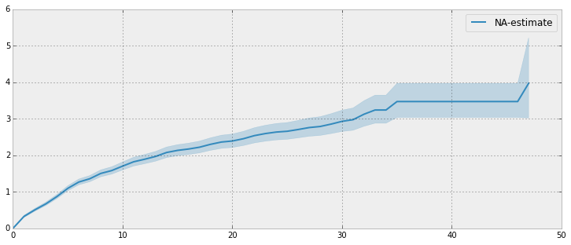


The cumulative hazard has less immediate understanding than the survival
curve, but the hazard curve is the basis of more advanced techniques in
survival anaylsis. Recall that we are estimating *cumulative hazard
curve*, :math:`\Lambda(t)`. (Why? The sum of estimates is much more
stable than the point-wise estimates.) Thus we know the *rate of change*
of this curve is an estimate of the hazard function.

Looking at figure above, it looks like the hazard starts off high and
gets smaller (as seen by the decreasing rate of change). Let's break the
regimes down between democratic and non-democratic, during the first 20
years:

    We are using the ``ix`` argument in plotting here: it accepts a
    ``slice`` and plots only points within that slice.

.. code:: python

    naf.fit(T[dem], censorship=C[dem], columns=["Democratic Regimes"])
    ax = naf.plot(ix=slice(0,20))
    naf.fit(T[~dem], censorship=C[~dem], columns=["Non-democratic Regimes"])
    naf.plot(ax=ax, ix=slice(0,20))
    plt.title("Cumulative hazard function of different global regimes");


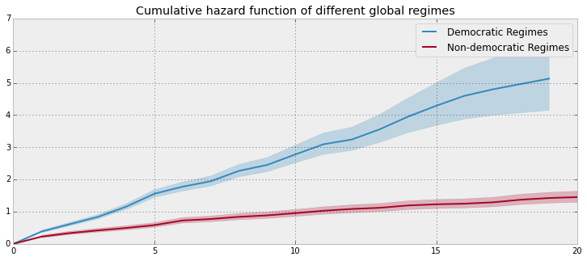


Looking at the rates of change, I would say that both political
philosophies have a constant hazard, albeit democratic regimes have a
much *higher* constant hazard. So why did the combination of both
regimes have a *decreasing* hazard? This is the effect of *frailty*, a
topic we will discuss later.

Smoothing the hazard curve
~~~~~~~~~~~~~~~~~~~~~~~~~~

Interpretation of the cumulative hazard function can be difficult -- it
is not how we usually interpret functions. (On the other hand, most
survival analysis is done using the cumulativ hazard fuction, so it is
recommend to be use to understanding them).

Alternatively, we can derive the more-interpretable hazard curve, but
there is a catch. The derivation involves a kernerl smoother (to smooth
out the differences of the cumulative hazard curve) , and this requires
us to specify a bandwidth parameter that controls the amount of
smoothing. This functionality is provided in the ``smoothed_hazard_``
and ``hazard_confidence_intervals_`` methods. (Why methods? They require
an arguement representing the bandwidth).

There is also a ``plot_hazard`` function (that also requires a
``bandwidth`` keyword) that will plot the estimate plus the confidence
intervals, similar to the traditional ``plot`` functionality.

.. code:: python

    b = 3.
    naf.fit(T[dem], censorship=C[dem], columns=["Democratic Regimes"])
    ax = naf.plot_hazard(bandwidth=b)
    naf.fit(T[~dem], censorship=C[~dem], columns=["Non-democratic Regimes"])
    naf.plot_hazard(ax=ax, bandwidth=b)
    plt.title("Hazard function of different global regimes | bandwith=%.1f"%b);
    plt.ylim(0,0.4)
    plt.xlim(0,25);


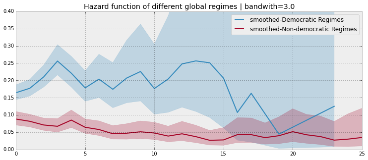


It is more clear here which group has the higher hazard, and like
hypothesized above, both hazard rates are close to being constant.

Choosing an appropriate bandwidth to use is difficult, and different
bandwidth can produce different inferences, so best to be very careful
here.

.. code:: python

    b = 8.
    naf.fit(T[dem], censorship=C[dem], columns=["Democratic Regimes"])
    ax = naf.plot_hazard(bandwidth=b)
    naf.fit(T[~dem], censorship=C[~dem], columns=["Non-democratic Regimes"])
    naf.plot_hazard(ax=ax, bandwidth=b)
    plt.title("Hazard function of different global regimes | bandwith=%.1f"%b);
    plt.ylim(0,0.4);
    plt.xlim(0,25)


.. parsed-literal::

    (0, 25)


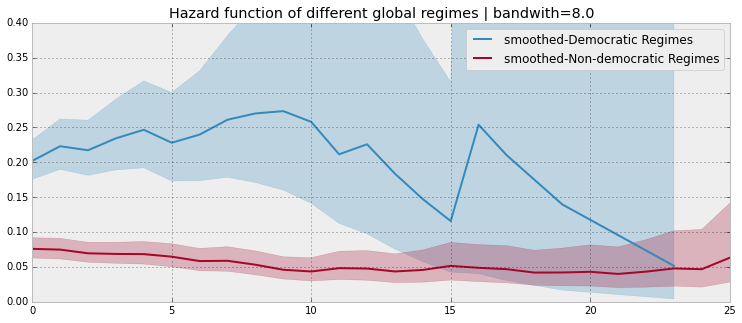


Survival regression
''''''''''''''''''''''''''''''''''''''''''''''''''''''''''''''''

Often we have additional data aside from the durations, and if
applicable any censorships that occured. In the regime dataset, we have
the type of government the political leader was part of, the country
they were head of, and the year they were elected. Can we use this data
in survival analysis?

Yes, the technique is called *survival regression* -- the name implies
we regress covariates (eg: year elected, country, etc.) against a
another variable -- in this case durations and lifetimes. Similar to the
logic in the first part of this tutorial, we cannot use traditional
methods like linear regression.

There are two popular competing techniques in survival regression: Cox's
model and Aalen's additive model. Both models attemps to model the
hazard rate :math:`\lambda(t)`. In Cox's model, the relationship is
defined:

.. math:: \lambda(t) = b_0(t)\exp\left( b_1x_1 + ... + b_Nx_n\right)

On the other hand, Aalen's additive model assumes the following form:

.. math:: \lambda(t) = b_0(t) + b_1(t)x_1 + ... + b_N(t)x_T

Currently, *lifelines* implements Aalen's additive model (mostly because
the original authors only were interested in this model). In both
models, we attempt to fit the :math:`b` coefficients best to the data --
notice that in Aalen's additive model has time varying coefficients.

Aalen's Additive model
~~~~~~~~~~~~~~~~~~~~~~~~~~~~~~~~~~~~~~

``Caution: This is still experimental.``

The estimator to fit unknown coefficients in Aalen's additive model is
located in ``estimators`` under ``AalenAdditiveFitter``. For this
exercise, we will use the regime dataset and include the catagorical
variables ``un_continent_name`` (eg: Asia, North America,...), the
``regime`` type (eg: monarchy, civilan,...) and the year the regime
started in, ``start_year``.

Aalens additive model typically does not estimate the individual
:math:`b_i(t)` but instead estimates :math:`\int_0^t b_i(s) \; ds`
(similar to estimate of the hazard rate using ``NelsonAalenFitter``
above). This is important to keep in mind when analzying the output.

.. code:: python

    from lifelines import AalenAdditiveFitter
    data.head()


.. raw:: html

    <div style="max-height:1000px;max-width:1500px;overflow:auto;">
    <table border="1" class="dataframe">
      <thead>
        <tr style="text-align: right;">
          <th></th>
          <th>ctryname</th>
          <th>cowcode2</th>
          <th>politycode</th>
          <th>un_region_name</th>
          <th>un_continent_name</th>
          <th>ehead</th>
          <th>leaderspellreg</th>
          <th>democracy</th>
          <th>regime</th>
          <th>start_year</th>
          <th>duration</th>
          <th>observed</th>
        </tr>
      </thead>
      <tbody>
        <tr>
          <th>1</th>
          <td> Afghanistan</td>
          <td> 700</td>
          <td> 700</td>
          <td> Southern Asia</td>
          <td> Asia</td>
          <td>   Mohammad Zahir Shah</td>
          <td> Mohammad Zahir Shah.Afghanistan.1946.1952.Mona...</td>
          <td> Non-democracy</td>
          <td>      Monarchy</td>
          <td> 1946</td>
          <td>  7</td>
          <td> 1</td>
        </tr>
        <tr>
          <th>2</th>
          <td> Afghanistan</td>
          <td> 700</td>
          <td> 700</td>
          <td> Southern Asia</td>
          <td> Asia</td>
          <td> Sardar Mohammad Daoud</td>
          <td> Sardar Mohammad Daoud.Afghanistan.1953.1962.Ci...</td>
          <td> Non-democracy</td>
          <td> Civilian Dict</td>
          <td> 1953</td>
          <td> 10</td>
          <td> 1</td>
        </tr>
        <tr>
          <th>3</th>
          <td> Afghanistan</td>
          <td> 700</td>
          <td> 700</td>
          <td> Southern Asia</td>
          <td> Asia</td>
          <td>   Mohammad Zahir Shah</td>
          <td> Mohammad Zahir Shah.Afghanistan.1963.1972.Mona...</td>
          <td> Non-democracy</td>
          <td>      Monarchy</td>
          <td> 1963</td>
          <td> 10</td>
          <td> 1</td>
        </tr>
        <tr>
          <th>4</th>
          <td> Afghanistan</td>
          <td> 700</td>
          <td> 700</td>
          <td> Southern Asia</td>
          <td> Asia</td>
          <td> Sardar Mohammad Daoud</td>
          <td> Sardar Mohammad Daoud.Afghanistan.1973.1977.Ci...</td>
          <td> Non-democracy</td>
          <td> Civilian Dict</td>
          <td> 1973</td>
          <td>  5</td>
          <td> 0</td>
        </tr>
        <tr>
          <th>5</th>
          <td> Afghanistan</td>
          <td> 700</td>
          <td> 700</td>
          <td> Southern Asia</td>
          <td> Asia</td>
          <td>   Nur Mohammad Taraki</td>
          <td> Nur Mohammad Taraki.Afghanistan.1978.1978.Civi...</td>
          <td> Non-democracy</td>
          <td> Civilian Dict</td>
          <td> 1978</td>
          <td>  1</td>
          <td> 0</td>
        </tr>
      </tbody>
    </table>
    <p>5 rows × 12 columns</p>
    </div>


I'm using the lovely library
```patsy`` <https://github.com/pydata/patsy>`__ here to create a
covaritate matrix from my original dataframe.

.. code:: python

    import patsy
    # the '-1' term 
    # refers to not adding an intercept column (a column of all 1s).
    # It can be added to the Fitter class.
    X = patsy.dmatrix('un_continent_name + regime + start_year -1', data) 
.. code:: python

    X.design_info.column_names


.. parsed-literal::

    ['un_continent_name[Africa]',
     'un_continent_name[Americas]',
     'un_continent_name[Asia]',
     'un_continent_name[Europe]',
     'un_continent_name[Oceania]',
     'regime[T.Military Dict]',
     'regime[T.Mixed Dem]',
     'regime[T.Monarchy]',
     'regime[T.Parliamentary Dem]',
     'regime[T.Presidential Dem]',
     'start_year']


.. code:: python

    T = data['duration'].values[:,None]
    C = data['observed'].values[:,None] 
Below we create our Fitter class. Since we did not supply an intercept
column in our patsy we have included the keyword ``fit_intercept=True``
(``True`` by default) which will append the column of ones to our
matrix. (Sidenote: the intercept term, :math:`b_0(t)` in surival
regression is often referred to as the *baseline* hazard.)

We have also included the ``penalizer`` option. During the estimation, a
linear regression is computed at each step. Often the regression can be
unstable (due to high
`co-linearity <http://camdp.com/blogs/machine-learning-counter-examples-pt1>`__
or small sample sizes) -- adding a penalizer term controls the stability
(though it introduces a small bias -- think of it as a the bias-variance
tradeoff). I recommend alway starting with a small penalizer term -- if
the estimates still appear to be too unstable, try increasing it.

.. code:: python

    aaf = AalenAdditiveFitter(penalizer=1., fit_intercept=True)
Like the API syntax above, an instance of ``AalenAdditiveFitter``
includes a ``fit`` method. In this method is an additional requirement:
our covariate matrix.

.. code:: python

    aaf.fit(T, X, columns=X.design_info.column_names)


.. parsed-literal::

    <lifelines.estimation.AalenAdditiveFitter at 0x1091c2710>


After fitting, the instance exposes a ``cumulative_hazards_`` DataFrame
containing the estimates of :math:`\int_0^t b_i(s) \; ds`:

.. code:: python

    figsize(12.5,8)
    aaf.cumulative_hazards_.plot(legend=True)


.. parsed-literal::

    <matplotlib.axes.AxesSubplot at 0x109546550>


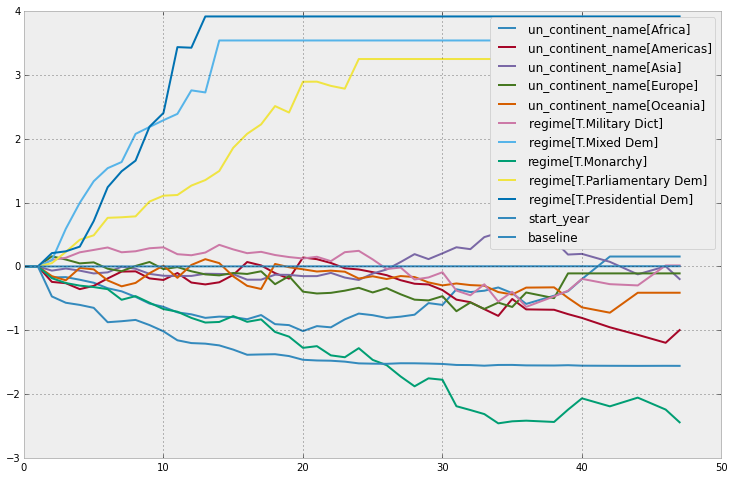


Regression is most interesting if we use it on data we have not yet
seen, i.e. prediction! We can use what we have learned to predict
individual hazard rates, survival functions, and median survival time.
The dataset we are using is limited to 2008, so let's use this data to
predict the (though already partly seen) possible duration of Canadian
Prime Minister Stephen Harper.

.. code:: python

    ix = (data['ctryname'] == 'Canada')
    obama = X[ix,:][-1,:][None,:]
    obama[0,-1] = 2003
    print "Harper's unique data point"
    obama

.. parsed-literal::

    Harper's unique data point


.. parsed-literal::

    array([[    0.,     0.,     1.,     0.,     0.,     0.,     0.,     1.,
                0.,     0.,  2003.]])


.. code:: python

    figsize(12.5,6)
    ax = plt.subplot(2,1,1)
    plt.xlim(0,15)
    aaf.predict_cumulative_hazard(obama, columns=["Harper's hazard rate"]).plot(ax = ax)
    ax = plt.subplot(2,1,2)
    plt.ylim(0,1.1)
    plt.xlim(0,15)
    aaf.predict_survival_function(obama, columns=["Harper's survival function"]).plot(ax=ax);
    print "Median lifespan of PM Harper: ", aaf.predict_median_lifetimes(obama).values


.. parsed-literal::

    Median lifespan of PM Harper: 


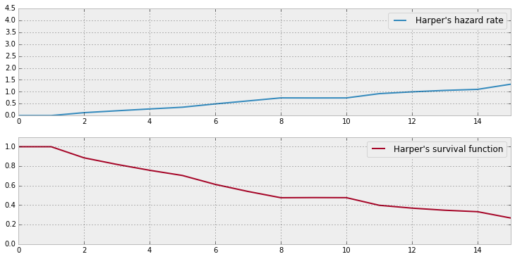


Conclusion
~~~~~~~~~~

Most of *lifelines* has been covered in this tutorial (it is a
relatively small library, by design). If you have any questions, the
best place to post them is currently in the Issues portion of the Github
homepage, or ping me on Twitter at @cmrn\_dp.


    