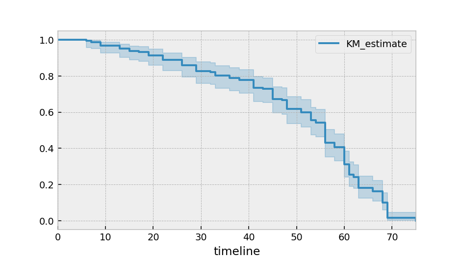

.. _code_directive:

Quickstart
'''''''''''''''''''''''''''''''''''''''

Installation
---------------------------------------

Install via ``pip``:

.. code:: 

    pip install lifelines 

Kaplan-Meier and Nelson-Aalen
---------------------------------------

Let's start by importing some data. We need the durations that individuals are observed for, and whether they "died" or not. 

.. code:: python

    from lifelines.datasets import load_waltons
    df = load_waltons() # returns a pandas DataFrame

    T = df['T']
    E = df['E']

``T`` is an array of durations, ``E`` is a either boolean or binary array representing whether the "death" was observed (alternatively an individual can be censored). 

.. note:: By default, *lifelines* assumes all "deaths" are observed. 

.. code:: python

    from lifelines import KaplanMeierFitter
    kmf = KaplanMeierFitter()
    kmf.fit(T, event_observed=E) # more succiently, kmf.fit(T,E)

After calling the ``fit`` method, we have access to new properties like ``survival_function_`` and methods like ``plot()``. The latter is a wrapper around Pandas internal plotting library (see `here <http://lifelines.readthedocs.org/en/latest/examples.html#plotting-options-and-styles>`__ for examples). 

.. code:: python
    
    kmf.plot()

Multiple groups
^^^^^^^^^^^^^^^^^^^^^^^^^^^^^^^^^^^^^^^^^^^^^^^^^^^

.. code:: python
    
    groups = df['group']
    ix = (groups == 'control')

    kmf.fit(T[ix], E[ix], label='control')
    ax = kmf.plot()

    kmf.fit(T[~ix], E[~ix], label='miR-137')
    kmf.plot(ax=ax)

.. image:: images/quickstart_multi.png   

Similar functionality exists for the ``NelsonAalenFitter``:

.. code:: python

    from lifelines import NelsonAalenFitter
    naf = NelsonAalenFitter()
    naf.fit(T, event_observed=E)

but instead of a ``survival_function_`` being exposed, a ``cumulative_hazard_`` is. 

.. note:: Similar to Scikit-Learn, all statistically estimated quanities append an underscore to the property name. 

Survival Regression
---------------------------------

While the above ``KaplanMeierFitter`` and ``NelsonAalenFitter`` are useful, they only give us an "average" view of the population. Often we have specific data at the individual level, either continuous or categorical, that we would like to use. For this, we turn to **survival regression**, specifically ``AalenAdditiveFitter`` or ``CoxPHFitter``.

.. code:: python
    
    from lifelines.datasets import load_regression_dataset
    regression_dataset = load_regression_dataset()

    regression_dataset.head()

The input of the ``fit`` method's API on ``AalenAdditiveFitter`` is different than above. All the data, including durations, censorships and covariates must be contained in **a Pandas DataFrame** (yes, it must be a DataFrame). The duration column and event occured column must be specified in the call to ``fit``. 

.. code:: python
    
    from lifelines import AalenAdditiveFitter, CoxPHFitter

    # Using Cox Proportional Hazards model
    cf = CoxPHFitter()
    cf.fit(regression_dataset, duration_col='T', event_col='E')
    print cf.summary

    # Using Aalen's Additive model
    aaf = AalenAdditiveFitter(fit_intercept=False)
    aaf.fit(regression_dataset, duration_col='T', event_col='E')

After fitting, you'll have access to properties like ``cumulative_hazards_`` and methods like ``plot``, ``predict_cumulative_hazards``, and ``predict_survival_function``. The latter two methods require an additional argument of individual covariates:

.. code:: python
    
    x = regression_dataset[regression_dataset.columns - ['E','T']]
    aaf.predict_survival_function(x.ix[10:12]).plot() #get the unique survival functions of the first two subjects 

Like the above estimators, there is also a built-in plotting method:

.. code:: python

    aaf.plot()

.. image:: images/quickstart_aaf.png  
