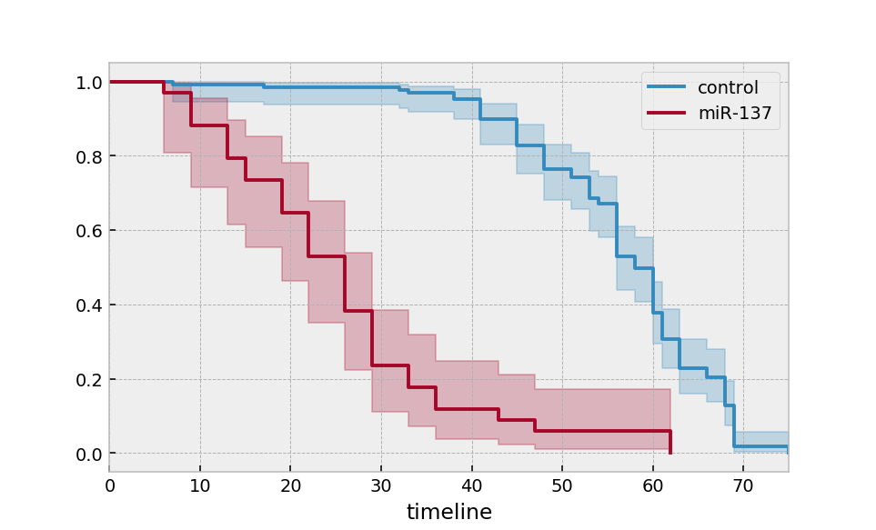
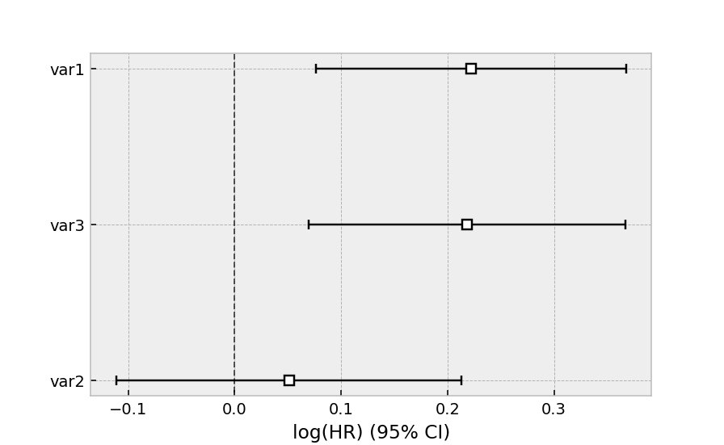

.. _code_directive:

.. image:: http://i.imgur.com/EOowdSD.png

-------------------------------------

Quickstart
''''''''''

Installation
------------

Install via ``pip``:

.. code-block:: console

    pip install lifelines

Kaplan-Meier and Nelson-Aalen
-----------------------------

.. note:: For readers looking for an introduction to survival analysis, it's recommended to start at :ref:`Introduction to Survival Analysis`

Let's start by importing some data. We need the durations that individuals are observed for, and whether they "died" or not. 

.. code:: python

    from lifelines.datasets import load_waltons
    df = load_waltons() # returns a Pandas DataFrame

    print(df.head())
    """
        T  E    group
    0   6  1  miR-137
    1  13  1  miR-137
    2  13  1  miR-137
    3  13  1  miR-137
    4  19  1  miR-137
    """

    T = df['T']
    E = df['E']

``T`` is an array of durations, ``E`` is a either boolean or binary array representing whether the "death" was observed (alternatively an individual can be censored).

.. note:: *lifelines* assumes all "deaths" are observed unless otherwise specified. 

.. code:: python

    from lifelines import KaplanMeierFitter
    kmf = KaplanMeierFitter()
    kmf.fit(T, event_observed=E)  # or, more succinctly, kmf.fit(T, E)

After calling the ``fit`` method, we have access to new properties like ``survival_function_`` and methods like ``plot()``. The latter is a wrapper around Panda's internal plotting library.

.. code:: python

    kmf.survival_function_
    kmf.median_
    kmf.plot()

.. image:: images/quickstart_kmf.png

Multiple groups
^^^^^^^^^^^^^^^

.. code:: python

    groups = df['group']
    ix = (groups == 'miR-137')

    kmf.fit(T[~ix], E[~ix], label='control')
    ax = kmf.plot()

    kmf.fit(T[ix], E[ix], label='miR-137')
    ax = kmf.plot(ax=ax)

Alternatively, for many more groups and more "pandas-esque":

.. code:: python

    ax = plt.subplot(111)

    kmf = KaplanMeierFitter()

    for name, grouped_df in df.groupby('group'):
        kmf.fit(grouped_df["T"], grouped_df["E"], label=name)
        kmf.plot(ax=ax)

Similar functionality exists for the ``NelsonAalenFitter``:

.. code:: python

    from lifelines import NelsonAalenFitter
    naf = NelsonAalenFitter()
    naf.fit(T, event_observed=E)

but instead of a ``survival_function_`` being exposed, a ``cumulative_hazard_`` is.

.. note:: Similar to `Scikit-Learn <http://scikit-learn.org>`_, all statistically estimated quantities append an underscore to the property name.

.. note:: More detailed docs about estimating the survivial function and cumulative hazard are available in `Survival analysis with lifelines`_.

Getting data in the right format
--------------------------------

Often you'll have data that looks like:::

    *start_time1*, *end_time1*
    *start_time2*, *end_time2*
    *start_time3*, None
    *start_time4*, *end_time4*

*lifelines* has some utility functions to transform this dataset into duration and censoring vectors:

.. code:: python

    from lifelines.utils import datetimes_to_durations

    # start_times is a vector or list of datetime objects or datetime strings
    # end_times is a vector or list of (possibly missing) datetime objects or datetime strings
    T, E = datetimes_to_durations(start_times, end_times, freq='h')

Perhaps you are interested in viewing the survival table given some durations and censoring vectors.

.. code:: python

    from lifelines.utils import survival_table_from_events

    table = survival_table_from_events(T, E)
    print(table.head())

    """
              removed  observed  censored  entrance  at_risk
    event_at
    0               0         0         0       163      163
    6               1         1         0         0      163
    7               2         1         1         0      162
    9               3         3         0         0      160
    13              3         3         0         0      157
    """

Survival regression
-------------------

While the above ``KaplanMeierFitter`` and ``NelsonAalenFitter`` are useful, they only give us an "average" view of the population. Often we have specific data at the individual level, either continuous or categorical, that we would like to use. For this, we turn to **survival regression**, specifically ``AalenAdditiveFitter`` and ``CoxPHFitter``.

.. code:: python

    from lifelines.datasets import load_regression_dataset
    regression_dataset = load_regression_dataset()

    regression_dataset.head()

The input of the ``fit`` method's API in a regression is different. All the data, including durations, censorings and covariates must be contained in **a Pandas DataFrame** (yes, it must be a DataFrame). The duration column and event occurred column must be specified in the call to ``fit``.

.. code:: python

    from lifelines import CoxPHFitter

    # Using Cox Proportional Hazards model
    cph = CoxPHFitter()
    cph.fit(regression_dataset, 'T', event_col='E')
    cph.print_summary()

    """
    <lifelines.CoxPHFitter: fitted with 200 observations, 11 censored>
          duration col = 'T'
             event col = 'E'
    number of subjects = 200
      number of events = 189
        log-likelihood = -807.62
      time fit was run = 2019-01-27 23:11:22 UTC

    ---
          coef  exp(coef)  se(coef)    z      p  -log2(p)  lower 0.95  upper 0.95
    var1  0.22       1.25      0.07 2.99 <0.005      8.49        0.08        0.37
    var2  0.05       1.05      0.08 0.61   0.54      0.89       -0.11        0.21
    var3  0.22       1.24      0.08 2.88 <0.005      7.97        0.07        0.37
    ---
    Concordance = 0.58
    Likelihood ratio test = 15.54 on 3 df, -log2(p)=9.47
    """

    cph.plot()

If we focus on Aalen's Additive model,

.. code:: python

    # Using Aalen's Additive model
    from lifelines import AalenAdditiveFitter
    aaf = AalenAdditiveFitter(fit_intercept=False)
    aaf.fit(regression_dataset, 'T', event_col='E')

Like ``CoxPHFitter``, after fitting you'll have access to properties like ``cumulative_hazards_`` and methods like ``plot``, ``predict_cumulative_hazards``, and ``predict_survival_function``. The latter two methods require an additional argument of individual covariates:

.. code:: python

    X = regression_dataset.drop(['E', 'T'], axis=1)
    aaf.predict_survival_function(X.iloc[10:12]).plot()  # get the unique survival functions of two subjects

.. image:: images/quickstart_predict_aaf.png

Like the above estimators, there is also a built-in plotting method:

.. code:: python

    aaf.plot()

.. image:: images/quickstart_aaf.png

.. note:: More detailed documentation and tutorials are available in `Survival Regression`_.

.. _Survival Regression: Survival%20Regression.html
.. _Survival analysis with lifelines: Survival%20analysis%20with%20lifelines.html