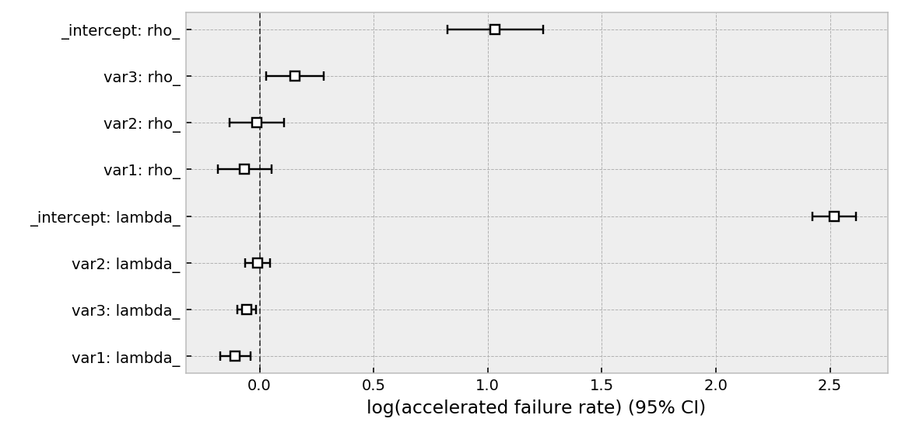

.. _code_directive:

.. image:: http://i.imgur.com/EOowdSD.png

-------------------------------------

Quickstart
''''''''''

Installation
------------

Install via ``pip``:

.. code-block:: console

    pip install lifelines

Kaplan-Meier Nelson-Aalen, and parametric models
---------------------------------------------------

.. note:: For readers looking for an introduction to survival analysis, it's recommended to start at :ref:`Introduction to Survival Analysis`

Let's start by importing some data. We need the durations that individuals are observed for, and whether they "died" or not.

.. code:: python

    from lifelines.datasets import load_waltons
    df = load_waltons() # returns a Pandas DataFrame

    print(df.head())
    """
        T  E    group
    0   6  1  miR-137
    1  13  1  miR-137
    2  13  1  miR-137
    3  13  1  miR-137
    4  19  1  miR-137
    """

    T = df['T']
    E = df['E']

``T`` is an array of durations, ``E`` is a either boolean or binary array representing whether the "death" was observed or not (alternatively an individual can be censored).

.. note:: *lifelines* assumes all "deaths" are observed unless otherwise specified.

.. code:: python

    from lifelines import KaplanMeierFitter
    kmf = KaplanMeierFitter()
    kmf.fit(T, event_observed=E)  # or, more succinctly, kmf.fit(T, E)

After calling the ``fit`` method, we have access to new properties like ``survival_function_`` and methods like ``plot()``. The latter is a wrapper around Panda's internal plotting library.

.. code:: python

    kmf.survival_function_
    kmf.cumulative_density_
    kmf.median_
    kmf.plot_survival_function() # or just kmf.plot()

.. image:: images/quickstart_kmf.png

Alternatively, you can plot the cumulative density function:

.. code:: python

    kmf.plot_cumulative_density()

By specifying the ``timeline`` keyword argument in ``fit``, we can change how the above models are indexed:

.. code:: python

    kmf.fit(T, E, timeline=range(0, 100, 2))

    kmf.survival_function_   # index is now the same as range(0, 100, 2)
    kmf.confidence_interval_ # index is now the same as range(0, 100, 2)

Instead of the Kaplan-Meier estimator, you may be interested in a parametric model. *lifelines* has builtin parametric models. For example, Weibull, Log-Normal, Log-Logistic, and more.

.. code:: python

    from lifelines import *

    fig, axes = plt.subplots(2, 3, figsize=(9, 5))

    kmf = KaplanMeierFitter().fit(T, E, label='KaplanMeierFitter')
    wbf = WeibullFitter().fit(T, E, label='WeibullFitter')
    exf = ExponentialFitter().fit(T, E, label='ExponentalFitter')
    lnf = LogNormalFitter().fit(T, E, label='LogNormalFitter')
    llf = LogLogisticFitter().fit(T, E, label='LogLogisticFitter')
    pwf = PiecewiseExponentialFitter([40, 60]).fit(T, E, label='PiecewiseExponentialFitter')

    wbf.plot_survival_function(ax=axes[0][0])
    exf.plot_survival_function(ax=axes[0][1])
    lnf.plot_survival_function(ax=axes[0][2])
    kmf.plot_survival_function(ax=axes[1][0])
    llf.plot_survival_function(ax=axes[1][1])
    pwf.plot_survival_function(ax=axes[1][2])

.. image:: images/waltons_survival_function.png

Multiple groups
^^^^^^^^^^^^^^^

.. code:: python

    groups = df['group']
    ix = (groups == 'miR-137')

    kmf.fit(T[~ix], E[~ix], label='control')
    ax = kmf.plot()

    kmf.fit(T[ix], E[ix], label='miR-137')
    ax = kmf.plot(ax=ax)

.. image:: images/quickstart_multi.png

Alternatively, for many more groups and more "pandas-esque":

.. code:: python

    ax = plt.subplot(111)

    kmf = KaplanMeierFitter()

    for name, grouped_df in df.groupby('group'):
        kmf.fit(grouped_df["T"], grouped_df["E"], label=name)
        kmf.plot(ax=ax)

Similar functionality exists for the ``NelsonAalenFitter``:

.. code:: python

    from lifelines import NelsonAalenFitter
    naf = NelsonAalenFitter()
    naf.fit(T, event_observed=E)

but instead of a ``survival_function_`` being exposed, a ``cumulative_hazard_`` is.

.. note:: Similar to `Scikit-Learn <http://scikit-learn.org>`_, all statistically estimated quantities append an underscore to the property name.

.. note:: More detailed docs about estimating the survival function and cumulative hazard are available in `Survival analysis with lifelines`_.

Getting data in the right format
--------------------------------

Often you'll have data that looks like:::

    *start_time1*, *end_time1*
    *start_time2*, *end_time2*
    *start_time3*, None
    *start_time4*, *end_time4*

*lifelines* has some utility functions to transform this dataset into duration and censoring vectors. The most common one is ``datetimes_to_durations``. The docs for it are `here <https://lifelines.readthedocs.io/en/latest/lifelines.utils.html#lifelines.utils.datetimes_to_durations>`_.

.. code:: python

    from lifelines.utils import datetimes_to_durations

    # start_times is a vector or list of datetime objects or datetime strings
    # end_times is a vector or list of (possibly missing) datetime objects or datetime strings
    T, E = datetimes_to_durations(start_times, end_times, freq='h')

Perhaps you are interested in viewing the survival table given some durations and censoring vectors. The docs for it are `here <https://lifelines.readthedocs.io/en/latest/lifelines.utils.html#lifelines.utils.survival_table_from_events>`_.

.. code:: python

    from lifelines.utils import survival_table_from_events

    table = survival_table_from_events(T, E)
    print(table.head())

    """
              removed  observed  censored  entrance  at_risk
    event_at
    0               0         0         0       163      163
    6               1         1         0         0      163
    7               2         1         1         0      162
    9               3         3         0         0      160
    13              3         3         0         0      157
    """

Survival regression
-------------------

While the above ``KaplanMeierFitter`` and ``NelsonAalenFitter`` are useful, they only give us an "average" view of the population. Often we have specific data at the individual level, either continuous or categorical, that we would like to use. For this, we turn to **survival regression**, specifically ``AalenAdditiveFitter``, ``WeibullAFTFitter``, and ``CoxPHFitter``.

.. code:: python

    from lifelines.datasets import load_regression_dataset
    regression_dataset = load_regression_dataset()

    regression_dataset.head()

The input of the ``fit`` method's API in a regression is different. All the data, including durations, censored indicators and covariates must be contained in **a Pandas DataFrame** (yes, it must be a DataFrame). The duration column and event occurred column must be specified in the call to ``fit``. Below we model our regression dataset using the Cox proportional hazard model, full docs `here <https://lifelines.readthedocs.io/en/latest/lifelines.fitters.html#module-lifelines.fitters.coxph_fitter>`_.

.. code:: python

    from lifelines import CoxPHFitter

    # Using Cox Proportional Hazards model
    cph = CoxPHFitter()
    cph.fit(regression_dataset, 'T', event_col='E')
    cph.print_summary()

    """
    <lifelines.CoxPHFitter: fitted with 200 observations, 11 censored>
          duration col = 'T'
             event col = 'E'
    number of subjects = 200
      number of events = 189
        log-likelihood = -807.62
      time fit was run = 2019-01-27 23:11:22 UTC

    ---
          coef  exp(coef)  se(coef)    z      p  -log2(p)  lower 0.95  upper 0.95
    var1  0.22       1.25      0.07 2.99 <0.005      8.49        0.08        0.37
    var2  0.05       1.05      0.08 0.61   0.54      0.89       -0.11        0.21
    var3  0.22       1.24      0.08 2.88 <0.005      7.97        0.07        0.37
    ---
    Concordance = 0.58
    Likelihood ratio test = 15.54 on 3 df, -log2(p)=9.47
    """

    cph.plot()

.. image:: images/coxph_plot_quickstart.png

The same dataset, but with a Weibull Accelerated Failure Time model. This model was two parameters (see docs `here <https://lifelines.readthedocs.io/en/latest/lifelines.fitters.html#module-lifelines.fitters.weibull_aft_fitter>`_), and we can choose to model both using our covariates or just one. Below we model just the scale parameter, ``lambda_``.

.. code:: python

    from lifelines import WeibullAFTFitter

    wft = WeibullAFTFitter()
    wft.fit(regression_dataset, 'T', event_col='E', ancillary_df=regression_dataset)
    wft.print_summary()

    """
    <lifelines.WeibullAFTFitter: fitted with 200 observations, 11 censored>
          duration col = 'T'
             event col = 'E'
    number of subjects = 200
      number of events = 189
        log-likelihood = -504.48
      time fit was run = 2019-02-19 22:07:57 UTC

    ---
                        coef  exp(coef)  se(coef)     z      p  -log2(p)  lower 0.95  upper 0.95
    lambda_ var1       -0.08       0.92      0.02 -3.45 <0.005     10.78       -0.13       -0.04
            var2       -0.02       0.98      0.03 -0.56   0.57      0.80       -0.07        0.04
            var3       -0.08       0.92      0.02 -3.33 <0.005     10.15       -0.13       -0.03
            _intercept  2.53      12.57      0.05 51.12 <0.005       inf        2.43        2.63
    rho_    _intercept  1.09       2.98      0.05 20.12 <0.005    296.66        0.99        1.20
    ---
    Concordance = 0.58
    Log-likelihood ratio test = 19.73 on 3 df, -log2(p)=12.34
    """

    wft.plot()

If we focus on Aalen's Additive model, which has time-varying hazards:

.. code:: python

    # Using Aalen's Additive model
    from lifelines import AalenAdditiveFitter
    aaf = AalenAdditiveFitter(fit_intercept=False)
    aaf.fit(regression_dataset, 'T', event_col='E')

Along with ``CoxPHFitter`` and ``WeibullAFTFitter``, after fitting you'll have access to properties like ``cumulative_hazards_`` and methods like ``plot``, ``predict_cumulative_hazards``, and ``predict_survival_function``. The latter two methods require an additional argument of individual covariates:

.. code:: python

    X = regression_dataset.drop(['E', 'T'], axis=1)
    aaf.predict_survival_function(X.iloc[10:12]).plot()  # get the unique survival functions of two subjects

.. image:: images/quickstart_predict_aaf.png

Like the above estimators, there is also a built-in plotting method:

.. code:: python

    aaf.plot()

.. image:: images/quickstart_aaf.png

.. note:: More detailed documentation and tutorials are available in `Survival Regression`_.

.. _Survival Regression: Survival%20Regression.html
.. _Survival analysis with lifelines: Survival%20analysis%20with%20lifelines.html
