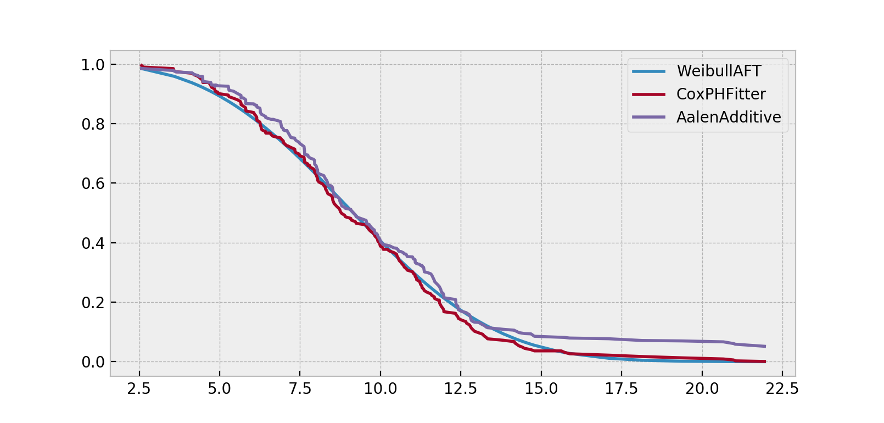
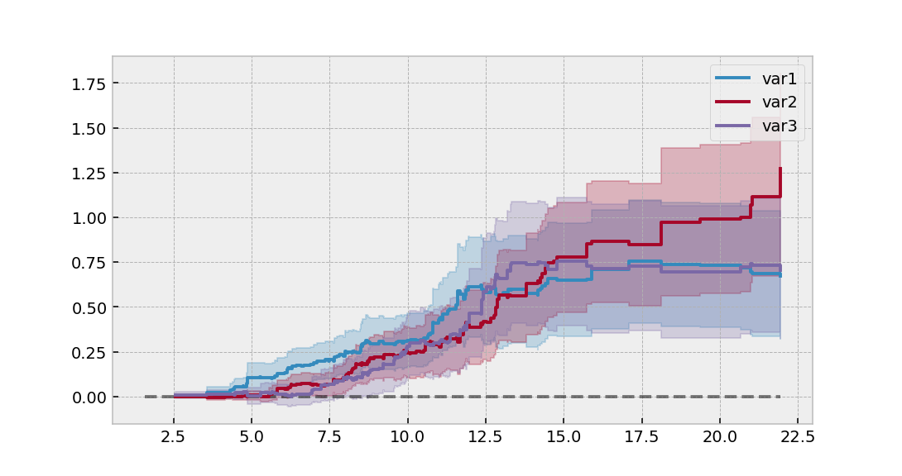

.. _code_directive:

.. image:: http://i.imgur.com/EOowdSD.png

-------------------------------------

Quickstart
''''''''''

Installation
------------

Install via ``pip`` (see `its documentation <https://pip.pypa.io/en/stable/installing>`_ if it is not yet installed on your system):

.. code:: 

    pip install lifelines 

Kaplan-Meier and Nelson-Aalen
-----------------------------

Let's start by importing some data. We need the durations that individuals are observed for, and whether they "died" or not. 

.. code:: python

    from lifelines.datasets import load_waltons
    df = load_waltons() # returns a Pandas DataFrame

    print(df.head())
    """
        T  E    group
    0   6  1  miR-137
    1  13  1  miR-137
    2  13  1  miR-137
    3  13  1  miR-137
    4  19  1  miR-137
    """

    T = df['T']
    E = df['E']

``T`` is an array of durations, ``E`` is a either boolean or binary array representing whether the "death" was observed (alternatively an individual can be censored). 

.. note:: By default, *lifelines* assumes all "deaths" are observed. 

.. code:: python

    from lifelines import KaplanMeierFitter
    kmf = KaplanMeierFitter()
    kmf.fit(T, event_observed=E)  # or, more succiently, kmf.fit(T, E)

After calling the ``fit`` method, we have access to new properties like ``survival_function_`` and methods like ``plot()``. The latter is a wrapper around Panda's internal plotting library. 

.. code:: python
    
    kmf.survival_function_
    kmf.median_
    kmf.plot()

.. image:: images/quickstart_kmf.png

Multiple groups
^^^^^^^^^^^^^^^

.. code:: python
    
    groups = df['group']
    ix = (groups == 'miR-137')

    kmf.fit(T[~ix], E[~ix], label='control')
    ax = kmf.plot()

    kmf.fit(T[ix], E[ix], label='miR-137')
    kmf.plot(ax=ax)

.. image:: images/quickstart_multi.png   

Similar functionality exists for the ``NelsonAalenFitter``:

.. code:: python

    from lifelines import NelsonAalenFitter
    naf = NelsonAalenFitter()
    naf.fit(T, event_observed=E)

but instead of a ``survival_function_`` being exposed, a ``cumulative_hazard_`` is. 

.. note:: Similar to `Scikit-Learn <http://scikit-learn.org>`_, all statistically estimated quantities append an underscore to the property name. 

Getting Data in The Right Format
--------------------------------

Often you'll have data that looks like:

*start_time*, *end_time*

Lifelines has some utility functions to transform this dataset into duration and censorship vectors:

.. code:: python
    
    from lifelines.utils import datetimes_to_durations

    # start_times is a vector of datetime objects
    # end_times is a vector of (possibly missing) datetime objects. 
    T, E = datetimes_to_durations(start_times, end_times, freq='h')

Alternatively, perhaps you are interested in viewing the survival table given some durations and censorship vectors.

.. code:: python
    
    from lifelines.utils import survival_table_from_events

    table = survival_table_from_events(T, E)
    print(table.head())

    """
              removed  observed  censored  entrance  at_risk
    event_at
    0               0         0         0       163      163
    6               1         1         0         0      163
    7               2         1         1         0      162
    9               3         3         0         0      160
    13              3         3         0         0      157
    """

Survival Regression
-------------------

While the above ``KaplanMeierFitter`` and ``NelsonAalenFitter`` are useful, they only give us an "average" view of the population. Often we have specific data at the individual level, either continuous or categorical, that we would like to use. For this, we turn to **survival regression**, specifically ``AalenAdditiveFitter`` and ``CoxPHFitter``.

.. code:: python
    
    from lifelines.datasets import load_regression_dataset
    regression_dataset = load_regression_dataset()

    regression_dataset.head()

The input of the ``fit`` method's API in a regression is different. All the data, including durations, censorships and covariates must be contained in **a Pandas DataFrame** (yes, it must be a DataFrame). The duration column and event occured column must be specified in the call to ``fit``. 

.. code:: python
    
    from lifelines import CoxPHFitter

    # Using Cox Proportional Hazards model
    cph = CoxPHFitter()
    cph.fit(regression_dataset, 'T', event_col='E')
    cph.print_summary()

    """
    n=200, number of events=189

           coef  exp(coef)  se(coef)      z      p  lower 0.95  upper 0.95
    var1 0.2213     1.2477    0.0743 2.9796 0.0029      0.0757      0.3669  **
    var2 0.0509     1.0522    0.0829 0.6139 0.5393     -0.1116      0.2134
    var3 0.2186     1.2443    0.0758 2.8836 0.0039      0.0700      0.3672  **
    ---
    Signif. codes:  0 '***' 0.001 '**' 0.01 '*' 0.05 '.' 0.1 ' ' 1

    Concordance = 0.580
    """

    cph.plot()

.. image:: http://i.imgur.com/ko1tzcCl.png

If we focus on Aalen's Additive model, 

.. code:: python

    # Using Aalen's Additive model
    from lifelines import AalenAdditiveFitter
    aaf = AalenAdditiveFitter(fit_intercept=False)
    aaf.fit(regression_dataset, 'T', event_col='E')

Like ``CoxPHFitter``, after fitting you'll have access to properties like ``cumulative_hazards_`` and methods like ``plot``, ``predict_cumulative_hazards``, and ``predict_survival_function``. The latter two methods require an additional argument of individual covariates:

.. code:: python
    
    X = regression_dataset.drop(['E', 'T'], axis=1)
    aaf.predict_survival_function(X.iloc[10:12]).plot()  # get the unique survival functions of two subjects 

Like the above estimators, there is also a built-in plotting method:

.. code:: python

    aaf.plot()

