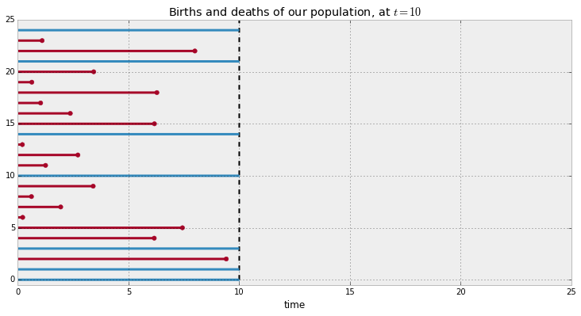

Introduction to Survival Analysis
'''''''''''''''''''''''''''''''''

Applications
--------------------------------

Traditionally, survival analysis was developed to measure lifespans of
individuals. An actuary or health professional would ask questions like
"how long does this population live for?", and answer it using survival analysis. For example, the
population may be a nation's population (for actuaries), or a population
sticken by a disease (in the medical professional's case).
Traditionally, sort of a morbid subject.

The anaylsis can be further applied to not just traditional *births and
deaths*, but any duration. Medical professional might be interested in
the *time between childbirths*, where a birth in this case is the event
of having a child , and a death is becoming pregnant again! (obviously,
we are loose with our definitions of *birth and death*) Another example
is users subscribing to a service: a birth is a user who joins the
service, and a death is when the user leaves the service.

Censorship
--------------------------------

At the time you want to make inferences about durations, it is possible, likely
true, that not all the death events have occured yet. For example, a
medical professional will not wait 50 years for each individual in the
study to pass away before investigating -- he or she is interested in
the effectiveness of improving lifetimes after only a few years, or months possibly.

The individuals in a population who have not been subject to the death
event are labeled as *right-censored*, i.e. we did not (or can not) view the rest of their life history 
due to some external circumstances. All the information we have on
these individuals are their current lifetime durations (which is
naturally *less* than their actual lifetimes).

.. note:: There is also left-censorship, where an individuals birth event is not seen.

A common mistake data analysts make is  choosing to ignore the
right-censored individuals. We'll shall see why this is a mistake next:

Consider a case where the population is actually made up of two
subpopulations, :math:`A` and :math:`B`. Population :math:`A` has a very
small lifespan, say 2 months on average, and population :math:`B`
enjoys a much large lifespan, say 12 months on average. We might
 not know this distinction before hand. At :math:`t=10`, we
wish to investigate the average lifespan. Below is an example of such a
situation.

.. code:: python

    
    from lifelines.plotting import plot_lifetimes
    from numpy.random import uniform, exponential
    
    N = 25
    current_time = 10
    actual_lifetimes = np.array([[exponential(12), exponential(2)][uniform()<0.5] for i in range(N)])
    observed_lifetimes = np.minimum(actual_lifetimes,current_time)
    observed= actual_lifetimes < current_time
    
    plt.xlim(0,25)
    plt.vlines(10,0,30,lw=2, linestyles="--")
    plt.xlabel('time')
    plt.title('Births and deaths of our population, at $t=10$')
    plot_lifetimes(observed_lifetimes, event_observed=observed)
    print "Observed lifetimes at time %d:\n"%(current_time), observed_lifetimes

.. parsed-literal::

    Observed lifetimes at time 10:
    [ 10.     1.1    8.    10.     3.43   0.63   6.28   1.03   2.37   6.17  10.
       0.21   2.71   1.25  10.     3.4    0.62   1.94   0.22   7.43   6.16  10.
       9.41  10.    10.  ]

The red lines denote the lifespan of individuals where the death event
has been observed, and the blue lines denote the lifespan of the
right-censored individuals (deaths have not been observed). If we are
asked to estimate the average lifetime of our population, and we naivly
decided to *not* included the right-censored individuals, it is clear
that we would be serverly underestimating the true average lifespan.

Furthermore, if we instead simply took the mean of *all* observed
lifespans, including the current lifespans of right-censored instances,
we would *still* be underestimating the true average lifespan. Below we
plot the actual lifetimes of all instances (recall we do not see this
information at :math:`t=10`).

.. code:: python

    plt.xlim(0,25)
    plt.vlines(10,0,30,lw=2,linestyles="--")
    plot_lifetimes(actual_lifetimes, event_observed=observed)

.. image:: Survival Analysis intro_files/Survival Analysis intro_6_0.png

Survival analysis was originally developed to solve this type of
problem, that is, to deal with estimation when our data is
right-censored. Even in the case where all events have been
observed, i.e. no censorship, survival analysis is still a very useful
to understand durations.

The observations need not always start at zero, either. This was done
only for understanding in the above example. Consider the example of
a customer entering a store is a birth: a customer can enter at
any time, and not necessarily at time zero. In survival analysis, durations
are relative: individuals may start at different times. (We actually only need the *duration* of the observation, and not
the necessarily the start and end time.)

We next introduce the two fundamental objects in survival analysis, the
*survival function* and the *hazard function*.

--------------

Survival function
--------------------------------

Let :math:`T` be a (possibly infinite, but always non-negative) random
lifetime taken from the population under study. For example, the
amount of time a couple is married. Or the time it takes a user to enter
a webpage (an infinite time if they never do). The survival function,
:math:`S(t)`, of a population is defined as

.. math::  S(t) = Pr( T > t) 

The huamn language: the survival function defines the probability the death event has not occured yet at time
:math:`t`, or equivalently, the probability of surviving until atleast time
:math:`T`. Note the following properties of the survival function:

1. :math:`0 \le S(t) \le 1`
2. :math:`F_T(t) = 1 - S(t)`, where :math:`F_T(t)` is the CDF of :math:`T`, which implies
3. :math:`S(t)` is a non-increasing function of :math:`t`.

Hazard curve
--------------------------------

We are also interested in the probability of dying in the next instant,
given we haven't expired yet. Mathematically, that is:

.. math::  \lim_{\delta t \rightarrow 0 } \; Pr( t \le T \le t + \delta t | T > t) 

This quantity goes to 0 as :math:`\delta t` shrinks, so we divide this
by the interval :math:`\delta t` (like we might do in calculus). This
defines the hazard function at time :math:`t`, :math:`\lambda(t)`:

.. math:: \lambda(t) =  \lim_{\delta t \rightarrow 0 } \; \frac{Pr( t \le T \le t + \delta t | T > t)}{\delta t} 

It can be shown with quite elementary probability that this is equal to:

.. math:: \lambda(t) = \frac{-S'(t)}{S(t)}

and solving this differential equation (yes, it is a differential
equation), we get:

.. math:: S(t) = \exp\left( -\int_0^t \lambda(z) dz \right)

What I love about the above equation is that it defines **all** survival
functions, and because the hazard function is arbitrary (i.e. there is
no parametric form), the entire function is non-parametric (this allows
for very flexible curves). Notice that we can now speak either about the
survival function, :math:`S(t)`, or the hazard function,
:math:`\lambda(t)`, and we can convert back and forth quite easily. It
also gives us another, albeit less useful, expression for :math:`T`:
Upon differentiation and some algebra, we recover:

.. math:: f_T(t) = \lambda(t)\exp\left( -\int_0^t \lambda(z) dz \right)

Of course, we do not observe the true survival curve of a population. We
must use the observed data to estimate it. We also want to continue to
be non-parametric, that is not assume anything about how the
survival curve looks. The *best* method to recreate the survival
function non-parametrically from the data is known as the Kaplan-Meier
estimate, which brings us to :doc:`estimation using lifelines</Intro to lifelines>`.

.. code:: python

    
