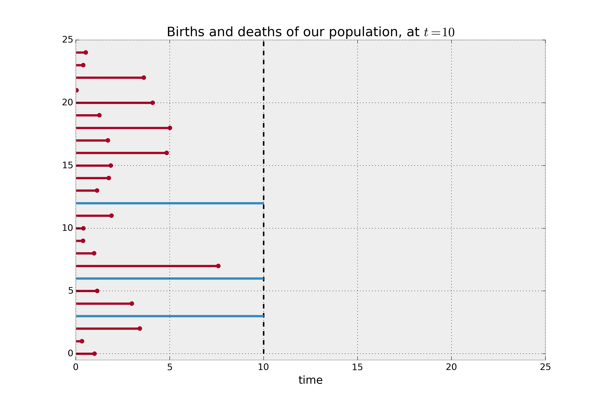
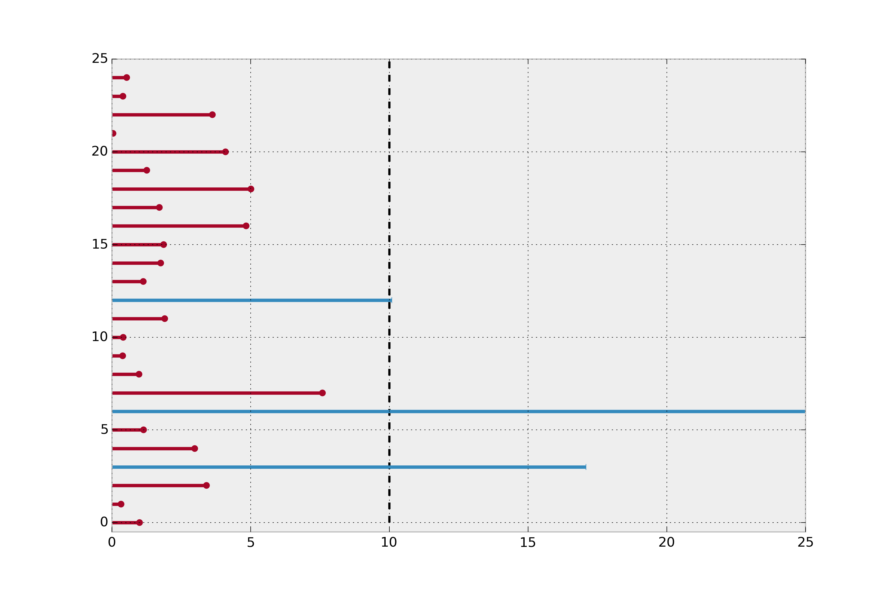
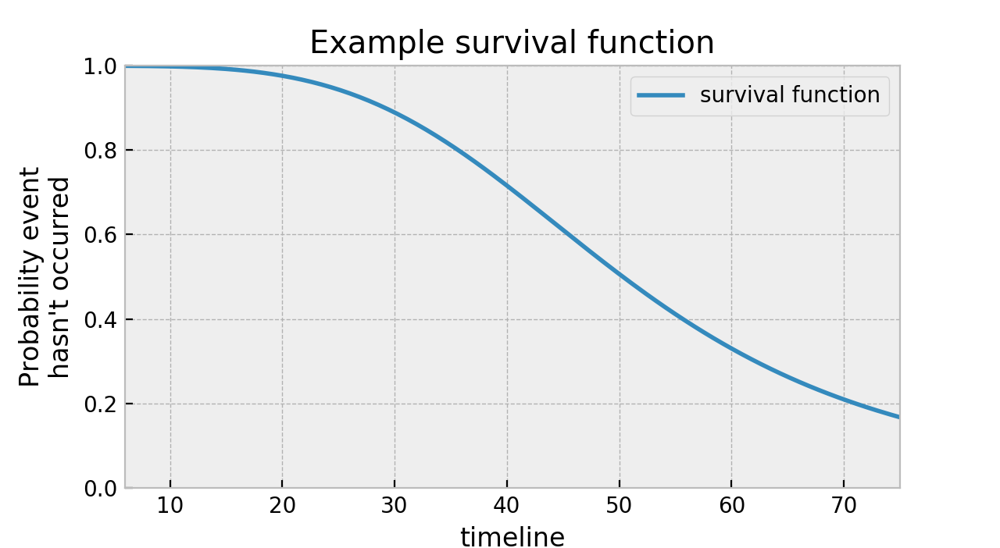
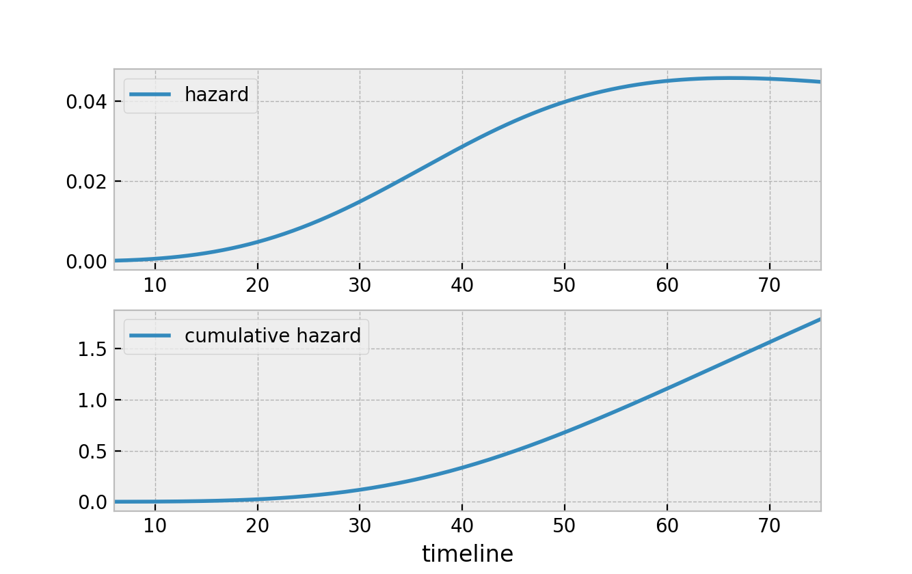

.. image:: https://i.imgur.com/EOowdSD.png

-------------------------------------

Introduction to survival analysis
'''''''''''''''''''''''''''''''''

Applications
------------

Traditionally, survival analysis was developed to measure lifespans of individuals.
An actuary or health professional would ask questions like
"how long does this population live for?", and answer it using survival analysis.
For example, the population may be a nation's population (for actuaries),
or a population stricken by a disease (in the medical professional's case).
Traditionally, sort of a morbid subject.

But survival analysis can be applied to not only *births and
deaths*, but *any* duration. Medical professionals might be interested in
the *time between childbirths*, where a birth in this case is the event
of having a child, and a death is becoming pregnant again! (obviously,
we are loose with our definitions of *birth and death*) Another example
is users subscribing to a service: a birth is a user who joins the
service, and a death is when the user leaves the service.

Censoring
----------

At the time you want to make inferences about durations, it is possible that not all the death events have occurred yet. For example, a
medical professional will not wait 50 years for each individual in the
study to pass away before investigating -- he or she is interested in
making decisions after only a few years, or months possibly.

The individuals in a population who have not been subject to the death
event are labeled as *right-censored*, i.e.,
we did not (or can not) view the rest of their life history
due to some external circumstances. All the information we have on
these individuals are their current lifetime durations (which is
naturally *less* than their actual lifetimes).

.. note:: There is also left-censoring and interval censoring, which are expanded on later.

A common mistake data analysts make is choosing to ignore the
right-censored individuals. We will see why this is a mistake next.

Consider a case where the population is actually made up of two
subpopulations, :math:`A` and :math:`B`. Population :math:`A` has a very
small lifespan, say 2 months on average, and population :math:`B`
enjoys a much larger lifespan, say 12 months on average. We don't
know this distinction beforehand. At :math:`t=10`, we
wish to investigate the average lifespan for the entire population.

In the figure below, the red lines denote the lifespan of individuals where the death event
has been observed, and the blue lines denote the lifespan of the
right-censored individuals (deaths have not been observed). If we are
asked to estimate the average lifetime of our population, and we naively
decided to *not* included the right-censored individuals, it is clear
that we would be severely underestimating the true average lifespan.

.. code:: python

    from lifelines.plotting import plot_lifetimes
    import numpy as np
    from numpy.random import uniform, exponential

    N = 25

    CURRENT_TIME = 10

    actual_lifetimes = np.array([
        exponential(12) if (uniform() < 0.5) else exponential(2) for i in range(N)
    ])
    observed_lifetimes = np.minimum(actual_lifetimes, CURRENT_TIME)
    death_observed = actual_lifetimes < CURRENT_TIME

    ax = plot_lifetimes(observed_lifetimes, event_observed=death_observed)

    ax.set_xlim(0, 25)
    ax.vlines(10, 0, 30, lw=2, linestyles='--')
    ax.set_xlabel("time")
    ax.set_title("Births and deaths of our population, at $t=10$")
    print("Observed lifetimes at time %d:\n" % (CURRENT_TIME), observed_lifetimes)

    Example lifetimes of individuals. We only observe up to time 10, but the blue individuals have not died yet (i.e. they are censored).

.. parsed-literal::

    Observed lifetimes at time 10:
    [10.   1.1   8.   10.  3.43   0.63   6.28   1.03   2.37   6.17  10.
       0.21   2.71   1.25  10.   3.4  0.62   1.94   0.22   7.43   6.16  10.
       9.41  10.  10.]

Furthermore, if we instead simply took the mean of *all*
lifespans, including the current lifespans of right-censored instances,
we would *still* be underestimating the true average lifespan. Below we
plot the actual lifetimes of all instances (recall we do not see this
information at :math:`t=10`).

.. code:: python

    ax = plot_lifetimes(actual_lifetimes, event_observed=death_observed)
    ax.vlines(10, 0, 30, lw=2, linestyles='--')
    ax.set_xlim(0, 25)

    Revealing the actual lifetimes of individuals.

Survival analysis was originally developed to solve this type of
problem, that is, to deal with estimation when our data is
right-censored. However, even in the case where all events have been
observed, i.e. there is no censoring, survival analysis is still a very useful tool
to understand durations and rates.

The observations need not always start at zero, either. This was done
only for understanding in the above example. Consider the example where
a customer entering a store is a birth: a customer can enter at
any time, and not necessarily at time zero. In survival analysis, durations
are relative: individuals may start at different times.
(We actually only need the *duration* of the observation, and not
necessarily the start and end time.)

We next introduce the three fundamental objects in survival analysis, the
*survival function*, *hazard function* and the *cumulative hazard function*.

--------------

Survival function
-----------------

Let :math:`T` be a (possibly infinite, but always non-negative) random
lifetime taken from the population under study. For example, the
amount of time a couple is married. Or the time it takes a user to enter
a webpage (an infinite time if they never do). The survival function -
:math:`S(t)` - of a population is defined as

.. math::  S(t) = Pr(T > t)

Simply, the survival function defines the probability the death event has not occurred yet at time
:math:`t`, or equivalently, the probability of surviving past time
:math:`t`. Note the following properties of the survival function:

1. :math:`0 \le S(t) \le 1`
2. :math:`F_T(t) = 1 - S(t)`, where :math:`F_T(t)` is the CDF of :math:`T`, which implies
3. :math:`S(t)` is a non-increasing function of :math:`t`.

Here's an example of a survival function:

Reading from this graph, we can see that at time 40, about 75% of the population is still alive.

Hazard function
-----------------

We are also interested in the probability of the death event occurring at time :math:`t`,
given that the death event has not occurred yet. Mathematically, that is:

.. math::  \lim_{\delta t \rightarrow 0 } \; Pr( t \le T \le t + \delta t | T > t)

This quantity goes to 0 as :math:`\delta t` shrinks, so we divide this
by the interval :math:`\delta t` (like we might do in calculus). This
defines the hazard function at time :math:`t`, :math:`h(t)`:

.. math:: h(t) =  \lim_{\delta t \rightarrow 0 } \; \frac{Pr( t \le T \le t + \delta t | T > t)}{\delta t}

It can be shown that this is equal to:

.. math:: h(t) = \frac{-S'(t)}{S(t)}

and solving this differential equation (cool, it is a differential
equation!), we get:

.. math:: S(t) = \exp\left( -\int_0^t h(z) \mathrm{d}z \right)

The integral has a more common name: the *cumulative hazard function*, denoted :math:`H(t)`. We can rewrite the above as:

.. math:: S(t) = \exp\left(-H(t) \right)

What I love about the above equation is that it defines **all** survival
functions. Notice that we can now speak either about the
survival function, :math:`S(t)`, the hazard, :math:`h(t)`, or the cumulative hazard function,
:math:`H(t)`, and we can convert back and forth quite easily. Below is a graphic of all the relationships between the quantities.

.. figure:: images/map.png
    :width: 550px
    :figwidth: 600px
    :align: center
    :figclass: align-center

    Map of the mathematical entities used in the survival analysis and the transforms between them.
    Don't panic: *lifelines* does this all for you.

The two figures below represent the hazard and the cumulative hazard of the survival function in the figure above.

Next steps
-----------------

Of course, we do not observe the true survival function of a population. We
must use the observed data to estimate it. There are many ways to estimate the survival function and the hazard functions, which brings us to :doc:`estimation using lifelines</Survival analysis with lifelines>`.
