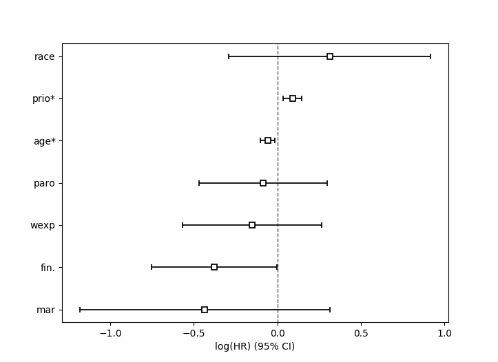
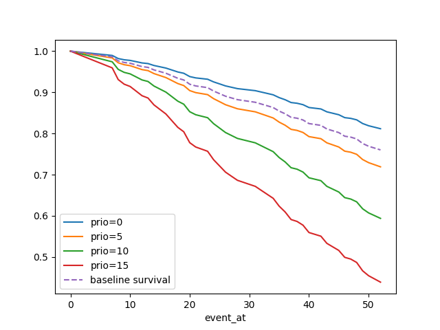
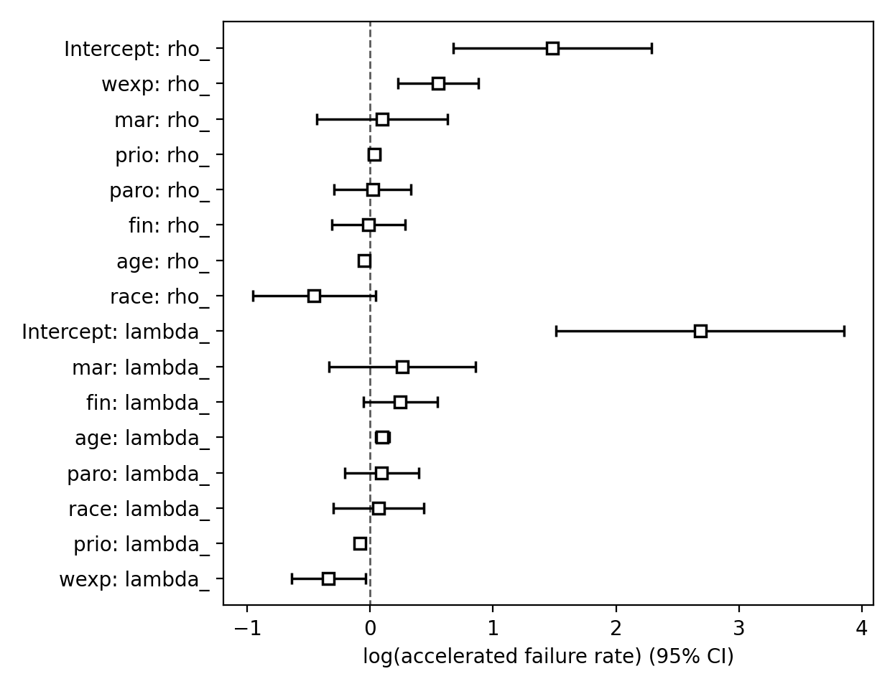
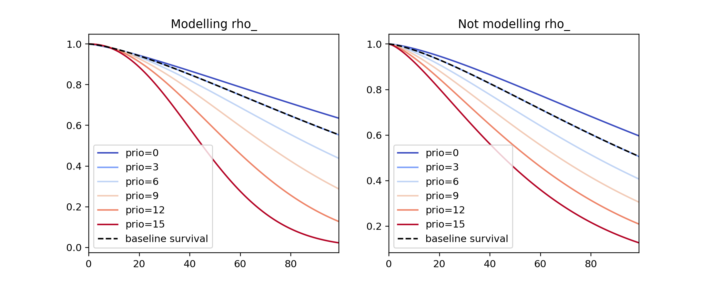
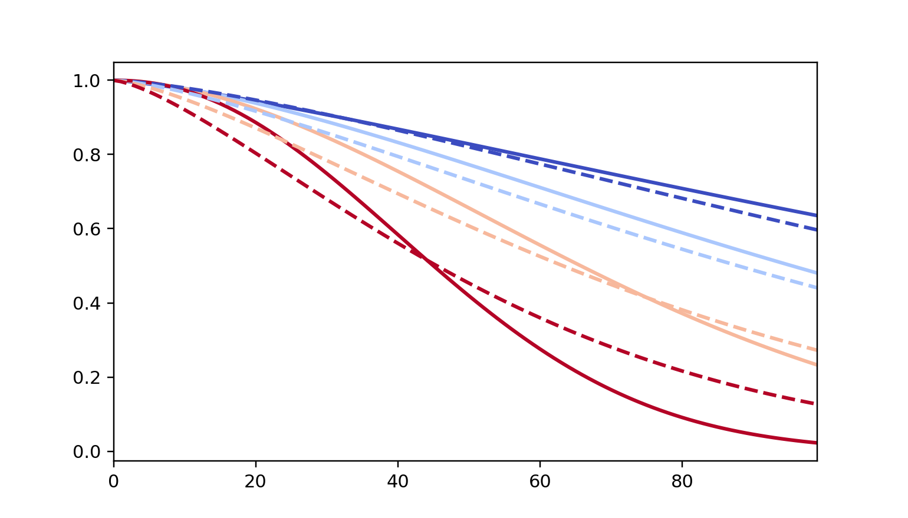
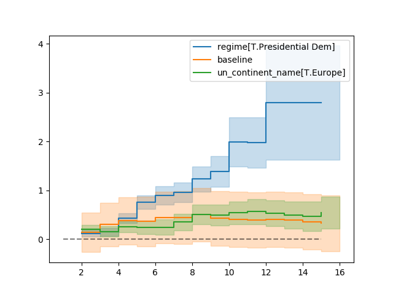
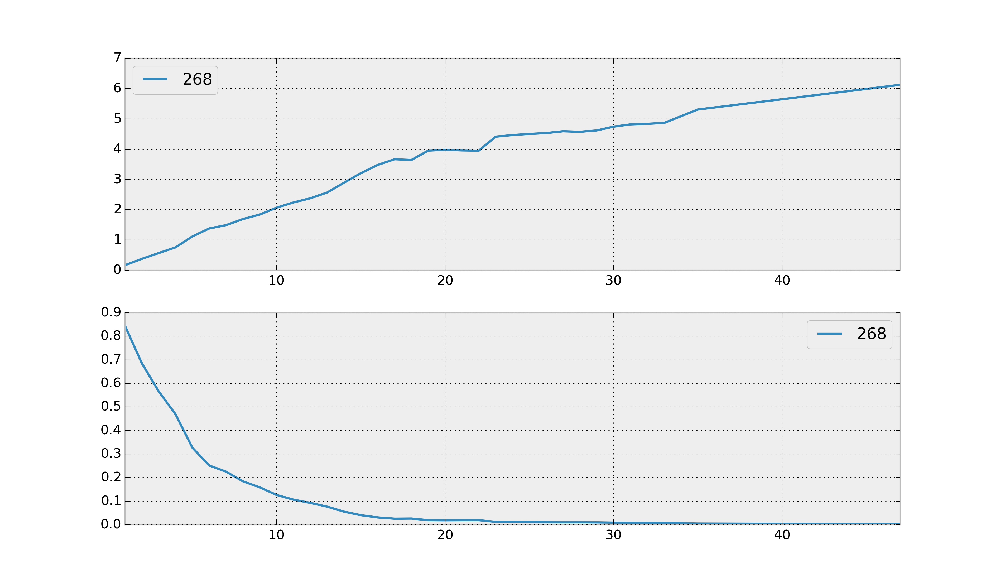
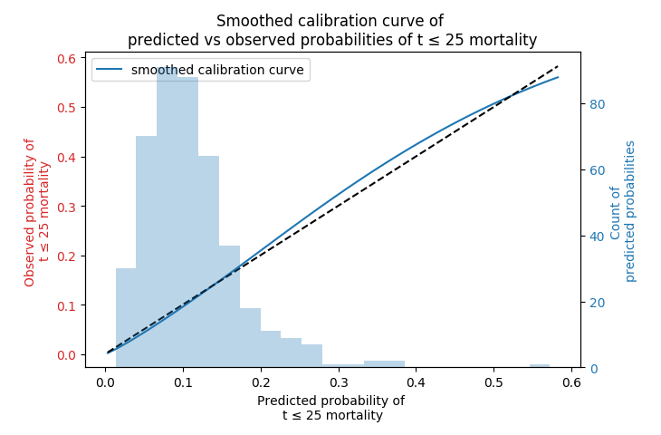

.. image:: https://i.imgur.com/EOowdSD.png

-------------------------------------

Survival regression
#######################

Often we have additional data aside from the duration that we want to use.
The technique is called *survival regression* -- the name implies
we regress covariates (e.g., age, country, etc.) against
another variable -- in this case durations. Similar to the
logic in the first part of this tutorial, we cannot use traditional
methods like linear regression because of censoring.

There are a few popular models in survival regression: Cox's
model, accelerated failure models, and Aalen's additive model. All models attempt to represent the
hazard rate :math:`h(t | x)` as a function of :math:`t` and some covariates :math:`x`. We explore these models next.

The dataset for regression
===========================
The dataset required for survival regression must be in the format of a Pandas DataFrame. Each row of the DataFrame should be an observation. There should be a column denoting the durations of the observations. There may be a column denoting the event status of each observation (1 if event occurred, 0 if censored). There are also the additional covariates you wish to regress against. Optionally, there could be columns in the DataFrame that are used for stratification, weights, and clusters which will be discussed later in this tutorial.

An example dataset we will use is the Rossi recidivism dataset, available in *lifelines* as :meth:`~lifelines.datasets.load_rossi`.

.. code:: python

    from lifelines.datasets import load_rossi

    rossi = load_rossi()

    """
         week  arrest  fin  age  race  wexp  mar  paro  prio
    0      20       1    0   27     1     0    0     1     3
    1      17       1    0   18     1     0    0     1     8
    2      25       1    0   19     0     1    0     1    13
    3      52       0    1   23     1     1    1     1     1
    """

The DataFrame ``rossi`` contains 432 observations. The ``week`` column is the duration, the ``arrest`` column denotes if the event occurred, and the other columns represent variables we wish to regress against.

If you need to first clean or transform your dataset (encode categorical variables, add interaction terms, etc.), that should happen *before* using *lifelines*. Libraries like Pandas and Patsy help with that.

Cox's proportional hazard model
=================================

The idea behind Cox's proportional hazard model model is that the log-hazard of an individual is a linear function of their covariates *and* a population-level baseline hazard that changes over time. Mathematically:

.. math::  \underbrace{h(t | x)}_{\text{hazard}} = \overbrace{b_0(t)}^{\text{baseline hazard}} \underbrace{\exp \overbrace{\left(\sum_{i=1}^n b_i (x_i - \overline{x_i})\right)}^{\text{log-partial hazard}}}_ {\text{partial hazard}}

Note a few facts about this model: the only time component is in the baseline hazard, :math:`b_0(t)`. In the above product, the partial hazard is a time-invariant scalar factor that only increases or decreases the baseline hazard. Thus a changes in covariates will only increase or decrease the baseline hazard.

.. note:: In other regression models, a column of 1s might be added that represents that intercept or baseline. This is not necessary in the Cox model. In fact, there is no intercept in the additive Cox model - the baseline hazard represents this. *lifelines* will will throw warnings and may experience convergence errors if a column of 1s is present in your dataset.

Fitting the regression
-----------------------

The implementation of the Cox model in *lifelines* is under :class:`~lifelines.fitters.coxph_fitter.CoxPHFitter`. We fit the model to the dataset using :meth:`~lifelines.fitters.coxph_fitter.CoxPHFitter.fit`. Like R, it has a :meth:`~lifelines.fitters.coxph_fitter.CoxPHFitter.print_summary` function that prints a tabular view of coefficients and related stats.

.. code:: python

    from lifelines import CoxPHFitter
    from lifelines.datasets import load_rossi

    rossi_dataset = load_rossi()

    cph = CoxPHFitter()
    cph.fit(rossi_dataset, duration_col='week', event_col='arrest')

    cph.print_summary()  # access the results using cph.summary

    """
    <lifelines.CoxPHFitter: fitted with 432 total observations, 318 right-censored observations>
                 duration col = 'week'
                    event col = 'arrest'
       number of observations = 432
    number of events observed = 114
       partial log-likelihood = -658.75
             time fit was run = 2019-10-05 14:24:44 UTC

    ---
           coef  exp(coef)   se(coef)   coef lower 95%   coef upper 95%  exp(coef) lower 95%  exp(coef) upper 95%
    fin   -0.38       0.68       0.19            -0.75            -0.00                 0.47                 1.00
    age   -0.06       0.94       0.02            -0.10            -0.01                 0.90                 0.99
    race   0.31       1.37       0.31            -0.29             0.92                 0.75                 2.50
    wexp  -0.15       0.86       0.21            -0.57             0.27                 0.57                 1.30
    mar   -0.43       0.65       0.38            -1.18             0.31                 0.31                 1.37
    paro  -0.08       0.92       0.20            -0.47             0.30                 0.63                 1.35
    prio   0.09       1.10       0.03             0.04             0.15                 1.04                 1.16

             z      p   -log2(p)
    fin  -1.98   0.05       4.40
    age  -2.61   0.01       6.79
    race  1.02   0.31       1.70
    wexp -0.71   0.48       1.06
    mar  -1.14   0.26       1.97
    paro -0.43   0.66       0.59
    prio  3.19 <0.005       9.48
    ---
    Concordance = 0.64
    Partial AIC = 1331.50
    log-likelihood ratio test = 33.27 on 7 df
    -log2(p) of ll-ratio test = 15.37
    """

To access the coefficients and the baseline hazard directly, you can use :attr:`~lifelines.fitters.coxph_fitter.CoxPHFitter.params_` and :attr:`~lifelines.fitters.coxph_fitter.CoxPHFitter.baseline_hazard_` respectively. Taking a look at these coefficients for a moment, ``prio`` (the number of prior arrests) has a coefficient of about 0.09. Thus, a one unit increase in ``prio`` means the the baseline hazard will increase by a factor of :math:`\exp{(0.09)} = 1.10` - about a 10% increase. Recall, in the Cox proportional hazard model, a higher hazard means more at risk of the event occurring. The value :math:`\exp{(0.09)}` is called the *hazard ratio*, a name that will be clear with another example.

Consider the coefficient of ``mar`` (whether the subject is married or not). The values in the column are binary: 0 or 1, representing either  unmarried or married. The value of the coefficient associated with ``mar``, :math:`\exp{(-.43)}`, is the value of ratio of *hazards* associated with being married, that is:

.. math::

 \exp(-0.43) = \frac{\text{hazard of married subjects at time $t$}}{\text{hazard of unmarried subjects at time $t$}}

Note that left-hand side is a constant (specifically, it's independent of time, :math:`t`), but the right-hand side has two factors that may vary with time. The *proportional hazard assumption* is that relationship is true. That is, hazards can change over time, but their ratio between levels remains a constant. Later we will deal with checking this assumption. However, in reality, it's very common for the hazard ratio to change over the study duration. The hazard ratio then has the interpretation of some sort of weighted average of period-specific hazard ratios. As a result, the hazard ratio may critically depend on the duration of the follow-up.

Convergence
-----------------------

Fitting the Cox model to the data involves using iterative methods. *lifelines* takes extra effort to help with convergence, so please be attentive to any warnings that appear. Fixing any warnings will generally help convergence and decrease the number of iterative steps required. If you wish to see more information during fitting, there is a ``show_progress`` parameter in :meth:`~lifelines.fitters.coxph_fitter.CoxPHFitter.fit` function. For further help, see :ref:`Problems with convergence in the Cox Proportional Hazard Model`.

After fitting, the value of the maximum log-likelihood this available using :attr:`~lifelines.fitters.coxph_fitter.CoxPHFitter.log_likelihood_`. The variance matrix of the coefficients is available under :attr:`~lifelines.fitters.coxph_fitter.CoxPHFitter.variance_matrix_`.

Goodness of fit
-----------------------

After fitting, you may want to know how "good" of a fit your model was to the data. A few methods the author has found useful is to

 - inspect the survival probability calibration plot (see below section on :ref:`Model probability calibration`)
 - look at the concordance-index (see below section on :ref:`Model selection and calibration in survival regression`), available as :attr:`~lifelines.fitters.coxph_fitter.CoxPHFitter.concordance_index_` or in the :meth:`~lifelines.fitters.coxph_fitter.CoxPHFitter.print_summary` as a measure of predictive accuracy.
 - look at the log-likelihood test result in the :meth:`~lifelines.fitters.coxph_fitter.CoxPHFitter.print_summary` or :meth:`~lifelines.fitters.coxph_fitter.CoxPHFitter.log_likelihood_ratio_test`
 - check the proportional hazards assumption with the :meth:`~lifelines.fitters.coxph_fitter.CoxPHFitter.check_assumptions` method. See section later on this page for more details.

Prediction
-----------------------

After fitting, you can use use the suite of prediction methods: :meth:`~lifelines.fitters.coxph_fitter.CoxPHFitter.predict_partial_hazard`, :meth:`~lifelines.fitters.coxph_fitter.CoxPHFitter.predict_survival_function`, and others. See also the section on `Predicting censored subjects below <https://lifelines.readthedocs.io/en/latest/Survival%20Regression.html#prediction-on-censored-subjects>`_

.. code:: python

    X = rossi_dataset

    cph.predict_survival_function(X)
    cph.predict_median(X)
    cph.predict_partial_hazard(X)
    ...

Penalties and sparse regression
-----------------------------------------------

It's possible to add a penalizer term to the Cox regression as well. One can use these to i) stabilize the coefficients, ii) shrink the estimates to 0, iii) encourages a Bayesian viewpoint, and iv) create sparse coefficients. All regression models, including the Cox model, include both an L1 and L2 penalty:

.. math:: \frac{1}{2} \text{penalizer} \left((1-\text{l1\_ratio}) \cdot ||\beta||_2^2 + \text{l1\_ratio} \cdot ||\beta||_1\right)

.. note:: It's not clear from the above, but intercept (when applicable) are not penalized.

To use this in *lifelines*, both the ``penalizer`` and ``l1_ratio`` can be specified in the class creation:

.. code:: python

    from lifelines import CoxPHFitter
    from lifelines.datasets import load_rossi

    rossi = load_rossi()

    cph = CoxPHFitter(penalizer=0.1, l1_ratio=1.0) # sparse solutions,
    cph.fit(rossi, 'week', 'arrest')
    cph.print_summary()

Instead of a float, an *array* can be provided that is the same size as the number of penalized parameters. The values in the array are specific penalty coefficients for each covariate. This is useful for more complicated covariate structure. Some examples:

i) you have lots of confounders you wish to penalizer, but not the main treatment(s).

.. code:: python

    from lifelines import CoxPHFitter
    from lifelines.datasets import load_rossi

    rossi = load_rossi()

    # variable `fin` is the treatment of interest so don't penalize it at all
    penalty = np.array([0, 0.5, 0.5, 0.5, 0.5, 0.5, 0.5])

    cph = CoxPHFitter(penalizer=penalty)
    cph.fit(rossi, 'week', 'arrest')
    cph.print_summary()

ii) you have to `fuse categories together <https://stats.stackexchange.com/questions/146907/principled-way-of-collapsing-categorical-variables-with-many-levels>`_.

Plotting the coefficients
------------------------------

With a fitted model, an alternative way to view the coefficients and their ranges is to use the ``plot`` method.

.. code:: python

    from lifelines.datasets import load_rossi
    from lifelines import CoxPHFitter

    rossi_dataset = load_rossi()
    cph = CoxPHFitter()
    cph.fit(rossi_dataset, duration_col='week', event_col='arrest')

    cph.plot()

Plotting the effect of varying a covariate
-------------------------------------------

After fitting, we can plot what the survival curves look like as we vary a single covariate while
holding everything else equal. This is useful to understand the impact of a covariate, *given the model*. To do this, we use the :meth:`~lifelines.fitters.coxph_fitter.CoxPHFitter.plot_covariate_groups` method and give it the covariate of interest, and the values to display.

.. code:: python

    from lifelines.datasets import load_rossi
    from lifelines import CoxPHFitter

    rossi_dataset = load_rossi()
    cph = CoxPHFitter()
    cph.fit(rossi_dataset, duration_col='week', event_col='arrest')

    cph.plot_covariate_groups(covariates='prio', values=[0, 2, 4, 6, 8, 10], cmap='coolwarm')

The :meth:`~lifelines.fitters.coxph_fitter.CoxPHFitter.plot_covariate_groups` method can accept multiple covariates as well. This is useful for two purposes:

1. There are derivative features in your dataset. For example, suppose you have included ``prio`` and ``prio**2`` in your dataset. It doesn't make sense to just vary ``year`` and leave ``year**2`` fixed. You'll need to specify manually the values the covariates take on in a N-d array or list (where N is the number of covariates being varied.)

.. code:: python

    rossi_dataset['prio**2'] = rossi_dataset['prio'] ** 2

    cph.fit(rossi_dataset, 'week', 'arrest')

    cph.plot_covariate_groups(
        covariates=['prio', 'prio**2'],
        values=[
            [0, 0],
            [1, 1],
            [2, 4],
            [3, 9],
            [8, 64],
        ],
        cmap='coolwarm')

2. This feature is also useful for analyzing categorical variables. In your regression, you may have dummy variables (also called one-hot-encoded variables) in your DataFrame that represent some categorical variable. To simultaneously plot the survival curves of each category, all else being equal, we can use (assuming no reference category)

.. code:: python

    cph.plot_covariate_groups(
        covariates=['d1', 'd2', 'd3', 'd4', 'd5'],
        values=np.eye(5),
        plot_baseline=False)

The reason why we use ``np.eye`` is because we want each row of the matrix to "turn on" one category and "turn off" the others.

If there is a reference category, say `"d0"`, we can add another row to our values matrix that is all zeros, denoting all other columns are turned off (and by default `"d0"` is turned on):

.. code:: python

    import numpy as np

    cph.plot_covariate_groups(
        covariates=['d1', 'd2', 'd3', 'd4', 'd5'],
        values=np.append(np.eye(5), np.zeros((5, 1)), axis=1),
        plot_baseline=False)

Checking the proportional hazards assumption
-----------------------------------------------

To make proper inferences, we should ask if our Cox model is appropriate for our dataset. Recall from above that when using the Cox model, we are implicitly applying the proportional hazard assumption. We should ask, does our dataset obey this assumption?

:class:`~lifelines.fitters.coxph_fitter.CoxPHFitter` has a :meth:`~lifelines.fitters.coxph_fitter.CoxPHFitter.check_assumptions` method that will output violations of the proportional hazard assumption. For a tutorial on how to fix violations, see `Testing the Proportional Hazard Assumptions`_. Suggestions are to look for ways to *stratify* a column (see docs below), or use a `time varying model`_.

.. note:: Checking assumptions like this is only necessary if your goal is inference or correlation. That is, you wish to understand the influence of a covariate on the survival duration & outcome. If your goal is prediction, checking model assumptions is less important since your goal is to maximize an accuracy metric, and not learn about *how* the model is making that prediction.

Stratification
-----------------------------------------------

Sometimes one or more covariates may not obey the proportional hazard assumption. In this case, we can allow the covariate(s) to still be including in the model without estimating its effect. This is called stratification. At a high level, think of it as splitting the dataset into *N* smaller datasets, defined by the unique values of the stratifying covariate(s). Each dataset has its own baseline hazard (the non-parametric part of the model), but they all share the regression parameters (the parametric part of the model). Since covariates are the same within each dataset, there is no regression parameter for the covariates stratified on, hence they will not show up in the output. However there will be *N* baseline hazards under :attr:`~lifelines.fitters.coxph_fitter.CoxPHFitter.baseline_cumulative_hazard_`.

To specify variables to be used in stratification, we define them in the call to :meth:`~lifelines.fitters.coxph_fitter.CoxPHFitter.fit`:

.. code:: python

    from lifelines.datasets import load_rossi
    from lifelines import CoxPHFitter
    rossi_dataset = load_rossi()

    cph = CoxPHFitter()
    cph.fit(rossi_dataset, 'week', event_col='arrest', strata=['race'])
    cph.print_summary()

    """
    <lifelines.CoxPHFitter: fitted with 432 total observations, 318 right-censored observations>
                 duration col = 'week'
                    event col = 'arrest'
                       strata = ['race']
          baseline estimation = breslow
       number of observations = 432
    number of events observed = 114
       partial log-likelihood = -620.56
             time fit was run = 2020-07-07 21:44:15 UTC

    ---
           coef  exp(coef)   se(coef)   coef lower 95%   coef upper 95%  exp(coef) lower 95%  exp(coef) upper 95%
    fin   -0.38       0.68       0.19            -0.75            -0.00                 0.47                 1.00
    age   -0.06       0.94       0.02            -0.10            -0.01                 0.90                 0.99
    wexp  -0.14       0.87       0.21            -0.56             0.27                 0.57                 1.32
    mar   -0.44       0.64       0.38            -1.19             0.31                 0.30                 1.36
    paro  -0.09       0.92       0.20            -0.47             0.30                 0.63                 1.35
    prio   0.09       1.10       0.03             0.04             0.15                 1.04                 1.16

             z      p   -log2(p)
    fin  -1.98   0.05       4.39
    age  -2.62   0.01       6.83
    wexp -0.67   0.50       0.99
    mar  -1.15   0.25       2.00
    paro -0.44   0.66       0.60
    prio  3.21 <0.005       9.56
    ---
    Concordance = 0.63
    Partial AIC = 1253.13
    log-likelihood ratio test = 32.73 on 6 df
    -log2(p) of ll-ratio test = 16.37
    """

    cph.baseline_cumulative_hazard_.shape
    # (49, 2)

Weights & robust errors
-----------------------------------------------

Observations can come with weights, as well. These weights may be integer values representing some commonly occurring observation, or they may be float values representing some sampling weights (ex: inverse probability weights). In the :meth:`~lifelines.fitters.coxph_fitter.CoxPHFitter.fit` method, an kwarg is present for specifying which column in the DataFrame should be used as weights, ex: ``CoxPHFitter(df, 'T', 'E', weights_col='weights')``.

When using sampling weights, it's correct to also change the standard error calculations. That is done by turning on the ``robust`` flag in :meth:`~lifelines.fitters.coxph_fitter.CoxPHFitter.fit`. Internally, :class:`~lifelines.fitters.coxph_fitter.CoxPHFitter` will use the sandwich estimator to compute the errors.

.. code:: python

    import pandas as pd
    from lifelines import CoxPHFitter

    df = pd.DataFrame({
        'T': [5, 3, 9, 8, 7, 4, 4, 3, 2, 5, 6, 7],
        'E': [1, 1, 1, 1, 1, 1, 0, 0, 1, 1, 1, 0],
        'weights': [1.1, 0.5, 2.0, 1.6, 1.2, 4.3, 1.4, 4.5, 3.0, 3.2, 0.4, 6.2],
        'month': [10, 3, 9, 8, 7, 4, 4, 3, 2, 5, 6, 7],
        'age': [4, 3, 9, 8, 7, 4, 4, 3, 2, 5, 6, 7],
    })

    cph = CoxPHFitter()
    cph.fit(df, 'T', 'E', weights_col='weights', robust=True)
    cph.print_summary()

See more examples in _`Adding weights to observations in a Cox model`.

Clusters & correlations
-----------------------------------------------

Another property your dataset may have is groups of related subjects. This could be caused by:

 - a single individual having multiple occurrences, and hence showing up in the dataset more than once.
 - subjects that share some common property, like members of the same family or being matched on propensity scores.

We call these grouped subjects "clusters", and assume they are designated by some column in the DataFrame (example below). When using cluster, the point estimates of the model don't change, but the standard errors will increase. An intuitive argument for this is that 100 observations on 100 individuals provide more information than 100 observations on 10 individuals (or clusters).

.. code:: python

    from lifelines import CoxPHFitter

    df = pd.DataFrame({
        'T': [5, 3, 9, 8, 7, 4, 4, 3, 2, 5, 6, 7],
        'E': [1, 1, 1, 1, 1, 1, 0, 0, 1, 1, 1, 0],
        'month': [10, 3, 9, 8, 7, 4, 4, 3, 2, 5, 6, 7],
        'age': [4, 3, 9, 8, 7, 4, 4, 3, 2, 5, 6, 7],
        'id': [1, 1, 1, 1, 2, 3, 3, 4, 4, 5, 6, 7]
    })

    cph = CoxPHFitter()
    cph.fit(df, 'T', 'E', cluster_col='id')
    cph.print_summary()

For more examples, see _`Correlations between subjects in a Cox model`.

Residuals
-----------------------------------------------

After fitting a Cox model, we can look back and compute important model residuals. These residuals can tell us about non-linearities not captured, violations of proportional hazards, and help us answer other useful modeling questions. See `Assessing Cox model fit using residuals`_.

Modeling baseline hazard and survival with splines
-----------------------------------------------------

Normally, the Cox model is *semi-parametric*, which means that its baseline hazard, :math:`h_0(t)`, has no parametric form. This is the default for *lifelines*. However, it is sometimes valuable to produce a parametric baseline instead. There is an option to create a parametric baseline with cubic splines:

.. code:: python

    from lifelines.datasets import load_rossi
    from lifelines import CoxPHFitter

    rossi_dataset = load_rossi()

    cph = CoxPHFitter(baseline_estimation_method="spline", n_baseline_knots=3)
    cph.fit(rossi_dataset, 'week', event_col='arrest')

To access the baseline hazard and baseline survival, one can use :attr:`~lifelines.fitters.coxph_fitter.CoxPHFitter.baseline_hazard_` and :attr:`~lifelines.fitters.coxph_fitter.CoxPHFitter.baseline_survival_` respectively. One nice thing about parametric models is we can interpolate baseline survival / hazards  too, see :meth:`~lifelines.fitters.coxph_fitter.CoxPHFitter.baseline_hazard_at_times` and :meth:`~lifelines.fitters.coxph_fitter.CoxPHFitter.baseline_survival_at_times`

Parametric survival models
==================================

Accelerated failure time models
-----------------------------------------------

Suppose we have two populations, A and B, with different survival functions, :math:`S_A(t)` and :math:`S_B(t)`, and they are related by some *accelerated failure rate*, :math:`\lambda`:

.. math::
    S_A(t) = S_B\left(\frac{t}{\lambda}\right)

This can be interpreted as slowing down or speeding up moving along the survival function. A classic example of this is that dogs age at 7 times the rate of humans, i.e. :math:`\lambda = \frac{1}{7}`. This model has some other nice properties: the average survival time of population B is :math:`{\lambda}` times the average survival time of population A. Likewise with the *median* survival time.

More generally, we can model the :math:`\lambda` as a function of covariates available, that is:

.. math::
    S_A(t) = S_B\left(\frac{t}{\lambda(x)}\right)\\
    \lambda(x) = \exp\left(b_0 + \sum_{i=1}^n b_i x_i \right)

This model can accelerate or decelerate failure times depending on subjects' covariates. Another nice feature of this is the ease of interpretation of the coefficients: a unit increase in :math:`x_i` means the average/median survival time changes by a factor of :math:`\exp(b_i)`.

.. note:: An important note on interpretation: Suppose :math:`b_i` was positive, then the factor :math:`\exp(b_i)` is greater than 1, which will decelerate the event time since we divide time by the factor ⇿ increase mean/median survival. Hence, it will be a *protective effect*. Likewise, a negative :math:`b_i` will hasten the event time ⇿ reduce the mean/median survival time. This interpretation is *opposite* of how the sign influences event times in the Cox model! This is standard survival analysis convention.

Next, we pick a parametric form for the survival function, :math:`S(t)`. The most common is the Weibull form. So if we assume the relationship above and a Weibull form, our hazard function is quite easy to write down:

.. math::
    H(t; x) = \left( \frac{t}{\lambda(x)} \right)^\rho

We call these accelerated failure time models, shortened often to just AFT models. Using *lifelines*, we can fit this model (and the unknown :math:`\rho` parameter too).

The Weibull AFT model
-----------------------------------------------

The Weibull AFT model is implemented under :class:`~lifelines.fitters.weibull_aft_fitter.WeibullAFTFitter`. The API for the class is similar to the other regression models in *lifelines*. After fitting, the coefficients can be accessed using :attr:`~lifelines.fitters.weibull_aft_fitter.WeibullAFTFitter.params_` or :attr:`~lifelines.fitters.weibull_aft_fitter.WeibullAFTFitter.summary`, or alternatively printed using :meth:`~lifelines.fitters.weibull_aft_fitter.WeibullAFTFitter.print_summary`.

.. code:: python

    from lifelines import WeibullAFTFitter
    from lifelines.datasets import load_rossi

    rossi_dataset = load_rossi()

    aft = WeibullAFTFitter()
    aft.fit(rossi_dataset, duration_col='week', event_col='arrest')

    aft.print_summary(3)  # access the results using aft.summary

    """
    <lifelines.WeibullAFTFitter: fitted with 432 observations, 318 censored>
          duration col = 'week'
             event col = 'arrest'
    number of subjects = 432
      number of events = 114
        log-likelihood = -679.917
      time fit was run = 2019-02-20 17:47:19 UTC

    ---
                         coef  exp(coef)  se(coef)      z       p  -log2(p)  lower 0.95  upper 0.95
    lambda_ fin         0.272      1.313     0.138  1.973   0.049     4.365       0.002       0.543
            age         0.041      1.042     0.016  2.544   0.011     6.512       0.009       0.072
            race       -0.225      0.799     0.220 -1.021   0.307     1.703      -0.656       0.207
            wexp        0.107      1.112     0.152  0.703   0.482     1.053      -0.190       0.404
            mar         0.311      1.365     0.273  1.139   0.255     1.973      -0.224       0.847
            paro        0.059      1.061     0.140  0.421   0.674     0.570      -0.215       0.333
            prio       -0.066      0.936     0.021 -3.143   0.002     9.224      -0.107      -0.025
            _intercept  3.990     54.062     0.419  9.521 <0.0005    68.979       3.169       4.812
    rho_    _intercept  0.339      1.404     0.089  3.809 <0.0005    12.808       0.165       0.514
    ---
    Concordance = 0.640
    AIC = 1377.833
    log-likelihood ratio test = 33.416 on 7 df
    -log2(p) of ll-ratio test = 15.462
    """

From above, we can see that ``prio``, which is the number of previous incarcerations, has a large negative coefficient. This means that each addition incarcerations changes a subject's mean/median survival time by :math:`\exp(-0.066) = 0.936`, approximately a 7% decrease in mean/median survival time. What is the mean/median survival time?

.. code:: python

    print(aft.median_survival_time_)
    print(aft.mean_survival_time_)

    # 100.325
    # 118.67

What does the ``rho_    _intercept`` row mean in the above table? Internally, we model the log of the ``rho_`` parameter, so the value of :math:`\rho` is the exponential of the value, so in case above it's :math:`\hat{\rho} = \exp0.339 = 1.404`. This brings us to the next point - modelling :math:`\rho` with covariates as well:

Modeling ancillary parameters
-----------------------------------------------

In the above model, we left the parameter :math:`\rho` as a single unknown. We can also choose to model this parameter as well. Why might we want to do this? It can help in survival prediction to allow heterogeneity in the :math:`\rho` parameter. The model is no longer an AFT model, but we can still recover and understand the influence of changing a covariate by looking at its outcome plot (see section below). To model :math:`\rho`, we use the ``ancillary_df`` keyword argument in the call to :meth:`~lifelines.fitters.weibull_aft_fitter.WeibullAFTFitter.fit`. There are four valid options:

1. ``False`` or ``None``: explicitly do not model the ``rho_`` parameter (except for its intercept).
2. a Pandas DataFrame. This option will use the columns in the Pandas DataFrame as the covariates in the regression for ``rho_``. This DataFrame could be a equal to, or a subset of, the original dataset using for modeling ``lambda_``, or it could be a totally different dataset.
3. ``True``. Passing in ``True`` will internally reuse the dataset that is being used to model ``lambda_``.

.. code:: python

    aft = WeibullAFTFitter()

    aft.fit(rossi, duration_col='week', event_col='arrest', ancillary_df=False)
    # identical to aft.fit(rossi, duration_col='week', event_col='arrest', ancillary_df=None)

    aft.fit(rossi, duration_col='week', event_col='arrest', ancillary_df=some_df)

    aft.fit(rossi, duration_col='week', event_col='arrest', ancillary_df=True)
    # identical to aft.fit(rossi, duration_col='week', event_col='arrest', ancillary_df=rossi)

    aft.print_summary()

    """
    <lifelines.WeibullAFTFitter: fitted with 432 observations, 318 censored>
          duration col = 'week'
             event col = 'arrest'
    number of subjects = 432
      number of events = 114
        log-likelihood = -669.40
      time fit was run = 2019-02-20 17:42:55 UTC

    ---
                        coef  exp(coef)  se(coef)     z      p  -log2(p)  lower 0.95  upper 0.95
    lambda_ fin         0.24       1.28      0.15  1.60   0.11      3.18       -0.06        0.55
            age         0.10       1.10      0.03  3.43 <0.005     10.69        0.04        0.16
            race        0.07       1.07      0.19  0.36   0.72      0.48       -0.30        0.44
            wexp       -0.34       0.71      0.15 -2.22   0.03      5.26       -0.64       -0.04
            mar         0.26       1.30      0.30  0.86   0.39      1.35       -0.33        0.85
            paro        0.09       1.10      0.15  0.61   0.54      0.88       -0.21        0.39
            prio       -0.08       0.92      0.02 -4.24 <0.005     15.46       -0.12       -0.04
            _intercept  2.68      14.65      0.60  4.50 <0.005     17.14        1.51        3.85
    rho_    fin        -0.01       0.99      0.15 -0.09   0.92      0.11       -0.31        0.29
            age        -0.05       0.95      0.02 -3.10 <0.005      9.01       -0.08       -0.02
            race       -0.46       0.63      0.25 -1.79   0.07      3.77       -0.95        0.04
            wexp        0.56       1.74      0.17  3.32 <0.005     10.13        0.23        0.88
            mar         0.10       1.10      0.27  0.36   0.72      0.47       -0.44        0.63
            paro        0.02       1.02      0.16  0.12   0.90      0.15       -0.29        0.33
            prio        0.03       1.03      0.02  1.44   0.15      2.73       -0.01        0.08
            _intercept  1.48       4.41      0.41  3.60 <0.005     11.62        0.68        2.29
    ---
    Concordance = 0.63
    Log-likelihood ratio test = 54.45 on 14 df, -log2(p)=19.83
    """

Plotting
-----------------------------------------------

The plotting API is the same as in :class:`~lifelines.fitters.coxph_fitter.CoxPHFitter`. We can view all covariates in a forest plot:

.. code:: python

    from matplotlib import pyplot as plt

    wft = WeibullAFTFitter().fit(rossi, 'week', 'arrest', ancillary_df=True)
    wft.plot()

We can observe the influence a variable in the model by plotting the *outcome* (i.e. survival) of changing the variable. This is done using :meth:`~lifelines.fitters.weibull_aft_fitter.WeibullAFTFitter.plot_covariate_groups`, and this is also a nice time to observe the effects of modeling ``rho_`` vs keeping it fixed. Below we fit the Weibull model to the same dataset twice, but in the first model we model ``rho_`` and in the second model we don't. We when vary the ``prio`` (which is the number of prior arrests) and observe how the survival changes.

.. code:: python

    fig, ax = plt.subplots(nrows=1, ncols=2, figsize=(10, 4))

    times = np.arange(0, 100)
    wft_model_rho = WeibullAFTFitter().fit(rossi, 'week', 'arrest', ancillary_df=True, timeline=times)
    wft_model_rho.plot_covariate_groups('prio', range(0, 16, 3), cmap='coolwarm', ax=ax[0])
    ax[0].set_title("Modelling rho_")

    wft_not_model_rho = WeibullAFTFitter().fit(rossi, 'week', 'arrest', ancillary_df=False, timeline=times)
    wft_not_model_rho.plot_covariate_groups('prio', range(0, 16, 3), cmap='coolwarm', ax=ax[1])
    ax[1].set_title("Not modelling rho_");

Comparing a few of these survival functions side by side:

.. code:: python

    fig, ax = plt.subplots(nrows=1, ncols=1, figsize=(7, 4))

    wft_model_rho.plot_covariate_groups('prio', range(0, 16, 5), cmap='coolwarm', ax=ax, lw=2, plot_baseline=False)
    wft_not_model_rho.plot_covariate_groups('prio', range(0, 16, 5), cmap='coolwarm', ax=ax, ls='--', lw=2, plot_baseline=False)
    ax.get_legend().remove()

You read more about and see other examples of the extensions to :meth:`~lifelines.fitters.weibull_aft_fitter.WeibullAFTFitter.plot_covariate_groups`

Prediction
-----------------------------------------------

Given a new subject, we ask questions about their future survival? When are they likely to experience the event? What does their survival function look like? The :class:`~lifelines.fitters.weibull_aft_fitter.WeibullAFTFitter` is able to answer these. If we have modeled the ancillary covariates, we are required to include those as well:

.. code:: python

    X = rossi.loc[:10]

    aft.predict_cumulative_hazard(X, ancillary_df=X)
    aft.predict_survival_function(X, ancillary_df=X)
    aft.predict_median(X, ancillary_df=X)
    aft.predict_percentile(X, p=0.9, ancillary_df=X)
    aft.predict_expectation(X, ancillary_df=X)

There are two hyper-parameters that can be used to to achieve a better test score. These are ``penalizer`` and ``l1_ratio`` in the call to :class:`~lifelines.fitters.weibull_aft_fitter.WeibullAFTFitter`. The penalizer is similar to scikit-learn's ``ElasticNet`` model, see their `docs <https://scikit-learn.org/stable/modules/generated/sklearn.linear_model.ElasticNet.html>`_. (However, *lifelines* will also accept an array for custom penalizer per variable, see `Cox docs above <https://lifelines.readthedocs.io/en/latest/Survival%20Regression.html#penalties-and-sparse-regression>`_)

.. code:: python

    aft_with_elastic_penalty = WeibullAFTFitter(penalizer=1e-4, l1_ratio=1.0)
    aft_with_elastic_penalty.fit(rossi, 'week', 'arrest')
    aft_with_elastic_penalty.predict_median(rossi)

    aft_with_elastic_penalty.print_summary()

    """
    <lifelines.WeibullAFTFitter: fitted with 432 observations, 318 censored>
          duration col = 'week'
             event col = 'arrest'
             penalizer = 4.0
              l1_ratio = 1.0
    number of subjects = 432
      number of events = 114
        log-likelihood = -2710.95
      time fit was run = 2019-02-20 19:53:29 UTC

    ---
                        coef  exp(coef)  se(coef)     z      p  -log2(p)  lower 0.95  upper 0.95
    lambda_ fin         0.00       1.00      0.08  0.00   1.00      0.00       -0.15        0.15
            age         0.13       1.14      0.01 12.27 <0.005    112.47        0.11        0.15
            race        0.55       1.73      0.09  5.80 <0.005     27.16        0.36        0.73
            wexp        0.00       1.00      0.09  0.00   1.00      0.00       -0.17        0.17
            mar         0.00       1.00      0.14  0.01   0.99      0.01       -0.27        0.28
            paro        0.00       1.00      0.08  0.01   0.99      0.01       -0.16        0.16
            prio        0.00       1.00      0.01  0.00   1.00      0.00       -0.03        0.03
            _intercept  0.00       1.00      0.19  0.00   1.00      0.00       -0.38        0.38
    rho_    _intercept -0.00       1.00       nan   nan    nan       nan         nan         nan
    ---
    Concordance = 0.64
    AIC = 1377.91
    log-likelihood ratio test = 33.34 on 7 df
    -log2(p) of ll-ratio test = 15.42
    """

The log-normal and log-logistic AFT models
-----------------------------------------------

There are also the :class:`~lifelines.fitters.log_normal_aft_fitter.LogNormalAFTFitter` and :class:`~lifelines.fitters.log_logistic_aft_fitter.LogLogisticAFTFitter` models, which instead of assuming that the survival time distribution is Weibull, we assume it is Log-Normal or Log-Logistic, respectively. They have identical APIs to the :class:`~lifelines.fitters.weibull_aft_fitter.WeibullAFTFitter`, but the parameter names are different.

.. code:: python

    from lifelines import LogLogisticAFTFitter
    from lifelines import LogNormalAFTFitter

    llf = LogLogisticAFTFitter().fit(rossi, 'week', 'arrest')
    lnf = LogNormalAFTFitter().fit(rossi, 'week', 'arrest')

The piecewise-exponential regression and generalized gamma models
-------------------------------------------------------------------------

Another class of parametric models involves more flexible modeling of the hazard function. The :class:`~lifelines.fitters.piecewise_exponential_regression_fitter.PiecewiseExponentialRegressionFitter` can model jumps in the hazard (think: the differences in "survival-of-staying-in-school" between 1st year, 2nd year, 3rd year, and 4th year students), and constant values between jumps. The ability to specify *when* these jumps occur, called breakpoints, offers modelers great flexibility. An example application involving customer churn is available in this `notebook <https://github.com/CamDavidsonPilon/lifelines/blob/master/examples/SaaS%20churn%20and%20piecewise%20regression%20models.ipynb>`_.

For a flexible and *smooth* parametric model, there is the :class:`~lifelines.fitters.generalized_gamma_regression_fitter.GeneralizedGammaRegressionFitter`. This model is actually a generalization of all the AFT models above (that is, specific values of its parameters represent another model ) - see docs for specific parameter values. The API is slightly different however, and looks more like how custom regression models are built (see next section on *Custom Regression Models*).

.. code:: python

    from lifelines import GeneralizedGammaRegressionFitter
    from lifelines.datasets import load_rossi

    df = load_rossi()
    df['constant'] = 1.

    # this will regress df against all 3 parameters
    ggf = GeneralizedGammaRegressionFitter(penalizer=0.1).fit(df, 'week', 'arrest')
    ggf.print_summary()

    # if we only want to regress against the scale parameter, `mu_`
    regressors = {
        'mu_': rossi.columns,
        'sigma_': ['constant'],
        'lambda_': ['constant']
    }

    ggf = GeneralizedGammaRegressionFitter(penalizer=0.1).fit(df, 'week', 'arrest', regressors=regressors)
    ggf.print_summary()

Model selection for parametric models
-----------------------------------------------

Often, you don't know *a priori* which parametric model to use. Each model has some assumptions built-in (not implemented yet in *lifelines*), but a quick and effective method is to compare the log-likelihoods for each fitted model. (Technically, we are comparing the `AIC <https://en.wikipedia.org/wiki/Akaike_information_criterion>`_, but the number of parameters for each model is the same, so we can simply and just look at the log-likelihood). Generally, given the same dataset and number of parameters, a better fitting model has a larger log-likelihood. We can look at the log-likelihood for each fitted model and select the largest one.

.. code:: python

    from lifelines import LogLogisticAFTFitter, WeibullAFTFitter, LogNormalAFTFitter
    from lifelines.datasets import load_rossi

    rossi = load_rossi()

    llf = LogLogisticAFTFitter().fit(rossi, 'week', 'arrest')
    lnf = LogNormalAFTFitter().fit(rossi, 'week', 'arrest')
    wf = WeibullAFTFitter().fit(rossi, 'week', 'arrest')

    print(llf.log_likelihood_)  # -679.938
    print(lnf.log_likelihood_)  # -683.234
    print(wf.log_likelihood_)   # -679.916, slightly the best model.

    # with some heterogeneity in the ancillary parameters
    ancillary_df = rossi[['prio']]
    llf = LogLogisticAFTFitter().fit(rossi, 'week', 'arrest', ancillary_df=ancillary_df)
    lnf = LogNormalAFTFitter().fit(rossi, 'week', 'arrest', ancillary_df=ancillary_df)
    wf = WeibullAFTFitter().fit(rossi, 'week', 'arrest', ancillary_df=ancillary_df)

    print(llf.log_likelihood_) # -678.94, slightly the best model.
    print(lnf.log_likelihood_) # -680.39
    print(wf.log_likelihood_)  # -679.60

Left, right and interval censored data
-----------------------------------------------

The parametric models have APIs that handle left and interval censored data, too. The API for them is different than the API for fitting to right censored data. Here's an example with interval censored data.

.. code:: python

    from lifelines.datasets import load_diabetes

    df = load_diabetes()
    df['gender'] = df['gender'] == 'male'

    print(df.head())
    """
       left  right  gender
    1    24     27    True
    2    22     22   False
    3    37     39    True
    4    20     20    True
    5     1     16    True
    """

    wf = WeibullAFTFitter().fit_interval_censoring(df, lower_bound_col='left', upper_bound_col='right')
    wf.print_summary()

    """
    <lifelines.WeibullAFTFitter: fitted with 731 observations, 136 censored>
             event col = 'E'
    number of subjects = 731
      number of events = 595
        log-likelihood = -2027.20
      time fit was run = 2019-04-11 19:39:42 UTC

    ---
                        coef exp(coef)  se(coef)      z      p  -log2(p)  lower 0.95  upper 0.95
    lambda_ gender      0.05      1.05      0.03   1.66   0.10      3.38       -0.01        0.10
            _intercept  2.91     18.32      0.02 130.15 <0.005       inf        2.86        2.95
    rho_    _intercept  1.04      2.83      0.03  36.91 <0.005    988.46        0.98        1.09
    ---
    Log-likelihood ratio test = 2.74 on 1 df, -log2(p)=3.35
    """

Another example of using lifelines for interval censored data is located `here <https://dataorigami.net/blogs/napkin-folding/counting-and-interval-censoring>`_.

Custom parametric regression models
-------------------------------------

*lifelines* has a very general syntax for creating your own parametric regression models. If you are looking to create your own custom models, see docs `Custom Regression Models`_.

Aalen's additive model
=============================

.. warning:: This implementation is still experimental.

Aalen's Additive model is another regression model we can use. Like the Cox model, it defines
the hazard rate, but instead of the linear model being multiplicative like the Cox model, the Aalen model is
additive. Specifically:

.. math::
    h(t|x)  = b_0(t) + b_1(t) x_1 + ... + b_N(t) x_N

Inference typically does not estimate the individual
:math:`b_i(t)` but instead estimates :math:`\int_0^t b_i(s) \; ds`
(similar to the estimate of the hazard rate using ``NelsonAalenFitter``). This is important
when interpreting plots produced.

For this
exercise, we will use the regime dataset and include the categorical
variables ``un_continent_name`` (eg: Asia, North America,...), the
``regime`` type (e.g., monarchy, civilian,...) and the year the regime
started in, ``start_year``. The estimator to fit unknown coefficients in Aalen's additive model is
located under :class:`~lifelines.fitters.aalen_additive_fitter.AalenAdditiveFitter`.

.. code:: python

    from lifelines import AalenAdditiveFitter
    from lifelines.datasets import load_dd

    data = load_dd()
    data.head()

.. table::

    +-----------+--------+----------+--------------+-----------------+---------------------+---------------------------------------------------------+-------------+-------------+----------+--------+--------+
    | ctryname  |cowcode2|politycode|un_region_name|un_continent_name|        ehead        |                     leaderspellreg                      |  democracy  |   regime    |start_year|duration|observed|
    +===========+========+==========+==============+=================+=====================+=========================================================+=============+=============+==========+========+========+
    |Afghanistan|     700|       700|Southern Asia |Asia             |Mohammad Zahir Shah  |Mohammad Zahir Shah.Afghanistan.1946.1952.Monarchy       |Non-democracy|Monarchy     |      1946|       7|       1|
    +-----------+--------+----------+--------------+-----------------+---------------------+---------------------------------------------------------+-------------+-------------+----------+--------+--------+
    |Afghanistan|     700|       700|Southern Asia |Asia             |Sardar Mohammad Daoud|Sardar Mohammad Daoud.Afghanistan.1953.1962.Civilian Dict|Non-democracy|Civilian Dict|      1953|      10|       1|
    +-----------+--------+----------+--------------+-----------------+---------------------+---------------------------------------------------------+-------------+-------------+----------+--------+--------+
    |Afghanistan|     700|       700|Southern Asia |Asia             |Mohammad Zahir Shah  |Mohammad Zahir Shah.Afghanistan.1963.1972.Monarchy       |Non-democracy|Monarchy     |      1963|      10|       1|
    +-----------+--------+----------+--------------+-----------------+---------------------+---------------------------------------------------------+-------------+-------------+----------+--------+--------+
    |Afghanistan|     700|       700|Southern Asia |Asia             |Sardar Mohammad Daoud|Sardar Mohammad Daoud.Afghanistan.1973.1977.Civilian Dict|Non-democracy|Civilian Dict|      1973|       5|       0|
    +-----------+--------+----------+--------------+-----------------+---------------------+---------------------------------------------------------+-------------+-------------+----------+--------+--------+
    |Afghanistan|     700|       700|Southern Asia |Asia             |Nur Mohammad Taraki  |Nur Mohammad Taraki.Afghanistan.1978.1978.Civilian Dict  |Non-democracy|Civilian Dict|      1978|       1|       0|
    +-----------+--------+----------+--------------+-----------------+---------------------+---------------------------------------------------------+-------------+-------------+----------+--------+--------+

I'm using the lovely library `Patsy <https://github.com/pydata/patsy>`__ here to create a
design matrix from my original DataFrame.

.. code:: python

    import patsy
    X = patsy.dmatrix('un_continent_name + regime + start_year', data, return_type='dataframe')
    X = X.rename(columns={'Intercept': 'baseline'})

    print(X.columns.tolist())

.. parsed-literal::

  ['baseline',
   'un_continent_name[T.Americas]',
   'un_continent_name[T.Asia]',
   'un_continent_name[T.Europe]',
   'un_continent_name[T.Oceania]',
   'regime[T.Military Dict]',
   'regime[T.Mixed Dem]',
   'regime[T.Monarchy]',
   'regime[T.Parliamentary Dem]',
   'regime[T.Presidential Dem]',
   'start_year']

We have also included the ``coef_penalizer`` option. During the estimation, a
linear regression is computed at each step. Often the regression can be
unstable (due to high co-linearity or small sample sizes) -- adding a penalizer term controls the stability. I recommend always starting with a small penalizer term -- if the estimates still appear to be too unstable, try increasing it.

.. code:: python

    aaf = AalenAdditiveFitter(coef_penalizer=1.0, fit_intercept=False)

An instance of :class:`~lifelines.fitters.aalen_additive_fitter.AalenAdditiveFitter`
includes a :meth:`~lifelines.fitters.aalen_additive_fitter.AalenAdditiveFitter.fit` method that performs the inference on the coefficients. This method accepts a pandas DataFrame: each row is an individual and columns are the covariates and
two individual columns: a *duration* column and a boolean *event occurred* column (where event occurred refers to the event of interest - expulsion from government in this case)

.. code:: python

    X['T'] = data['duration']
    X['E'] = data['observed']

.. code:: python

    aaf.fit(X, 'T', event_col='E')

After fitting, the instance exposes a :attr:`~lifelines.fitters.aalen_additive_fitter.AalenAdditiveFitter.cumulative_hazards_` DataFrame
containing the estimates of :math:`\int_0^t b_i(s) \; ds`:

.. code:: python

    aaf.cumulative_hazards_.head()

.. table::

    +--------+-----------------------------+-------------------------+---------------------------+----------------------------+-----------------------+-------------------+------------------+---------------------------+--------------------------+----------+
    |baseline|un_continent_name[T.Americas]|un_continent_name[T.Asia]|un_continent_name[T.Europe]|un_continent_name[T.Oceania]|regime[T.Military Dict]|regime[T.Mixed Dem]|regime[T.Monarchy]|regime[T.Parliamentary Dem]|regime[T.Presidential Dem]|start_year|
    +========+=============================+=========================+===========================+============================+=======================+===================+==================+===========================+==========================+==========+
    |-0.03447|                     -0.03173|                  0.06216|                     0.2058|                   -0.009559|                0.07611|            0.08729|           -0.1362|                    0.04885|                    0.1285|  0.000092|
    +--------+-----------------------------+-------------------------+---------------------------+----------------------------+-----------------------+-------------------+------------------+---------------------------+--------------------------+----------+
    | 0.14278|                     -0.02496|                  0.11122|                     0.2083|                   -0.079042|                0.11704|            0.36254|           -0.2293|                    0.17103|                    0.1238|  0.000044|
    +--------+-----------------------------+-------------------------+---------------------------+----------------------------+-----------------------+-------------------+------------------+---------------------------+--------------------------+----------+
    | 0.30153|                     -0.07212|                  0.10929|                     0.1614|                    0.063030|                0.16553|            0.68693|           -0.2738|                    0.33300|                    0.1499|  0.000004|
    +--------+-----------------------------+-------------------------+---------------------------+----------------------------+-----------------------+-------------------+------------------+---------------------------+--------------------------+----------+
    | 0.37969|                      0.06853|                  0.15162|                     0.2609|                    0.185569|                0.22695|            0.95016|           -0.2961|                    0.37351|                    0.4311| -0.000032|
    +--------+-----------------------------+-------------------------+---------------------------+----------------------------+-----------------------+-------------------+------------------+---------------------------+--------------------------+----------+
    | 0.36749|                      0.20201|                  0.21252|                     0.2429|                    0.188740|                0.25127|            1.15132|           -0.3926|                    0.54952|                    0.7593| -0.000000|
    +--------+-----------------------------+-------------------------+---------------------------+----------------------------+-----------------------+-------------------+------------------+---------------------------+--------------------------+----------+

:class:`~lifelines.fitters.aalen_additive_fitter.AalenAdditiveFitter` also has built in plotting:

.. code:: python

  aaf.plot(columns=['regime[T.Presidential Dem]', 'baseline', 'un_continent_name[T.Europe]'], iloc=slice(1,15))

Regression is most interesting if we use it on data we have not yet
seen, i.e., prediction! We can use what we have learned to predict
individual hazard rates, survival functions, and median survival time.
The dataset we are using is available up until 2008, so let's use this data to
predict the duration of former Canadian
Prime Minister Stephen Harper.

.. code:: python

    ix = (data['ctryname'] == 'Canada') & (data['start_year'] == 2006)
    harper = X.loc[ix]
    print("Harper's unique data point:")
    print(harper)

.. parsed-literal::

    Harper's unique data point:
         baseline  un_continent_name[T.Americas]  un_continent_name[T.Asia] ...  start_year  T  E
    268       1.0                            1.0                        0.0 ...      2006.0  3  0

.. code:: python

    ax = plt.subplot(2,1,1)
    aaf.predict_cumulative_hazard(harper).plot(ax=ax)

    ax = plt.subplot(2,1,2)
    aaf.predict_survival_function(harper).plot(ax=ax);

.. note:: Because of the nature of the model, estimated survival functions of individuals can increase. This is an expected artifact of Aalen's additive model.

Model selection and calibration in survival regression
==========================================================

Parametric vs semi-parametric models
---------------------------------------
Above, we've displayed two *semi-parametric* models (Cox model and Aalen's model), and a family of *parametric* models. Which should you choose? What are the advantages and disadvantages of either? I suggest reading the two following StackExchange answers to get a better idea of what experts think:

1. `In survival analysis, why do we use semi-parametric models (Cox proportional hazards) instead of fully parametric models? <https://stats.stackexchange.com/q/64739/11867>`__
2. `In survival analysis, when should we use fully parametric models over semi-parametric ones? <https://stats.stackexchange.com/q/399544/11867>`__

Model selection based on residuals
-----------------------------------------------

The sections `Testing the Proportional Hazard Assumptions`_ and `Assessing Cox model fit using residuals`_ may be useful for modeling your data better.

.. note:: Work is being done to extend residual methods to all regression models. Stay tuned.

Model selection based on predictive power and fit
---------------------------------------------------

If censoring is present, it's not appropriate to use a loss function like mean-squared-error or
mean-absolute-loss. This is because the difference between a censored value and the predicted value could be
due to poor prediction *or* due to censoring. Below we introduce alternative ways to measure prediction performance.

Out-of-sample validation
****************************

In this author's opinion, the best way to measure predictive performance is evaluating the log-likelihood on out-of-sample data. The log-likelihood correctly handles any type of censoring, and is precisely what we are maximizing in the model training. The in-sample log-likelihood is available under ``log_likelihood_`` of any regression model. For out-of-sample data, the  :meth:`~lifelines.fitters.cox_ph_fitter.CoxPHFitter.score` method (available on all regression models) can be used. This returns the *average evaluation of the out-of-sample log-likelihood*. We want to maximize this.

.. code:: python

    from lifelines import CoxPHFitter
    from lifelines.datasets import load_rossi

    rossi = load_rossi().sample(frac=1.0)
    train_rossi = rossi.iloc[:400]
    test_rossi = rossi.iloc[400:]

    cph_l2 = CoxPHFitter(penalizer=0.1, l1_ratio=0.).fit(train_rossi, 'week', 'arrest')
    cph_l1 = CoxPHFitter(penalizer=0.1, l1_ratio=1.).fit(train_rossi, 'week', 'arrest')

    print(cph_l2.score(test_rossi))
    print(cph_l1.score(test_rossi)) # better model

Within-sample validation
****************************

For within-sample validation, the AIC is a great metric for comparing models as it relies on the log-likelihood. It's available under ``AIC_`` for parametric models, and ``AIC_partial_`` for Cox models (because the Cox model maximizes a *partial* log-likelihood, it can't be reliably compared to parametric model's AIC.)

.. code:: python

    from lifelines import CoxPHFitter
    from lifelines.datasets import load_rossi

    rossi = load_rossi()

    cph_l2 = CoxPHFitter(penalizer=0.1, l1_ratio=0.).fit(rossi, 'week', 'arrest')
    cph_l1 = CoxPHFitter(penalizer=0.1, l1_ratio=1.).fit(rossi, 'week', 'arrest')

    print(cph_l2.AIC_partial_) # lower is better
    print(cph_l1.AIC_partial_)

Another censoring-sensitive measure is the concordance-index, also known as the c-index. This measure
evaluates the accuracy of the *ranking* of predicted time. It is in fact a generalization
of AUC, another common loss function, and is interpreted similarly:

* 0.5 is the expected result from random predictions,
* 1.0 is perfect concordance and,
* 0.0 is perfect anti-concordance (multiply predictions with -1 to get 1.0)

Fitted survival models typically have a concordance index between 0.55 and 0.75 (this may seem bad, but even a perfect model has a lot of noise than can make a high score impossible). In *lifelines*, a fitted model's concordance-index is present in the output of :meth:`~lifelines.fitters.cox_ph_fitter.CoxPHFitter.score`, but also available under the ``concordance_index_`` property. Generally, the measure is implemented in *lifelines* under :meth:`lifelines.utils.concordance_index` and accepts the actual times (along with any censored subjects) and the predicted times.

.. code:: python

    from lifelines import CoxPHFitter
    from lifelines.datasets import load_rossi

    rossi = load_rossi()

    cph = CoxPHFitter()
    cph.fit(rossi, duration_col="week", event_col="arrest")

    # fours ways to view the c-index:
    # method one
    cph.print_summary()

    # method two
    print(cph.concordance_index_)

    # method three
    print(cph.score(rossi, scoring_method="concordance_index"))

    # method four
    from lifelines.utils import concordance_index
    print(concordance_index(rossi['week'], -cph.predict_partial_hazard(rossi), rossi['arrest']))

.. note:: Remember, the concordance score evaluates the relative rankings of subject's event times. Thus, it is scale and shift invariant (i.e. you can multiple by a positive constant, or add a constant, and the rankings won't change). A model maximized for concordance-index does not necessarily give good predicted *times*, but will give good predicted *rankings*.

Cross validation
****************************

*lifelines* has an implementation of k-fold cross validation under :func:`lifelines.utils.k_fold_cross_validation`. This function accepts an instance of a regression fitter (either :class:`~lifelines.fitters.coxph_fitter.CoxPHFitter` of :class:`~lifelines.fitters.aalen_additive_fitter.AalenAdditiveFitter`), a dataset, plus ``k`` (the number of folds to perform, default 5). On each fold, it splits the data
into a training set and a testing set fits itself on the training set and evaluates itself on the testing set (using the concordance measure by default).

.. code:: python

        from lifelines import CoxPHFitter
        from lifelines.datasets import load_regression_dataset
        from lifelines.utils import k_fold_cross_validation

        regression_dataset = load_regression_dataset()
        cph = CoxPHFitter()
        scores = k_fold_cross_validation(cph, regression_dataset, 'T', event_col='E', k=3)
        print(scores)
        #[-2.9896, -3.08810, -3.02747]

        scores = k_fold_cross_validation(cph, regression_dataset, 'T', event_col='E', k=3, scoring_method="concordance_index")
        print(scores)
        # [0.5449, 0.5587, 0.6179]

Also, lifelines has wrappers for `compatibility with scikit learn`_ for making cross-validation and grid-search even easier.

Model probability calibration
---------------------------------------------------

New in *lifelines* v0.24.11 is the :func:`~lifelines.calibration.survival_probability_calibration` function to measure your fitted survival model against observed frequencies of events. We follow the advice in "Graphical calibration curves and the integrated calibration index (ICI) for survival models" by P. Austin and co., and use create a smoothed calibration curve using a flexible spline regression model (this avoids the traditional problem of binning the continuous-valued probability, and handles censored data).

.. code:: python

        from lifelines import CoxPHFitter
        from lifelines.datasets import load_rossi
        from lifelines.calibration import survival_probability_calibration

        regression_dataset = load_rossi()
        cph = CoxPHFitter(baseline_estimation_method="spline", n_baseline_knots=3)
        cph.fit(rossi, "week", "arrest")

        survival_probability_calibration(cph, rossi, t0=25)

Prediction on censored subjects
===================================

A common use case is to predict the event time of censored subjects. This is easy to do, but we first have to calculate an important conditional probability. Let :math:`T` be the (random) event time for some subject, and :math:`S(t)≔P(T > t)` be their survival function. We are interested in answering the following: *What is a subject's new survival function given I know the subject has lived past time :math:`s`?* Mathematically:

.. math::

    \begin{align*}
    P(T > t \;|\; T > s) &= \frac{P(T > t \;\text{and}\; T > s)}{P(T > s)} \\
                         &= \frac{P(T > t)}{P(T > s)} \\
                         &= \frac{S(t)}{S(s)}
    \end{align*}

Thus we scale the original survival function by the survival function at time :math:`s` (everything prior to :math:`s` should be mapped to 1.0 as well, since we are working with probabilities and we know that the subject was alive before :math:`s`).

This is such a common calculation that *lifelines* has all this built in. The ``conditional_after`` kwarg in all prediction methods
allows you to specify what :math:`s` is per subject. Below we predict the remaining life of censored subjects:

.. code:: python

    # all regression models can be used here, WeibullAFTFitter is used for illustration
    wf = WeibullAFTFitter().fit(rossi, "week", "arrest")

    # filter down to just censored subjects to predict remaining survival
    censored_subjects = rossi.loc[~rossi['arrest'].astype(bool)]
    censored_subjects_last_obs = censored_subjects['week']

    # predict new survival function
    wf.predict_survival_function(censored_subjects, conditional_after=censored_subjects_last_obs)

    # predict median remaining life
    wf.predict_median(censored_subjects, conditional_after=censored_subjects_last_obs)

.. note:: It's important to remember that this is now computing a *conditional* probability (or metric), so if the result of ``predict_median`` is 10.5, then the *entire lifetime* is 10.5 + ``conditional_after``.

.. note:: If using ``conditional_after`` to predict on *uncensored* subjects, then ``conditional_after`` should probably be set to 0, or left blank.

.. _Assessing Cox model fit using residuals: jupyter_notebooks/Cox%20residuals.html
.. _Testing the Proportional Hazard Assumptions: jupyter_notebooks/Proportional%20hazard%20assumption.html
.. _Custom Regression Models: jupyter_notebooks/Custom%20Regression%20Models.html
.. _time varying model: Time%20varying%20survival%20regression.html
.. _compatibility with scikit learn: Compatibility%20with%20scikit-learn.html
