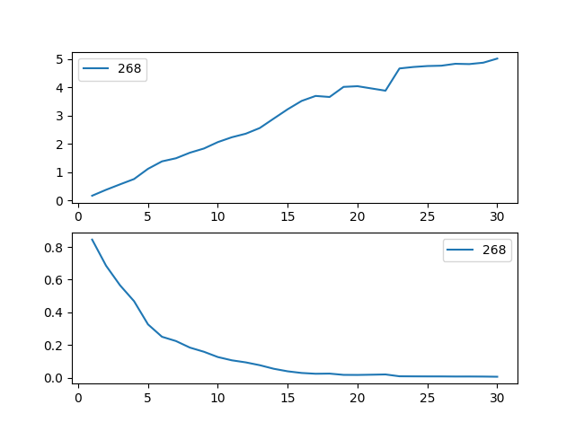

.. image:: http://i.imgur.com/EOowdSD.png

-------------------------------------

Survival Regression
=====================================

Often we have additional data aside from the durations, and if
applicable any censorships that occurred. In the regime dataset, we have
the type of government the political leader was part of, the country
they were head of, and the year they were elected. Can we use this data
in survival analysis?

Yes, the technique is called *survival regression* -- the name implies
we regress covariates (eg: year elected, country, etc.) against a
another variable -- in this case durations and lifetimes. Similar to the
logic in the first part of this tutorial, we cannot use traditional
methods like linear regression.

There are two popular competing techniques in survival regression: Cox's
model and Aalen's additive model. Both models attempt to represent the
hazard rate :math:`\lambda(t | x)` as a function of :math:`t` and some covariates :math:`x`. In Cox's model, the relationship is
defined:

.. math:: \lambda(t | x) = b_0(t)\exp\left( b_1x_1 + ... + b_dx_d\right)

On the other hand, Aalen's additive model assumes the following form:

.. math:: \lambda(t | x) = b_0(t) + b_1(t)x_1 + ... + b_d(t)x_d

Aalen's Additive model
~~~~~~~~~~~~~~~~~~~~~~~~~~~~~~~~~~~~~~

.. warning:: This model is still experimental.

The estimator to fit unknown coefficients in Aalen's additive model is
located in ``estimators`` under ``AalenAdditiveFitter``. For this
exercise, we will use the regime dataset and include the categorical
variables ``un_continent_name`` (eg: Asia, North America,...), the
``regime`` type (eg: monarchy, civilan,...) and the year the regime
started in, ``start_year``.

Aalen's additive model typically does not estimate the individual
:math:`b_i(t)` but instead estimates :math:`\int_0^t b_i(s) \; ds`
(similar to the estimate of the hazard rate using ``NelsonAalenFitter``
above). This is important to keep in mind when analzying the output.

.. code:: python

    from lifelines import AalenAdditiveFitter
    data.head()

.. raw:: html

    

    <table border="1" class="dataframe">
      <thead>
        <tr style="text-align: right;">
          <th style="padding:8px;">ctryname</th>
          <th style="padding:8px;">cowcode2</th>
          <th style="padding:8px;">politycode</th>
          <th style="padding:8px;">un_region_name</th>
          <th style="padding:8px;">un_continent_name</th>
          <th style="padding:8px;">ehead</th>
          <th style="padding:8px;">leaderspellreg</th>
          <th style="padding:8px;">democracy</th>
          <th style="padding:8px;">regime</th>
          <th style="padding:8px;">start_year</th>
          <th style="padding:8px;">duration</th>
          <th style="padding:8px;">observed</th>
        </tr>
      </thead>
      <tbody>
        <tr>
          <td style="padding: 8px;"> Afghanistan</td>
          <td style="padding: 8px;"> 700</td>
          <td style="padding: 8px;"> 700</td>
          <td style="padding: 8px;"> Southern Asia</td>
          <td style="padding: 8px;"> Asia</td>
          <td style="padding: 8px;">   Mohammad Zahir Shah</td>
          <td style="padding: 8px;"> Mohammad Zahir Shah.Afghanistan.1946.1952.Mona...</td>
          <td style="padding: 8px;"> Non-democracy</td>
          <td style="padding: 8px;">      Monarchy</td>
          <td style="padding: 8px;"> 1946</td>
          <td style="padding: 8px;">  7</td>
          <td style="padding: 8px;"> 1</td>
        </tr>
        <tr>
          <td style="padding: 8px;"> Afghanistan</td>
          <td style="padding: 8px;"> 700</td>
          <td style="padding: 8px;"> 700</td>
          <td style="padding: 8px;"> Southern Asia</td>
          <td style="padding: 8px;"> Asia</td>
          <td style="padding: 8px;"> Sardar Mohammad Daoud</td>
          <td style="padding: 8px;"> Sardar Mohammad Daoud.Afghanistan.1953.1962.Ci...</td>
          <td style="padding: 8px;"> Non-democracy</td>
          <td style="padding: 8px;"> Civilian Dict</td>
          <td style="padding: 8px;"> 1953</td>
          <td style="padding: 8px;"> 10</td>
          <td style="padding: 8px;"> 1</td>
        </tr>
        <tr>
          <td style="padding: 8px;"> Afghanistan</td>
          <td style="padding: 8px;"> 700</td>
          <td style="padding: 8px;"> 700</td>
          <td style="padding: 8px;"> Southern Asia</td>
          <td style="padding: 8px;"> Asia</td>
          <td style="padding: 8px;">   Mohammad Zahir Shah</td>
          <td style="padding: 8px;"> Mohammad Zahir Shah.Afghanistan.1963.1972.Mona...</td>
          <td style="padding: 8px;"> Non-democracy</td>
          <td style="padding: 8px;">      Monarchy</td>
          <td style="padding: 8px;"> 1963</td>
          <td style="padding: 8px;"> 10</td>
          <td style="padding: 8px;"> 1</td>
        </tr>
        <tr>
          <td style="padding: 8px;"> Afghanistan</td>
          <td style="padding: 8px;"> 700</td>
          <td style="padding: 8px;"> 700</td>
          <td style="padding: 8px;"> Southern Asia</td>
          <td style="padding: 8px;"> Asia</td>
          <td style="padding: 8px;"> Sardar Mohammad Daoud</td>
          <td style="padding: 8px;"> Sardar Mohammad Daoud.Afghanistan.1973.1977.Ci...</td>
          <td style="padding: 8px;"> Non-democracy</td>
          <td style="padding: 8px;"> Civilian Dict</td>
          <td style="padding: 8px;"> 1973</td>
          <td style="padding: 8px;">  5</td>
          <td style="padding: 8px;"> 0</td>
        </tr>
        <tr>
          <td style="padding: 8px;"> Afghanistan</td>
          <td style="padding: 8px;"> 700</td>
          <td style="padding: 8px;"> 700</td>
          <td style="padding: 8px;"> Southern Asia</td>
          <td style="padding: 8px;"> Asia</td>
          <td style="padding: 8px;">   Nur Mohammad Taraki</td>
          <td style="padding: 8px;"> Nur Mohammad Taraki.Afghanistan.1978.1978.Civi...</td>
          <td style="padding: 8px;"> Non-democracy</td>
          <td style="padding: 8px;"> Civilian Dict</td>
          <td style="padding: 8px;"> 1978</td>
          <td style="padding: 8px;">  1</td>
          <td style="padding: 8px;"> 0</td>
        </tr>
      </tbody>
    </table>
    
5 rows × 12 columns

    

I'm using the lovely library `patsy <https://github.com/pydata/patsy>`__ here to create a
covariance matrix from my original dataframe.

.. code:: python

    import patsy
    # the '-1' term refers to not adding an intercept column (a column of all 1s).
    X = patsy.dmatrix('un_continent_name + regime + start_year -1', data, return_type='dataframe') 

.. code:: python

    X.columns

.. parsed-literal::

    ['un_continent_name[Africa]',
     'un_continent_name[Americas]',
     'un_continent_name[Asia]',
     'un_continent_name[Europe]',
     'un_continent_name[Oceania]',
     'regime[T.Military Dict]',
     'regime[T.Mixed Dem]',
     'regime[T.Monarchy]',
     'regime[T.Parliamentary Dem]',
     'regime[T.Presidential Dem]',
     'start_year']

Below we create our fitter class. Since we did not supply an intercept
column in our matrix we have included the keyword ``fit_intercept=True``
(``True`` by default) which will append the column of ones to our
matrix. (Sidenote: the intercept term, :math:`b_0(t)` in survival
regression is often referred to as the *baseline* hazard.)

We have also included the ``coef_penalizer`` option. During the estimation, a
linear regression is computed at each step. Often the regression can be
unstable (due to high
`co-linearity <http://camdp.com/blogs/machine-learning-counter-examples-pt1>`__
or small sample sizes) -- adding a penalizer term controls the stability. I recommend always starting with a small penalizer term -- if the estimates still appear to be too unstable, try increasing it.

.. code:: python

    aaf = AalenAdditiveFitter(coef_penalizer=1.0, fit_intercept=True)

An instance of ``AalenAdditiveFitter``
includes a ``fit`` method that performs the inference on the coefficients. This method accepts a pandas DataFrame: each row is an individual and columns are the covariates and 
two special columns: a *duration* column and a boolean *event occured* column (where event occured refers to the event of interest - expulsion from government in this case)

.. code:: python
    
    data = lifelines.datasets.load_dd()

    X['T'] = data['duration']
    X['E'] = data['observed'] 

.. code:: python

    aaf.fit(X, 'T', event_col='E')

After fitting, the instance exposes a ``cumulative_hazards_`` DataFrame
containing the estimates of :math:`\int_0^t b_i(s) \; ds`:

.. code:: python

    figsize(12.5,8)
    aaf.cumulative_hazards_.head()

.. raw:: html

    

    <table border="1" class="dataframe">
      <thead>
        <tr style="text-align: right;">
          <th style="padding:8px;">un_continent_name[Africa]</th>
          <th style="padding:8px;">un_continent_name[Americas]</th>
          <th style="padding:8px;">un_continent_name[Asia]</th>
          <th style="padding:8px;">un_continent_name[Europe]</th>
          <th style="padding:8px;">un_continent_name[Oceania]</th>
          <th style="padding:8px;">regime[T.Military Dict]</th>
          <th style="padding:8px;">regime[T.Mixed Dem]</th>
          <th style="padding:8px;">regime[T.Monarchy]</th>
          <th style="padding:8px;">regime[T.Parliamentary Dem]</th>
          <th style="padding:8px;">regime[T.Presidential Dem]</th>
          <th style="padding:8px;">start_year</th>
          <th style="padding:8px;">baseline</th>
        </tr>
      </thead>
      <tbody>
        <tr>
          <td style="padding: 8px;">-0.051595</td>
          <td style="padding: 8px;">-0.082406</td>
          <td style="padding: 8px;"> 0.010666</td>
          <td style="padding: 8px;"> 0.154493</td>
          <td style="padding: 8px;">-0.060438</td>
          <td style="padding: 8px;"> 0.075333</td>
          <td style="padding: 8px;"> 0.086274</td>
          <td style="padding: 8px;">-0.133938</td>
          <td style="padding: 8px;"> 0.048077</td>
          <td style="padding: 8px;"> 0.127171</td>
          <td style="padding: 8px;"> 0.000116</td>
          <td style="padding: 8px;">-0.029280</td>
        </tr>
        <tr>
          <td style="padding: 8px;">-0.014713</td>
          <td style="padding: 8px;">-0.039471</td>
          <td style="padding: 8px;"> 0.095668</td>
          <td style="padding: 8px;"> 0.194251</td>
          <td style="padding: 8px;">-0.092696</td>
          <td style="padding: 8px;"> 0.115033</td>
          <td style="padding: 8px;"> 0.358702</td>
          <td style="padding: 8px;">-0.226233</td>
          <td style="padding: 8px;"> 0.168783</td>
          <td style="padding: 8px;"> 0.121862</td>
          <td style="padding: 8px;"> 0.000053</td>
          <td style="padding: 8px;"> 0.143039</td>
        </tr>
        <tr>
          <td style="padding: 8px;"> 0.007389</td>
          <td style="padding: 8px;">-0.064758</td>
          <td style="padding: 8px;"> 0.115121</td>
          <td style="padding: 8px;"> 0.170549</td>
          <td style="padding: 8px;"> 0.069371</td>
          <td style="padding: 8px;"> 0.161490</td>
          <td style="padding: 8px;"> 0.677347</td>
          <td style="padding: 8px;">-0.271183</td>
          <td style="padding: 8px;"> 0.328483</td>
          <td style="padding: 8px;"> 0.146234</td>
          <td style="padding: 8px;"> 0.000004</td>
          <td style="padding: 8px;"> 0.297672</td>
        </tr>
        <tr>
          <td style="padding: 8px;">-0.058418</td>
          <td style="padding: 8px;"> 0.011399</td>
          <td style="padding: 8px;"> 0.091784</td>
          <td style="padding: 8px;"> 0.205824</td>
          <td style="padding: 8px;"> 0.125722</td>
          <td style="padding: 8px;"> 0.220028</td>
          <td style="padding: 8px;"> 0.932674</td>
          <td style="padding: 8px;">-0.294900</td>
          <td style="padding: 8px;"> 0.365604</td>
          <td style="padding: 8px;"> 0.422617</td>
          <td style="padding: 8px;"> 0.000002</td>
          <td style="padding: 8px;"> 0.376311</td>
        </tr>
        <tr>
          <td style="padding: 8px;">-0.099282</td>
          <td style="padding: 8px;"> 0.106641</td>
          <td style="padding: 8px;"> 0.112083</td>
          <td style="padding: 8px;"> 0.150708</td>
          <td style="padding: 8px;"> 0.091900</td>
          <td style="padding: 8px;"> 0.241575</td>
          <td style="padding: 8px;"> 1.123860</td>
          <td style="padding: 8px;">-0.391103</td>
          <td style="padding: 8px;"> 0.536185</td>
          <td style="padding: 8px;"> 0.743913</td>
          <td style="padding: 8px;"> 0.000057</td>
          <td style="padding: 8px;"> 0.362049</td>
        </tr>
      </tbody>
    </table>
    
5 rows × 12 columns

    

``AalenAdditiveFitter`` also has built in plotting:

.. code:: python

  aaf.plot(columns=['regime[T.Presidential Dem]', 'baseline', 'un_continent_name[Europe]'], iloc=slice(1,15))

.. image:: images/survival_regression_aaf.png

Regression is most interesting if we use it on data we have not yet
seen, i.e. prediction! We can use what we have learned to predict
individual hazard rates, survival functions, and median survival time.
The dataset we are using is aviable up until 2008, so let's use this data to
predict the (already partly seen) possible duration of Canadian
Prime Minister Stephen Harper.

.. code:: python

    ix = (data['ctryname'] == 'Canada') * (data['start_year'] == 2006)
    harper = X.loc[ix]
    print "Harper's unique data point", harper

.. parsed-literal::

    Harper's unique data point

.. parsed-literal::

    array([[    0.,     0.,     1.,     0.,     0.,     0.,     0.,     1.,
                0.,     0.,  2003.]])

.. code:: python

    ax = plt.subplot(2,1,1)

    aaf.predict_cumulative_hazard(harper).plot(ax=ax)
    ax = plt.subplot(2,1,2)

    aaf.predict_survival_function(harper).plot(ax=ax);

.. warning:: Because of the nature of the model, estimated survival functions of individuals can increase. This is an expected artifact of Aalen's additive model.

Cox's Proportional Hazard model
~~~~~~~~~~~~~~~~~~~~~~~~~~~~~~~~~~~~~~

Lifelines has an implementation of the Cox propotional hazards regression model (implemented in 
R under ``coxph``). The idea behind the model is that the log-hazard of an individual is a linear function of their static covariates *and* a population-level baseline hazard that changes over time. Mathematically:

.. math::  \lambda(t | X) = b_0(t) \exp{\left(\sum_{i=1}^d b_i x_i\right)}

Note a few facts about this model: the only time component is in the baseline hazard, :math:`b_0(t)`. In the above product, the second term is only a scalar factor that only increases or decreases the baseline hazard. Thus a change in a covariate will only increase or decrease this baseline hazard. 

Lifelines implementation
###########################################

The implementation of the Cox model in lifelines, called ``CoxPHFitter`` has a similar API to ``AalensAdditiveFitter``. Like R, it has a ``print_summary`` function that prints a tabular view of coefficients and related stats. 

This example data is from the paper `here <http://socserv.socsci.mcmaster.ca/jfox/Books/Companion/appendix/Appendix-Cox-Regression.pdf>`_, avaible as ``load_rossi`` in lifelines. 

.. code:: python

    from lifelines.datasets import load_rossi
    from lifelines import CoxPHFitter

    rossi_dataset = load_rossi()
    cph = CoxPHFitter()
    cph.fit(rossi_dataset, duration_col='week', event_col='arrest')

    cph.print_summary()  # access the results using cph.summary

    """
    n=432, number of events=114

            coef  exp(coef)  se(coef)       z      p  lower 0.95  upper 0.95
    fin  -0.3790     0.6845    0.1914 -1.9806 0.0476     -0.7542     -0.0039   *
    age  -0.0572     0.9444    0.0220 -2.6042 0.0092     -0.1003     -0.0142  **
    race  0.3141     1.3691    0.3080  1.0198 0.3078     -0.2897      0.9180
    wexp -0.1511     0.8597    0.2121 -0.7124 0.4762     -0.5670      0.2647
    mar  -0.4328     0.6487    0.3818 -1.1335 0.2570     -1.1813      0.3157
    paro -0.0850     0.9185    0.1957 -0.4341 0.6642     -0.4687      0.2988
    prio  0.0911     1.0954    0.0286  3.1824 0.0015      0.0350      0.1472  **
    ---
    Signif. codes:  0 '***' 0.001 '**' 0.01 '*' 0.05 '.' 0.1 ' ' 1

    Concordance = 0.640
    """

To access the coefficients and the baseline hazard directly, you can use ``cph.hazards_`` and ``cph.baseline_hazard_`` respectively. 

Convergence 
###########################################

Fitting the Cox model to the data involves using gradient descent. Lifelines takes extra effort to help with convergence. If you wish to see the fitting, there is a ``show_progress`` parameter in ``CoxPHFitter.fit`` function. For further help, see :ref:`Problems with convergence in the Cox Proportional Hazard Model`.

After fitting, the value of the maximum log-likelihood this available using ``cph._log_likelihood``. Similarly, the score and Hessian matrix are available under ``_score_`` and ``_hessian_`` respectively. The ``_hessian_`` can be used the find the covariance matrix of the coefficients. 

Goodness of fit and prediction
###########################################

After fitting, you may want to know how "good" of a fit your model was to the data. Aside from traditional approaches, two methods the author has found useful is to 1. look at the concordance-index (see below section on :ref:`Model Selection in Survival Regression`), available as ``cph.score_`` or in the ``print_summary`` and 2. compare spread between the baseline survival function vs the Kaplan Meier survival function (Why? a small spread between these two curves means that the impact of the exponential in the Cox model does very little, whereas a large spread means *most* of the changes in individual hazard can be attributed to the exponential term). For example, the first figure below is a good fit, and the second figure is a much weaker fit.

.. image:: images/goodfit.png

After fitting, you can use use the suite of prediction methods (similar to Aalen's additve model above): ``.predict_partial_hazard``, ``.predict_survival_function``, etc.

.. code:: python
    
    cph.predict_partial_hazard(rossi_dataset.drop(["week", "arrest"], axis=1))

Plotting the coefficients
###########################################

With a fitted model, an altervative way to view the coefficients and their ranges is to use the ``plot`` method.

.. code:: python

    from lifelines.datasets import load_rossi
    from lifelines import CoxPHFitter

    rossi_dataset = load_rossi()
    cph = CoxPHFitter()
    cph.fit(rossi_dataset, duration_col='week', event_col='arrest')

    cph.plot()

.. image:: images/coxph_plot.png

Checking the proportional hazards assumption
#############################################

A quick and visual way to check the proportional hazards assumption of a variable is to plot the survival curves segmented by the values of the variable. If the survival curves are the same "shape", and differ only by constant factor, then the assumption holds. A more clear way to see this is to plot what's called the loglogs curve: the log(-log(survival curve)) vs log(time). If the curves are parallel (and hence do not cross each other), then it's likely the variable satisfies the assumption. If the curves do cross, likely you'll have to "stratify" the variable (see next section). In lifelines, the ``KaplanMeierFitter`` object has a ``.plot_loglogs`` function for this purpose. 

The following is the loglogs curves of two variables in our regime dataset. The first is the democracy type, which does have (close to) parallel lines, hence satisfies our assumption:

.. code:: python

    from lifelines.datasets import load_dd
    from lifelines import KaplanMeierFitter

    data = load_dd()

    democracy_0 = data.loc[data['democracy'] == 'Non-democracy']
    democracy_1 = data.loc[data['democracy'] == 'Democracy']

    kmf0 = KaplanMeierFitter()
    kmf0.fit(democracy_0['duration'], event_observed=democracy_0['observed'])

    kmf1 = KaplanMeierFitter()
    kmf1.fit(democracy_1['duration'], event_observed=democracy_1['observed'])

    fig, axes = plt.subplots()
    kmf0.plot_loglogs(ax=axes)
    kmf1.plot_loglogs(ax=axes)

    axes.legend(['Non-democracy', 'Democracy'])

    plt.show()

.. image:: images/lls_democracy.png

The second variable is the regime type, and this variable does not follow the proportional hazards assumption.

.. image:: images/lls_regime_type.png

Stratification
################

Sometimes a covariate may not obey the proportional hazard assumption. In this case, we can allow a factor to be adjusted for without estimating its effect. To specify categorical variables to be used in stratification, we specify them in the call to ``fit``:

.. code:: python

    cph.fit(rossi_dataset, 'week', event_col='arrest', strata=['race'])

    cph.print_summary()  # access the results using cph.summary

    """
    n=432, number of events=114

            coef  exp(coef)  se(coef)       z      p  lower 0.95  upper 0.95
    fin  -0.3775     0.6856    0.1913 -1.9731 0.0485     -0.7525     -0.0024   *
    age  -0.0573     0.9443    0.0220 -2.6081 0.0091     -0.1004     -0.0142  **
    wexp -0.1435     0.8664    0.2127 -0.6746 0.4999     -0.5603      0.2734
    mar  -0.4419     0.6428    0.3820 -1.1570 0.2473     -1.1907      0.3068
    paro -0.0839     0.9196    0.1958 -0.4283 0.6684     -0.4677      0.3000
    prio  0.0919     1.0962    0.0287  3.1985 0.0014      0.0356      0.1482  **
    ---
    Signif. codes:  0 '***' 0.001 '**' 0.01 '*' 0.05 '.' 0.1 ' ' 1

    Concordance = 0.638
    """

Cox's Time Varying Proportional Hazard model
~~~~~~~~~~~~~~~~~~~~~~~~~~~~~~~~~~~~~~~~~~~~~

Often an individual will have a covariate change over time. An example of this is hospital patients who enter the study, and at some future time, they may recieve a heart transplant. We would like to know the effect of the transplant and the other variables, but we cannot condition on whether they recieved the transplant naively. Consider that if patients needed to wait at least 1 year before getting a transplant, then everyone who dies before that year is considered as a non-transplant patient, and hence this would overestimate the hazard of not recieving a transplant. 

We can incorporate changes over time into our survival analysis by using a modification of the Cox model above. The general mathematical description is:

.. math::  \lambda(t | X) = b_0(t) \exp{\left(\sum_{i=1}^d b_i x_i(t)\right)}

Note the time-varying :math:`x_i(t)` to denote that covariates can change over time. This model is implemented in lifelines as ``CoxTimeVaryingFitter``. The dataset required is unique, so we will spend some time describing this. 

Dataset for time-varying regression
####################################

Lifelines requires that the dataset be in what is called the *long* format. This looks like one row per state change, including an ID, the left (exclusive), and right (inclusive) time points. For example:

.. raw:: html

    

      <table border="1" class="dataframe">
        <thead>
          <tr style="text-align: right;">
            <th style="padding:8px;">start</th>
            <th style="padding:8px;">group</th>
            <th style="padding:8px;">z</th>
            <th style="padding:8px;">stop</th>
            <th style="padding:8px;">id</th>
            <th style="padding:8px;">event</th>
          </tr>
        </thead>
        <tbody>
          <tr>
            <td style="padding: 8px;">0</td>
            <td style="padding: 8px;">1</td>
            <td style="padding: 8px;">0</td>
            <td style="padding: 8px;">8.0</td>
            <td style="padding: 8px;">8</td>
            <td style="padding: 8px;">False</td>
          </tr>
          <tr>
            <td style="padding: 8px;">0</td>
            <td style="padding: 8px;">0</td>
            <td style="padding: 8px;">0</td>
            <td style="padding: 8px;">5.0</td>
            <td style="padding: 8px;">9</td>
            <td style="padding: 8px;">False</td>
          </tr>
          <tr>
            <td style="padding: 8px;">5</td>
            <td style="padding: 8px;">0</td>
            <td style="padding: 8px;">1</td>
            <td style="padding: 8px;">9.0</td>
            <td style="padding: 8px;">9</td>
            <td style="padding: 8px;">True</td>
          </tr>
          <tr>
            <td style="padding: 8px;">0</td>
            <td style="padding: 8px;">1</td>
            <td style="padding: 8px;">0</td>
            <td style="padding: 8px;">3.0</td>
            <td style="padding: 8px;">10</td>
            <td style="padding: 8px;">False</td>
          </tr>
          <tr>
            <td style="padding: 8px;">3</td>
            <td style="padding: 8px;">1</td>
            <td style="padding: 8px;">1</td>
            <td style="padding: 8px;">10.0</td>
            <td style="padding: 8px;">10</td>
            <td style="padding: 8px;">True</td>
          </tr>
        </tbody>
      </table>
      
5 rows × 6 columns

    

In the above dataset, ``start`` and ``stop`` denote the boundaries, ``id`` is the unique identifier per subject, and ``event`` denotes if the subject died at the end of that period. This is the desired dataset, but it needs to be built up first from smaller datasets. To do this we can use some helper functions provided in lifelines. 

Typically, data will be in a format that looks like it comes out of a relational database, or close to. You may have a "base" table with ids, durations, and a censorsed flag, and possibly with static covariates. Ex: 

.. raw:: html

    

      <table border="1" class="dataframe">
        <thead>
          <tr style="text-align: right;">
            <th style="padding:8px;">id</th>
            <th style="padding:8px;">duration</th>
            <th style="padding:8px;">event</th>
            <th style="padding:8px;">var1</th>
          </tr>
        </thead>
        <tbody>
          <tr>
            <td style="padding: 8px;">1</td>
            <td style="padding: 8px;">10</td>
            <td style="padding: 8px;">True</td>
            <td style="padding: 8px;">0.1</td>
          </tr>
          <tr>
            <td style="padding: 8px;">2</td>
            <td style="padding: 8px;">12</td>
            <td style="padding: 8px;">False</td>
            <td style="padding: 8px;">0.5</td>
          </tr>
        </tbody>
      </table>
      
2 rows × 4 columns

    

You'll also have secondary data pulls that reference taking future measurements. Example:

.. raw:: html

    

      <table border="1" class="dataframe">
        <thead>
          <tr style="text-align: right;">
            <th style="padding:8px;">id</th>
            <th style="padding:8px;">time</th>
            <th style="padding:8px;">var2</th>
          </tr>
        </thead>
        <tbody>
          <tr>
            <td style="padding: 8px;">1</td>
            <td style="padding: 8px;">0</td>
            <td style="padding: 8px;">1.4</td>
          </tr>          
          <tr>
            <td style="padding: 8px;">1</td>
            <td style="padding: 8px;">4</td>
            <td style="padding: 8px;">1.2</td>
          </tr>          
          <tr>
            <td style="padding: 8px;">1</td>
            <td style="padding: 8px;">8</td>
            <td style="padding: 8px;">1.5</td>
          </tr>
          <tr>
            <td style="padding: 8px;">2</td>
            <td style="padding: 8px;">0</td>
            <td style="padding: 8px;">1.6</td>
          </tr>
        </tbody>
      </table>
      
4 rows × 3 columns

    

where ``time`` is the duration from the entry event. Here we see subject 1 had a change in their ``var2`` covariate at time 4 and time 8. We can use ``to_long_format`` to transform the base dataset into a long format and ``add_covariate_to_timeline`` to fold the covariate dataset into the original dataset.

.. code:: python
    
      from lifelines.utils import to_long_format
      from lifelines.utils import add_covariate_to_timeline

      base_df = to_long_format(base_df, duration_col="T")
      df = add_covariate_to_timeline(base_df, cv, duration_col="time", id_col="id", event_col="event")

.. raw:: html

    

      <table border="1" class="dataframe">
        <thead>
          <tr style="text-align: right;">
            <th style="padding: 8px;">start</th>
            <th style="padding: 8px;">var1</th>
            <th style="padding: 8px;">var2</th>
            <th style="padding: 8px;">stop</th>
            <th style="padding: 8px;">id</th>
            <th style="padding: 8px;">E</th>
          </tr>
        </thead>
        <tbody>
          <tr>
            <td style="padding: 8px;">0</td>
            <td style="padding: 8px;">0.1</td>
            <td style="padding: 8px;">1.4</td>
            <td style="padding: 8px;">4</td>
            <td style="padding: 8px;">1</td>
            <td style="padding: 8px;">False</td>
          </tr>
          <tr>
            <td style="padding: 8px;">4</td>
            <td style="padding: 8px;">0.1</td>
            <td style="padding: 8px;">1.2</td>
            <td style="padding: 8px;">8</td>
            <td style="padding: 8px;">1</td>
            <td style="padding: 8px;">False</td>
          </tr>
          <tr>
            <td style="padding: 8px;">8</td>
            <td style="padding: 8px;">0.1</td>
            <td style="padding: 8px;">1.5</td>
            <td style="padding: 8px;">10</td>
            <td style="padding: 8px;">1</td>
            <td style="padding: 8px;">True</td>
          </tr>
          <tr>
            <td style="padding: 8px;">0</td>
            <td style="padding: 8px;">0.5</td>
            <td style="padding: 8px;">1.6</td>
            <td style="padding: 8px;">12</td>
            <td style="padding: 8px;">2</td>
            <td style="padding: 8px;">False</td>
          </tr>
        </tbody>
      </table>
      
4 rows × 6 columns

    

From the above output, we can see that individual 1 changed state twice over the observation period, and the ``start`` (exclusive) and ``stop`` (inclusive) columns denote the time windows of their state. You may have multiple covariates you wish to add, so the above could be streamlined like so:

.. code:: python
    
      from lifelines.utils import to_long_format
      from lifelines.utils import add_covariate_to_timeline

      base_df = to_long_format(base_df, duration_col="T")
      df = base_df.pipe(add_covariate_to_timeline, cv1, duration_col="time", id_col="id", event_col="event")\
                  .pipe(add_covariate_to_timeline, cv2, duration_col="time", id_col="id", event_col="event")\
                  .pipe(add_covariate_to_timeline, cv3, duration_col="time", id_col="id", event_col="event")

For an example of pulling datasets like this from a SQL-sore, see :ref:`Example SQL queries and transformations to get time varying data`.

Fitting the model
####################################

Once your dataset is in the correct orientation, we can use ``CoxTimeVaryingFitter`` to fit the model to your data. 

.. code:: python

    from lifelines import CoxTimeVaryingFitter

    ctv = CoxTimeVaryingFitter()
    ctv.fit(df, id_col="id", event_col="event", start_col="start", stop_col="stop")
    ctv.print_summary()

Model Selection in Survival Regression
~~~~~~~~~~~~~~~~~~~~~~~~~~~~~~~~~~~~~~

If censorship is present, it's not appropriate to use a loss function like mean-squared-error or 
mean-absolute-loss. Instead, one measure is the concordance-index, also known as the c-index. This measure
evaluates the accuracy of the ordering of predicted time. It is infact a generalization
of AUC, another common loss function, and is interpreted similarly: 

* 0.5 is the expected result from random predictions,
* 1.0 is perfect concordance and,
* 0.0 is perfect anti-concordance (multiply predictions with -1 to get 1.0)

The measure is implemented in lifelines under `lifelines.utils.concordance_index` and accepts the actual times (along with any censorships) and the predicted times.

Cross Validation
######################################

Lifelines has an implementation of k-fold cross validation under ``lifelines.utils.k_fold_cross_validation``. This function accepts an instance of a regression fitter (either ``CoxPHFitter`` of ``AalenAdditiveFitter``), a dataset, plus `k` (the number of folds to perform, default 5). On each fold, it splits the data 
into a training set and a testing set, fits itself on the training set, and evaluates itself on the testing set (using the concordance measure). 

.. code:: python
      
        from lifelines import CoxPHFitter
        from lifelines.datasets import load_regression_dataset
        from lifelines.utils import k_fold_cross_validation

        regression_dataset = load_regression_dataset()
        cph = CoxPHFitter()
        scores = k_fold_cross_validation(cph, regression_dataset, 'T', event_col='E', k=3)
        print scores
        print np.mean(scores)
        print np.std(scores)
        
        #[ 0.5896  0.5358  0.5028]
        # 0.542
        # 0.035
