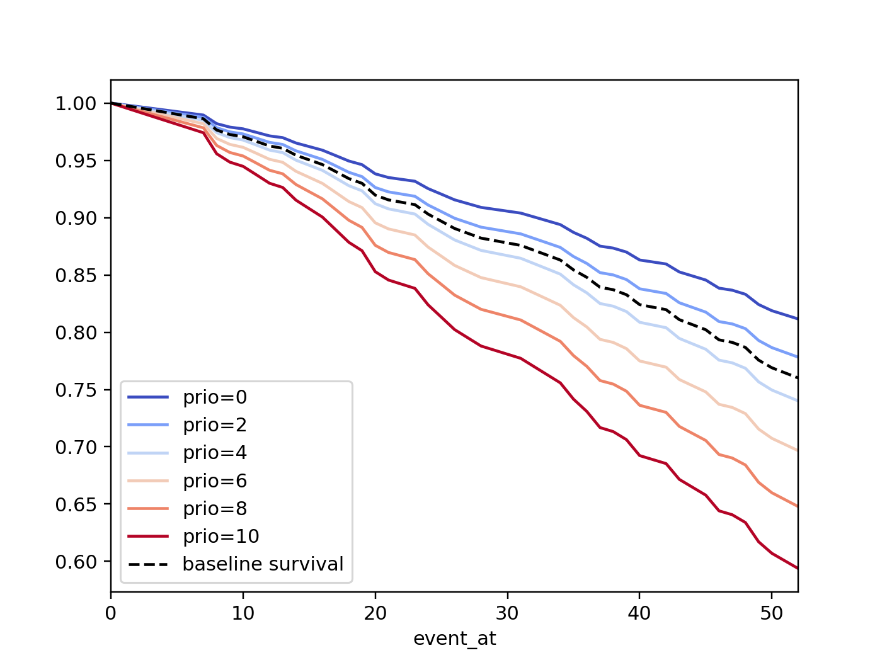

.. image:: http://i.imgur.com/EOowdSD.png

-------------------------------------

Survival regression
#######################

Often we have additional data aside from the duration, and if
applicable any censorings that occurred. In the previous section's regime dataset, we have
the type of government the political leader was part of, the country
they were head of, and the year they were elected. Can we use this data
in survival analysis?

Yes, the technique is called *survival regression* -- the name implies
we regress covariates (e.g., age, country, etc.) against
another variable -- in this case durations. Similar to the
logic in the first part of this tutorial, we cannot use traditional
methods like linear regression.

There are a few popular models in survival regression: Cox's
model, accelerated failure models, and Aalen's additive model. All models attempt to represent the
hazard rate :math:`h(t | x)` as a function of :math:`t` and some covariates :math:`x`. We explore these models next.

The dataset for regression
===========================
The dataset required for survival regression must be in the format of a Pandas DataFrame. Each row of the DataFrame should be an observation. There should be a column denoting the durations of the observations. There may be a column denoting the event status of each observation (1 if event occured, 0 if censored). There are also the additional covariates you wish to regress against. Optionally, there could be columns in the DataFrame that are used for stratification, weights, and clusters which will be discussed later in this tutorial.

An example dataset we will use is the Rossi recidivism dataset, available in *lifelines* as ``datasets.load_rossi``.

.. code:: python

    from lifelines.datasets import load_rossi

    rossi = load_rossi()

    """
         week  arrest  fin  age  race  wexp  mar  paro  prio
    0      20       1    0   27     1     0    0     1     3
    1      17       1    0   18     1     0    0     1     8
    2      25       1    0   19     0     1    0     1    13
    3      52       0    1   23     1     1    1     1     1
    """

The dataframe ``rossi`` contains 432 observations. The ``week`` column is the duration, the ``arrest`` column is the event occured, and the other columns represent variables we wish to regress against.

If you need to first clean or transform your dataset (encode categorical variables, add interation terms, etc.), that should happen *before* using *lifelines*. Libraries like Pandas and Patsy help with that.

Cox's proportional hazard model
=================================

*lifelines* has an implementation of the Cox proportional hazards regression model (implemented in
R as ``coxph``). The idea behind the model is that the log-hazard of an individual is a linear function of their static covariates *and* a population-level baseline hazard that changes over time. Mathematically:

.. math::  \underbrace{h(t | x)}_{\text{hazard}} = \overbrace{b_0(t)}^{\text{baseline hazard}} \underbrace{\exp \overbrace{\left(\sum_{i=1}^n b_i (x_i - \overline{x_i})\right)}^{\text{log-partial hazard}}}_ {\text{partial hazard}}

Note a few facts about this model: the only time component is in the baseline hazard, :math:`b_0(t)`. In the above product, the partial hazard is a time-invariant scalar factor that only increases or decreases the baseline hazard. Thus a changes in covariates will only increase or decrease the baseline hazard.

Running the regression
-----------------------

The implementation of the Cox model in *lifelines* is called ``CoxPHFitter``. Like R, it has a ``print_summary`` function that prints a tabular view of coefficients and related stats.

.. note:: In other regression models, a column of 1s might be added that represents that intercept or baseline. This is not necessary in the Cox model. In fact, there is no intercept in the additive Cox model - the baseline hazard represents this. *lifelines* will will throw warnings and may experience convergence errors if a column of 1s is present in your dataset.

.. code:: python

    from lifelines import CoxPHFitter
    from lifelines.datasets import load_rossi

    rossi_dataset = load_rossi()

    cph = CoxPHFitter()
    cph.fit(rossi_dataset, duration_col='week', event_col='arrest', show_progress=True)

    cph.print_summary()  # access the results using cph.summary

    """
    <lifelines.CoxPHFitter: fitted with 432 observations, 318 censored>
          duration col = 'week'
             event col = 'arrest'
    number of subjects = 432
      number of events = 114
        log-likelihood = -658.75
      time fit was run = 2019-01-27 23:10:15 UTC

    ---
          coef  exp(coef)  se(coef)     z      p  -log2(p)  lower 0.95  upper 0.95
    fin  -0.38       0.68      0.19 -1.98   0.05      4.40       -0.75       -0.00
    age  -0.06       0.94      0.02 -2.61   0.01      6.79       -0.10       -0.01
    race  0.31       1.37      0.31  1.02   0.31      1.70       -0.29        0.92
    wexp -0.15       0.86      0.21 -0.71   0.48      1.06       -0.57        0.27
    mar  -0.43       0.65      0.38 -1.14   0.26      1.97       -1.18        0.31
    paro -0.08       0.92      0.20 -0.43   0.66      0.59       -0.47        0.30
    prio  0.09       1.10      0.03  3.19 <0.005      9.48        0.04        0.15
    ---
    Concordance = 0.64
    Likelihood ratio test = 33.27 on 7 df, -log2(p)=15.37
    """

To access the coefficients and the baseline hazard directly, you can use ``cph.hazards_`` and ``cph.baseline_hazard_`` respectively. Taking a look at these coefficients for a moment, ``prio`` (the number of prior arrests) has a coefficient of about 0.09. Thus, a one unit increase in ``prio`` means the the baseline hazard will increase by a factor of :math:`exp(0.09) = 1.10` - about a 10% increase. Recall a higher hazard means more at risk of the event occurring.

Convergence
-----------------------

Fitting the Cox model to the data involves using gradient descent. *lifelines* takes extra effort to help with convergence, so please be attentive to any warnings that appear. Fixing any warnings will generally help convergence and decrease the number of iterative steps required. If you wish to see the fitting, there is a ``show_progress`` parameter in ``CoxPHFitter.fit`` function. For further help, see :ref:`Problems with convergence in the Cox Proportional Hazard Model`.

After fitting, the value of the maximum log-likelihood this available using ``cph._log_likelihood``. The variance matrix of the coefficients is available under ``cph.variance_matrix``.

Goodness of fit
-----------------------

After fitting, you may want to know how "good" of a fit your model was to the data. Aside from traditional approaches, two methods the author has found useful is to 1. look at the concordance-index (see below section on :ref:`Model Selection in Survival Regression`), available as ``cph.score_`` or in the ``print_summary`` and 2. compare spread between the baseline survival function vs the Kaplan Meier survival function (Why? Interpret the spread as how much "variance" is provided by the baseline hazard versus the partial hazard. The baseline hazard is approximately equal to the Kaplan-Meier curve if none of the variance is explained by the covariates / partial hazard. Deviations from this provide a visual measure of variance explained). For example, the first figure below is a good fit, and the second figure is a much weaker fit.

.. image:: images/badfit.png

Prediction
-----------------------

After fitting, you can use use the suite of prediction methods: ``.predict_partial_hazard``, ``.predict_survival_function``, etc.

.. code:: python

    X = rossi_dataset.drop(["week", "arrest"], axis=1)

    cph.predict_partial_hazard(X)

    cph.predict_survival_function(X, times=[5., 25., 50.])

    cph.predict_median(X)

A common use case is to predict the event time of censored subjects. This is easy to do, but we first have to calculate an important conditional probability. Let :math:`T` be the (random) event time for some subject, and :math:`S(t)≔P(T > t)` be their surival function. We are interested to know *What is the new survival function, given I know the subject has lived past time s, where s < t?* Mathmematically:

.. math::

    \begin{align*}
    P(T > t \;|\; T > s) &= \frac{P(T > t \;\text{and}\; T > s)}{P(T > s)} \\
                         &= \frac{P(T > t)}{P(T > s)} \\
                         &= \frac{S(t)}{S(s)}
    \end{align*}

Thus we scale the original survival function by the survival function at time :math:`s` (everything prior to :math:`s` should be mapped to 1.0 as well, since we are working with probabilities and we know that the subject was alive before :math:`s`).

Back to our original problem of predicting the event time of censored individuals, we do the same thing:

.. code:: python

    from lifelines import CoxPHFitter
    from lifelines.datasets import load_regression_dataset

    df = load_regression_dataset()

    cph = CoxPHFitter().fit(df, 'T', 'E')

    censored_subjects = df.loc[df['E'] == 0]

    unconditioned_sf = cph.predict_survival_function(censored_subjects)

    conditioned_sf = unconditioned_sf.apply(lambda c: (c / c.loc[df.loc[c.name, 'T']]).clip_upper(1))

    # let's focus on a single subject
    subject = 13
    unconditioned_sf[subject].plot(ls="--", color="#A60628", label="unconditioned")
    conditioned_sf[subject].plot(color="#A60628", label="conditioned on $T>10$")
    plt.legend()

From here, you can pick a median or percentile as a best guess as to the subject's event time:

.. code:: python

    from lifelines.utils import median_survival_times, qth_survival_times

    predictions_50 = median_survival_times(conditioned_sf)
    predictions_75 = qth_survival_times(0.75, conditioned_sf)

    # plotting subject 13 again
    plt.hlines([0.5, 0.75], 0, 23, alpha=0.5, label="percentiles")

    plt.scatter(median_survival_times(conditioned_sf[subject]), 0.5,  color="#E24A33", label="median prediction", zorder=20)
    plt.scatter(qth_survival_times(0.75, conditioned_sf[subject]), 0.75,  color="#467821", label="q=75 prediction", zorder=20)

    plt.legend()

Plotting the coefficients
------------------------------

With a fitted model, an alternative way to view the coefficients and their ranges is to use the ``plot`` method.

.. code:: python

    from lifelines.datasets import load_rossi
    from lifelines import CoxPHFitter

    rossi_dataset = load_rossi()
    cph = CoxPHFitter()
    cph.fit(rossi_dataset, duration_col='week', event_col='arrest', show_progress=True)

    cph.plot()

.. image:: images/coxph_plot.png

Plotting the effect of varying a covariate
-------------------------------------------

After fitting, we can plot what the survival curves look like as we vary a single covarite while
holding everything else equal. This is useful to understand the impact of a covariate, *given the model*. To do this, we use the ``plot_covariate_groups`` method and give it the covariate of interest, and the values to display.

.. code:: python

    from lifelines.datasets import load_rossi
    from lifelines import CoxPHFitter

    rossi_dataset = load_rossi()
    cph = CoxPHFitter()
    cph.fit(rossi_dataset, duration_col='week', event_col='arrest', show_progress=True)

    cph.plot_covariate_groups('prio', [0, 2, 4, 6, 8, 10], cmap='coolwarm')

Checking the proportional hazards assumption
-----------------------------------------------

``CoxPHFitter`` has a ``check_assumptions`` method that will output violations of the proportional hazard assumption. For a tutorial on how to fix violations, see `Testing the Proportional Hazard Assumptions`_.

Non-proportional hazards is a case of *model misspecification*. Suggestions are to look for ways to *stratify* a column (see docs below), or use a `time varying model`_.

Stratification
-----------------------------------------------

Sometimes one or more covariates may not obey the proportional hazard assumption. In this case, we can allow the covariate(s) to still be including in the model without estimating its effect. This is called stratification. At a high level, think of it as splitting the dataset into *N* smaller datasets, defined by the unique values of the stratifing covariate(s). Each dataset has its own baseline hazard (the non-parametric part of the model), but they all share the regression parameters (the parametric part of the model). Since covariates are the same within each dataset, there is no regression parameter for the covariates stratified on, hence they will not show up in the output. However there will be *N* baseline hazards under ``baseline_cumulative_hazard_``.

To specify variables to be used in stratification, we define them in the call to ``fit``:

.. code:: python

    from lifelines.datasets import load_rossi
    from lifelines import CoxPHFitter

    rossi_dataset = load_rossi()
    cph = CoxPHFitter()
    cph.fit(rossi_dataset, 'week', event_col='arrest', strata=['race'], show_progress=True)

    cph.print_summary()  # access the results using cph.summary

    """
    <lifelines.CoxPHFitter: fitted with 432 observations, 318 censored>
          duration col = 'week'
             event col = 'arrest'
                strata = ['race']
    number of subjects = 432
      number of events = 114
        log-likelihood = -620.56
      time fit was run = 2019-01-27 23:08:35 UTC

    ---
          coef  exp(coef)  se(coef)     z      p  -log2(p)  lower 0.95  upper 0.95
    fin  -0.38       0.68      0.19 -1.98   0.05      4.39       -0.75       -0.00
    age  -0.06       0.94      0.02 -2.62   0.01      6.83       -0.10       -0.01
    wexp -0.14       0.87      0.21 -0.67   0.50      0.99       -0.56        0.27
    mar  -0.44       0.64      0.38 -1.15   0.25      2.00       -1.19        0.31
    paro -0.09       0.92      0.20 -0.44   0.66      0.60       -0.47        0.30
    prio  0.09       1.10      0.03  3.21 <0.005      9.56        0.04        0.15
    ---
    Concordance = 0.64
    Likelihood ratio test = 109.63 on 6 df, -log2(p)=68.48
    """

    cph.baseline_cumulative_hazard_.shape
    # (49, 2)

Weights & robust errors
-----------------------------------------------

Observations can come with weights, as well. These weights may be integer values representing some commonly occuring observation, or they may be float values representing some sampling weights (ex: inverse probability weights). In the ``CoxPHFitter.fit`` method, an kwarg is present for specifying which column in the dataframe should be used as weights, ex: ``CoxPHFitter(df, 'T', 'E', weights_col='weights')``.

When using sampling weights, it's correct to also change the standard error calculations. That is done by turning on the ``robust`` flag in ``fit``. Interally, ``CoxPHFitter`` will use the sandwhich estimator to compute the errors.

.. code:: python

    from lifelines import CoxPHFitter

    df = pd.DataFrame({
        'T': [5, 3, 9, 8, 7, 4, 4, 3, 2, 5, 6, 7],
        'E': [1, 1, 1, 1, 1, 1, 0, 0, 1, 1, 1, 0],
        'weights': [1.1, 0.5, 2.0, 1.6, 1.2, 4.3, 1.4, 4.5, 3.0, 3.2, 0.4, 6.2],
        'month': [10, 3, 9, 8, 7, 4, 4, 3, 2, 5, 6, 7],
        'age': [4, 3, 9, 8, 7, 4, 4, 3, 2, 5, 6, 7],
    })

    cph = CoxPHFitter()
    cph.fit(df, 'T', 'E', weights_col='weights', robust=True)
    cph.print_summary()

See more examples in _`Adding weights to observations in a Cox model`.

Clusters & correlations
-----------------------------------------------

Another property your dataset may have is groups of related subjects. This could be caused by:

 - a single individual having multiple occurrences, and hence showing up in the dataset more than once.
 - subjects that share some common property, like members of the same family or being matched on prospensity scores.

We call these grouped subjects "clusters", and assume they are designated by some column in the dataframe (example below). When using clustesr, the point estimates of the model don't change, but the standard errors will increase. An intuitive argument for this is that 100 observations on 100 individuals provide more information than 100 observations on 10 individuals (or clusters).

.. code:: python

    from lifelines import CoxPHFitter

    df = pd.DataFrame({
        'T': [5, 3, 9, 8, 7, 4, 4, 3, 2, 5, 6, 7],
        'E': [1, 1, 1, 1, 1, 1, 0, 0, 1, 1, 1, 0],
        'month': [10, 3, 9, 8, 7, 4, 4, 3, 2, 5, 6, 7],
        'age': [4, 3, 9, 8, 7, 4, 4, 3, 2, 5, 6, 7],
        'id': [1, 1, 1, 1, 2, 3, 3, 4, 4, 5, 6, 7]
    })

    cph = CoxPHFitter()
    cph.fit(df, 'T', 'E', cluster_col='id')
    cph.print_summary()

For more examples, see _`Correlations between subjects in a Cox model`.

Residuals
-----------------------------------------------

After fitting a Cox model, we can look back and compute important model residuals. These residuals can tell us about non-linearities not captured, violations of proportional hazards, and help us answer other useful modelling questions. See `Assessing Cox model fit using residuals`_.

Accelerated failure time models
==================================

Suppose we have two populations, A and B, with different survival functions, :math:`S_A(t)` and :math:`S_B(t)`, and they are related by some *accelerated failure rate*, :math:`\lambda`:

.. math::
    S_A(t) = S_B\left(\frac{t}{\lambda}\right)

This can be interpreted as slowing down or speeding up moving along the survival function. A classic example of this is that dogs age at 7 times the rate of humans, i.e. :math:`\lambda = \frac{1}{7}`. This model has some other nice properties: the average survival time of population B is :math:`{\lambda}` times the average survival time of population A. Likewise with the *median* survival time.

More generally, we can model the :math:`\lambda` as a function of covariates available, that is:

.. math::
    S_A(t) = S_B\left(\frac{t}{\lambda(x)}\right)\\
    \lambda(x) = \exp\left(b_0 + \sum_{i=1}^n b_i x_i \right)

This model can accelerate or decelerate failure times depending on subjects' covariates. Another nice feature of this is the ease of interpretation of the coefficients: a unit increase in :math:`x_i` means the average/median survival time changes by a factor of :math:`\exp(b_i)`.

.. note:: An important note on interpretation: Suppose :math:`b_i` was positive, then the factor :math:`\exp(b_i)` is greater than 1, which will decelerate the event time since we divide time by the factor <=> increase mean/median survival. Hence, it will be a *protective effect*. Likewise, a negative :math:`b_i` will hasten the event time <=> reduce the mean/median survival time. This interpretation is *opposite* of how the sign influences event times in the Cox model! This is standard survival analysis convention.

Next, we pick a parametric form for the survival function, :math:`S(t)`. The most common is the Weibull form. So if we assume the relationship above and a Weibull form, our hazard function is quite easy to write down:

.. math::
    H(t; x) = \left( \frac{t}{\lambda(x)} \right)^\rho

We call these accelerated failure time models, shortened often to just AFT models. Using *lifelines*, we can fit this model (and the unknown :math:`\rho` parameter too).

The Weibull AFT model
-----------------------------------------------

The API for the Weibull AFT model is similar to the other regression models in *lifelines*. After fitting, the coefficients can be accessed using ``.params_`` or ``.summary``, or alternatively printed using ``.print_summary()``

.. code:: python

    from lifelines import WeibullAFTFitter
    from lifelines.datasets import load_rossi

    rossi_dataset = load_rossi()

    aft = WeibullAFTFitter()
    aft.fit(rossi_dataset, duration_col='week', event_col='arrest')

    aft.print_summary(3)  # access the results using aft.summary

    """
    <lifelines.WeibullAFTFitter: fitted with 432 observations, 318 censored>
          duration col = 'week'
             event col = 'arrest'
    number of subjects = 432
      number of events = 114
        log-likelihood = -679.917
      time fit was run = 2019-02-20 17:47:19 UTC

    ---
                         coef  exp(coef)  se(coef)      z       p  -log2(p)  lower 0.95  upper 0.95
    lambda_ fin         0.272      1.313     0.138  1.973   0.049     4.365       0.002       0.543
            age         0.041      1.042     0.016  2.544   0.011     6.512       0.009       0.072
            race       -0.225      0.799     0.220 -1.021   0.307     1.703      -0.656       0.207
            wexp        0.107      1.112     0.152  0.703   0.482     1.053      -0.190       0.404
            mar         0.311      1.365     0.273  1.139   0.255     1.973      -0.224       0.847
            paro        0.059      1.061     0.140  0.421   0.674     0.570      -0.215       0.333
            prio       -0.066      0.936     0.021 -3.143   0.002     9.224      -0.107      -0.025
            _intercept  3.990     54.062     0.419  9.521 <0.0005    68.979       3.169       4.812
    rho_    _intercept  0.339      1.404     0.089  3.809 <0.0005    12.808       0.165       0.514
    ---
    Concordance = 0.640
    Log-likelihood ratio test = 33.416 on 7 df, -log2(p)=15.462
    """

From above, we can see that ``prio``, which is the number of previous incarcerations, has a large negative coefficient. This means that each addition incarcerations changes a subject's mean/median survival time by :math:`\exp(-0.066) = 0.936`, approximately a 7% decrease in mean/median survival time. What is the mean/median survival time?

.. code:: python
    print(aft.median_survival_time_)
    print(aft.mean_survival_time_)

    # 100.325
    # 118.67

What does the ``rho_    _intercept`` row mean in the above table? Internally, we model the log of the ``rho_`` parameter, so the value of :math:`\rho` is the exponential of the value, so in case above it's :math:`\hat{\rho} = \exp0.339 = 1.404`. This brings us to the next point - modelling :math:`\rho` with covariates as well:

Modelling ancillary parameters
-----------------------------------------------

In the above model, we left the parameter :math:`\rho` as a single unknown. We can also choose to model this parameter as well. Why might we want to do this? It can help in survival prediction to allow heterogenity in the :math:`\rho` parameter. The model is no longer an AFT model, but we can still recover and understand the influence of changing a covariate by looking at its outcome plot (see section below). To model :math:`\rho`, we use the ``ancillary_df`` keyword argument in the call to ``fit``. There are four valid options:

1. ``False`` or ``None``: explicity do not model the ``rho_`` parameter (except for its intercept).
2. a Pandas DataFrame. This option will use the columns in the Pandas DataFrame as the covariates in the regression for ``rho_``. This DataFrame could be a equal to, or a subset of, the original dataset using for modelling ``lambda_``, or it could be a totally different dataset.
3. ``True``. Passing in ``True`` will internally reuse the dataset that is being used to model ``lambda_``.

.. code:: python

    aft = WeibullAFTFitter()

    aft.fit(rossi, duration_col='week', event_col='arrest', ancillary_df=False)
    # identical to aft.fit(rossi, duration_col='week', event_col='arrest', ancillary_df=None)

    aft.fit(rossi, duration_col='week', event_col='arrest', ancillary_df=some_df)

    aft.fit(rossi, duration_col='week', event_col='arrest', ancillary_df=True)
    # identical to aft.fit(rossi, duration_col='week', event_col='arrest', ancillary_df=rossi)

    aft.print_summary()

    """
    <lifelines.WeibullAFTFitter: fitted with 432 observations, 318 censored>
          duration col = 'week'
             event col = 'arrest'
    number of subjects = 432
      number of events = 114
        log-likelihood = -669.40
      time fit was run = 2019-02-20 17:42:55 UTC

    ---
                        coef  exp(coef)  se(coef)     z      p  -log2(p)  lower 0.95  upper 0.95
    lambda_ fin         0.24       1.28      0.15  1.60   0.11      3.18       -0.06        0.55
            age         0.10       1.10      0.03  3.43 <0.005     10.69        0.04        0.16
            race        0.07       1.07      0.19  0.36   0.72      0.48       -0.30        0.44
            wexp       -0.34       0.71      0.15 -2.22   0.03      5.26       -0.64       -0.04
            mar         0.26       1.30      0.30  0.86   0.39      1.35       -0.33        0.85
            paro        0.09       1.10      0.15  0.61   0.54      0.88       -0.21        0.39
            prio       -0.08       0.92      0.02 -4.24 <0.005     15.46       -0.12       -0.04
            _intercept  2.68      14.65      0.60  4.50 <0.005     17.14        1.51        3.85
    rho_    fin        -0.01       0.99      0.15 -0.09   0.92      0.11       -0.31        0.29
            age        -0.05       0.95      0.02 -3.10 <0.005      9.01       -0.08       -0.02
            race       -0.46       0.63      0.25 -1.79   0.07      3.77       -0.95        0.04
            wexp        0.56       1.74      0.17  3.32 <0.005     10.13        0.23        0.88
            mar         0.10       1.10      0.27  0.36   0.72      0.47       -0.44        0.63
            paro        0.02       1.02      0.16  0.12   0.90      0.15       -0.29        0.33
            prio        0.03       1.03      0.02  1.44   0.15      2.73       -0.01        0.08
            _intercept  1.48       4.41      0.41  3.60 <0.005     11.62        0.68        2.29
    ---
    Concordance = 0.63
    Log-likelihood ratio test = 54.45 on 14 df, -log2(p)=19.83
    """

Plotting
-----------------------------------------------

The plotting API is the same as in ``CoxPHFitter``. We can view all covarites in a forest plot:

.. code:: python

    wft = WeibullAFTFitter().fit(rossi, 'week', 'arrest', ancillary_df=True)
    wft.plot()

We can observe the influence a variable in the model by plotting the *outcome* (i.e. survival) of changing the variable. This is done using ``plot_covariate_groups``, and this is also a nice time to observe the effects of modelling ``rho_`` vs keeping it fixed. Below we fit the Weibull model to the same dataset twice, but in the first model we model ``rho_`` and in the second model we don't. We when vary the ``prio`` (which is the number of prior arrests) and observe how the survival changes.

.. code:: python

    fig, ax = plt.subplots(nrows=1, ncols=2, figsize=(10, 4))

    times = np.arange(0, 100)
    wft_model_rho = WeibullAFTFitter().fit(rossi, 'week', 'arrest', ancillary_df=True, timeline=times)
    wft_model_rho.plot_covariate_groups('prio', range(0, 16, 3), cmap='coolwarm', ax=ax[0])
    ax[0].set_title("Modelling rho_")

    wft_not_model_rho = WeibullAFTFitter().fit(rossi, 'week', 'arrest', ancillary_df=False, timeline=times)
    wft_not_model_rho.plot_covariate_groups('prio', range(0, 16, 3), cmap='coolwarm', ax=ax[1])
    ax[1].set_title("Not modelling rho_");

Comparing a few of these survival functions side by side:

.. code:: python

    fig, ax = plt.subplots(nrows=1, ncols=1, figsize=(7, 4))

    wft_model_rho.plot_covariate_groups('prio', range(0, 16, 5), cmap='coolwarm', ax=ax, lw=2, plot_baseline=False)
    wft_not_model_rho.plot_covariate_groups('prio', range(0, 16, 5), cmap='coolwarm', ax=ax, ls='--', lw=2, plot_baseline=False)
    ax.get_legend().remove()

Prediction
-----------------------------------------------

Given a new subject, we ask questions about their future survival? When are they likely to experience the event? What does their survival function look like? The ``WeibullAFTFitter`` is able to answer these. If we have modelled the ancillary covariates, we are required to include those as well:

.. code:: python

    X = rossi.loc[:10]

    aft.predict_cumulative_hazard(X, ancillary_X=X)
    aft.predict_survival_function(X, ancillary_X=X)
    aft.predict_median(X, ancillary_X=X)
    aft.predict_percentile(X, ancillary_X=X)
    aft.predict_expectation(X, ancillary_X=X)

There are two tunable parameters that can be used to to acheive a better test score. These are ``penalizer`` and ``l1_ratio`` in the call to ``WeibullAFTFitter``. The penalizer is similar to scikit-learn's ``ElasticNet`` model, see their `docs <https://scikit-learn.org/stable/modules/generated/sklearn.linear_model.ElasticNet.html>`_.

.. code:: python

    aft_with_elastic_penalty = WeibullAFTFitter(penalizer=4.0, l1_ratio=1.0)
    aft_with_elastic_penalty.fit(rossi, 'week', 'arrest')
    aft_with_elastic_penalty.predict_median(rossi)

    aft_with_elastic_penalty.print_summary()

    """
    <lifelines.WeibullAFTFitter: fitted with 432 observations, 318 censored>
          duration col = 'week'
             event col = 'arrest'
             penalizer = 4.0
              l1_ratio = 1.0
    number of subjects = 432
      number of events = 114
        log-likelihood = -2710.95
      time fit was run = 2019-02-20 19:53:29 UTC

    ---
                        coef  exp(coef)  se(coef)     z      p  -log2(p)  lower 0.95  upper 0.95
    lambda_ fin         0.00       1.00      0.08  0.00   1.00      0.00       -0.15        0.15
            age         0.13       1.14      0.01 12.27 <0.005    112.47        0.11        0.15
            race        0.55       1.73      0.09  5.80 <0.005     27.16        0.36        0.73
            wexp        0.00       1.00      0.09  0.00   1.00      0.00       -0.17        0.17
            mar         0.00       1.00      0.14  0.01   0.99      0.01       -0.27        0.28
            paro        0.00       1.00      0.08  0.01   0.99      0.01       -0.16        0.16
            prio        0.00       1.00      0.01  0.00   1.00      0.00       -0.03        0.03
            _intercept  0.00       1.00      0.19  0.00   1.00      0.00       -0.38        0.38
    rho_    _intercept -0.00       1.00       nan   nan    nan       nan         nan         nan
    ---
    Concordance = 0.60
    Log-likelihood ratio test = -4028.65 on 7 df, -log2(p)=-0.00
    """

Aalen's additive model
=============================

.. warning:: This implementation is still experimental.

.. note:: This API of this model changed in version 0.17.0

Aalen's Additive model is another regression model we can use. Like the Cox model, it defines
the hazard rate, but instead of the linear model being multiplicative like the Cox model, the Aalen model is
additive. Specifically:

.. math::
    h(t|x)  = b_0(t) + b_1(t) x_1 + ... + b_N(t) x_N

Inference typically does not estimate the individual
:math:`b_i(t)` but instead estimates :math:`\int_0^t b_i(s) \; ds`
(similar to the estimate of the hazard rate using ``NelsonAalenFitter``). This is important
when interpreting plots produced.

For this
exercise, we will use the regime dataset and include the categorical
variables ``un_continent_name`` (eg: Asia, North America,...), the
``regime`` type (e.g., monarchy, civilian,...) and the year the regime
started in, ``start_year``. The estimator to fit unknown coefficients in Aalen's additive model is
located under ``lifelines.AalenAdditiveFitter``.

.. code:: python

    from lifelines import AalenAdditiveFitter
    from lifelines.datasets import load_dd

    data = load_dd()
    data.head()

.. table::

    +-----------+--------+----------+--------------+-----------------+---------------------+---------------------------------------------------------+-------------+-------------+----------+--------+--------+
    | ctryname  |cowcode2|politycode|un_region_name|un_continent_name|        ehead        |                     leaderspellreg                      |  democracy  |   regime    |start_year|duration|observed|
    +===========+========+==========+==============+=================+=====================+=========================================================+=============+=============+==========+========+========+
    |Afghanistan|     700|       700|Southern Asia |Asia             |Mohammad Zahir Shah  |Mohammad Zahir Shah.Afghanistan.1946.1952.Monarchy       |Non-democracy|Monarchy     |      1946|       7|       1|
    +-----------+--------+----------+--------------+-----------------+---------------------+---------------------------------------------------------+-------------+-------------+----------+--------+--------+
    |Afghanistan|     700|       700|Southern Asia |Asia             |Sardar Mohammad Daoud|Sardar Mohammad Daoud.Afghanistan.1953.1962.Civilian Dict|Non-democracy|Civilian Dict|      1953|      10|       1|
    +-----------+--------+----------+--------------+-----------------+---------------------+---------------------------------------------------------+-------------+-------------+----------+--------+--------+
    |Afghanistan|     700|       700|Southern Asia |Asia             |Mohammad Zahir Shah  |Mohammad Zahir Shah.Afghanistan.1963.1972.Monarchy       |Non-democracy|Monarchy     |      1963|      10|       1|
    +-----------+--------+----------+--------------+-----------------+---------------------+---------------------------------------------------------+-------------+-------------+----------+--------+--------+
    |Afghanistan|     700|       700|Southern Asia |Asia             |Sardar Mohammad Daoud|Sardar Mohammad Daoud.Afghanistan.1973.1977.Civilian Dict|Non-democracy|Civilian Dict|      1973|       5|       0|
    +-----------+--------+----------+--------------+-----------------+---------------------+---------------------------------------------------------+-------------+-------------+----------+--------+--------+
    |Afghanistan|     700|       700|Southern Asia |Asia             |Nur Mohammad Taraki  |Nur Mohammad Taraki.Afghanistan.1978.1978.Civilian Dict  |Non-democracy|Civilian Dict|      1978|       1|       0|
    +-----------+--------+----------+--------------+-----------------+---------------------+---------------------------------------------------------+-------------+-------------+----------+--------+--------+

I'm using the lovely library `patsy <https://github.com/pydata/patsy>`__ here to create a
design matrix from my original dataframe.

.. code:: python

    import patsy
    X = patsy.dmatrix('un_continent_name + regime + start_year', data, return_type='dataframe')
    X = X.rename(columns={'Intercept': 'baseline'})

    print(X.columns.tolist())

.. parsed-literal::

  ['baseline',
   'un_continent_name[T.Americas]',
   'un_continent_name[T.Asia]',
   'un_continent_name[T.Europe]',
   'un_continent_name[T.Oceania]',
   'regime[T.Military Dict]',
   'regime[T.Mixed Dem]',
   'regime[T.Monarchy]',
   'regime[T.Parliamentary Dem]',
   'regime[T.Presidential Dem]',
   'start_year']

We have also included the ``coef_penalizer`` option. During the estimation, a
linear regression is computed at each step. Often the regression can be
unstable (due to high co-linearity or small sample sizes) -- adding a penalizer term controls the stability. I recommend always starting with a small penalizer term -- if the estimates still appear to be too unstable, try increasing it.

.. code:: python

    aaf = AalenAdditiveFitter(coef_penalizer=1.0, fit_intercept=False)

An instance of ``AalenAdditiveFitter``
includes a ``fit`` method that performs the inference on the coefficients. This method accepts a pandas DataFrame: each row is an individual and columns are the covariates and
two individual columns: a *duration* column and a boolean *event occurred* column (where event occurred refers to the event of interest - expulsion from government in this case)

.. code:: python

    X['T'] = data['duration']
    X['E'] = data['observed']

.. code:: python

    aaf.fit(X, 'T', event_col='E')

After fitting, the instance exposes a ``cumulative_hazards_`` DataFrame
containing the estimates of :math:`\int_0^t b_i(s) \; ds`:

.. code:: python

    aaf.cumulative_hazards_.head()

.. table::

    +--------+-----------------------------+-------------------------+---------------------------+----------------------------+-----------------------+-------------------+------------------+---------------------------+--------------------------+----------+
    |baseline|un_continent_name[T.Americas]|un_continent_name[T.Asia]|un_continent_name[T.Europe]|un_continent_name[T.Oceania]|regime[T.Military Dict]|regime[T.Mixed Dem]|regime[T.Monarchy]|regime[T.Parliamentary Dem]|regime[T.Presidential Dem]|start_year|
    +========+=============================+=========================+===========================+============================+=======================+===================+==================+===========================+==========================+==========+
    |-0.03447|                     -0.03173|                  0.06216|                     0.2058|                   -0.009559|                0.07611|            0.08729|           -0.1362|                    0.04885|                    0.1285|  0.000092|
    +--------+-----------------------------+-------------------------+---------------------------+----------------------------+-----------------------+-------------------+------------------+---------------------------+--------------------------+----------+
    | 0.14278|                     -0.02496|                  0.11122|                     0.2083|                   -0.079042|                0.11704|            0.36254|           -0.2293|                    0.17103|                    0.1238|  0.000044|
    +--------+-----------------------------+-------------------------+---------------------------+----------------------------+-----------------------+-------------------+------------------+---------------------------+--------------------------+----------+
    | 0.30153|                     -0.07212|                  0.10929|                     0.1614|                    0.063030|                0.16553|            0.68693|           -0.2738|                    0.33300|                    0.1499|  0.000004|
    +--------+-----------------------------+-------------------------+---------------------------+----------------------------+-----------------------+-------------------+------------------+---------------------------+--------------------------+----------+
    | 0.37969|                      0.06853|                  0.15162|                     0.2609|                    0.185569|                0.22695|            0.95016|           -0.2961|                    0.37351|                    0.4311| -0.000032|
    +--------+-----------------------------+-------------------------+---------------------------+----------------------------+-----------------------+-------------------+------------------+---------------------------+--------------------------+----------+
    | 0.36749|                      0.20201|                  0.21252|                     0.2429|                    0.188740|                0.25127|            1.15132|           -0.3926|                    0.54952|                    0.7593| -0.000000|
    +--------+-----------------------------+-------------------------+---------------------------+----------------------------+-----------------------+-------------------+------------------+---------------------------+--------------------------+----------+

``AalenAdditiveFitter`` also has built in plotting:

.. code:: python

  aaf.plot(columns=['regime[T.Presidential Dem]', 'baseline', 'un_continent_name[T.Europe]'], iloc=slice(1,15))

.. image:: images/survival_regression_aaf.png

Regression is most interesting if we use it on data we have not yet
seen, i.e., prediction! We can use what we have learned to predict
individual hazard rates, survival functions, and median survival time.
The dataset we are using is available up until 2008, so let's use this data to
predict the duration of former Canadian
Prime Minister Stephen Harper.

.. code:: python

    ix = (data['ctryname'] == 'Canada') & (data['start_year'] == 2006)
    harper = X.loc[ix]
    print("Harper's unique data point:")
    print(harper)

.. parsed-literal::

    Harper's unique data point:
         baseline  un_continent_name[T.Americas]  un_continent_name[T.Asia] ...  start_year  T  E
    268       1.0                            1.0                        0.0 ...      2006.0  3  0

.. code:: python

    ax = plt.subplot(2,1,1)
    aaf.predict_cumulative_hazard(harper).plot(ax=ax)

    ax = plt.subplot(2,1,2)
    aaf.predict_survival_function(harper).plot(ax=ax);

.. image:: images/survival_regression_harper.png

.. note:: Because of the nature of the model, estimated survival functions of individuals can increase. This is an expected artifact of Aalen's additive model.

Model selection in survival regression
=========================================

Model selection based on residuals
-----------------------------------------------

The sections `Testing the Proportional Hazard Assumptions`_ and `Assessing Cox model fit using residuals`_ may be useful for modelling your data better.

Model selection based on predictive power
-----------------------------------------------

If censoring is present, it's not appropriate to use a loss function like mean-squared-error or
mean-absolute-loss. Instead, one measure is the concordance-index, also known as the c-index. This measure
evaluates the accuracy of the ordering of predicted time. It is infact a generalization
of AUC, another common loss function, and is interpreted similarly:

* 0.5 is the expected result from random predictions,
* 1.0 is perfect concordance and,
* 0.0 is perfect anti-concordance (multiply predictions with -1 to get 1.0)

Fitted survival models typically have a concordance index between 0.55 and 0.7 (this may seem bad, but even a perfect model has a lot of noise than can make a high score impossible). In *lifelines*, a fitted model's concordance-index is present in the output of ``print_summary()``, but also available under the ``score_`` property. Generally, the measure is implemented in *lifelines* under ``lifelines.utils.concordance_index`` and accepts the actual times (along with any censorings) and the predicted times.

.. code:: python

    from lifelines import CoxPHFitter
    from lifelines.datasets import load_rossi

    rossi = load_rossi()

    cph = CoxPHFitter()
    cph.fit(rossi, duration_col="week", event_col="arrest")

    # Three ways to view the c-index:
    # method one
    cph.print_summary()

    # method two
    print(cph.score_)

    # method three
    from lifelines.utils import concordance_index
    print(concordance_index(rossi['week'], -cph.predict_partial_hazard(rossi), rossi['arrest']))

However, there are other, arguably better, methods to measure the fit of a model. Included in ``print_summary`` is the log-likelihood, which can be used in an `AIC calculation <https://en.wikipedia.org/wiki/Akaike_information_criterion>`_, and the `log-likelihood ratio statistic <https://en.wikipedia.org/wiki/Likelihood-ratio_test>`_. Generally, I personally loved this article by Frank Harrell, `"Statistically Efficient Ways to Quantify Added Predictive Value of New Measurements" <http://www.fharrell.com/post/addvalue/>`_.

*lifelines* has an implementation of k-fold cross validation under ``lifelines.utils.k_fold_cross_validation``. This function accepts an instance of a regression fitter (either ``CoxPHFitter`` of ``AalenAdditiveFitter``), a dataset, plus ``k`` (the number of folds to perform, default 5). On each fold, it splits the data
into a training set and a testing set fits itself on the training set and evaluates itself on the testing set (using the concordance measure by default).

.. code:: python

        from lifelines import CoxPHFitter
        from lifelines.datasets import load_regression_dataset
        from lifelines.utils import k_fold_cross_validation

        regression_dataset = load_regression_dataset()
        cph = CoxPHFitter()
        scores = k_fold_cross_validation(cph, regression_dataset, 'T', event_col='E', k=3)
        print(scores)
        print(np.mean(scores))
        print(np.std(scores))

        #[ 0.5896  0.5358  0.5028]
        # 0.542
        # 0.035

.. _Assessing Cox model fit using residuals: jupyter_notebooks/Cox%20residuals.html
.. _Testing the Proportional Hazard Assumptions: jupyter_notebooks/Proportional%20hazard%20assumption.html
.. _time varying model: Time varying survival regression
