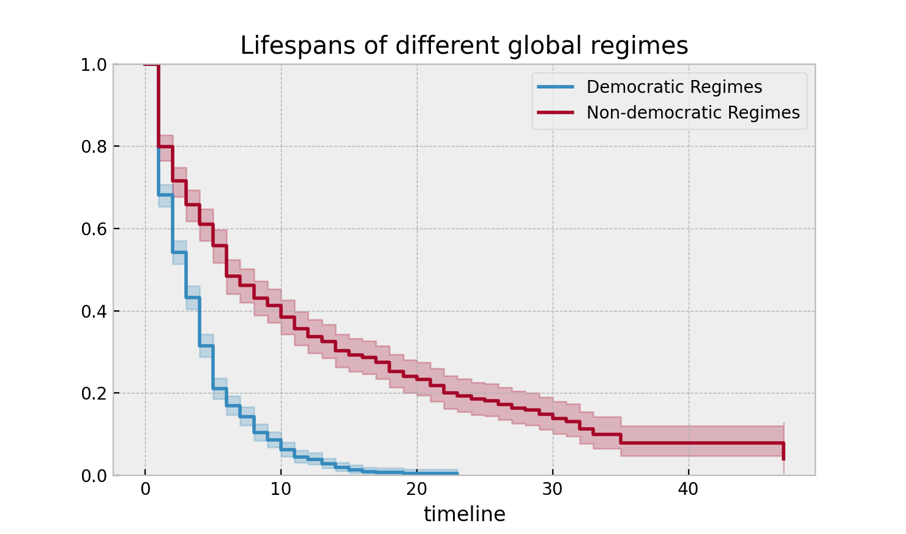
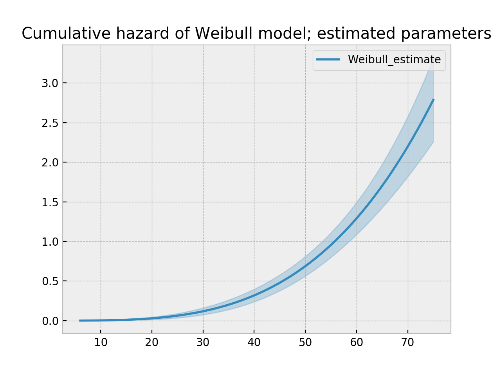
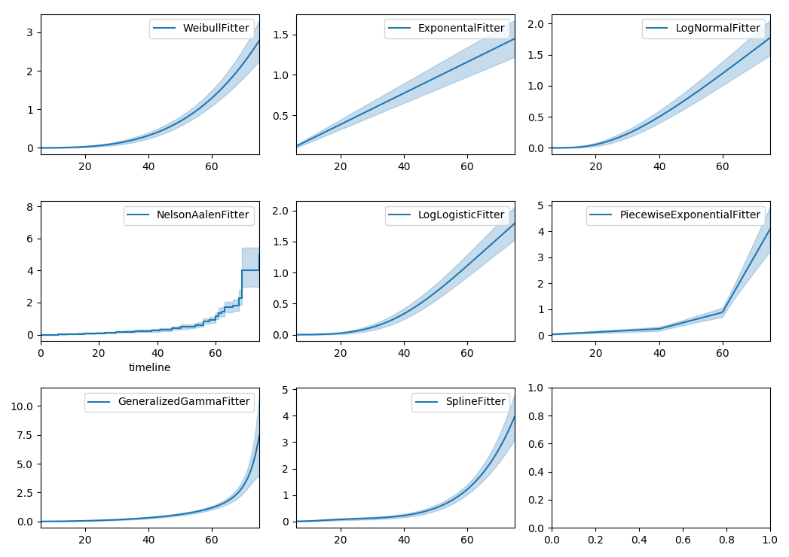
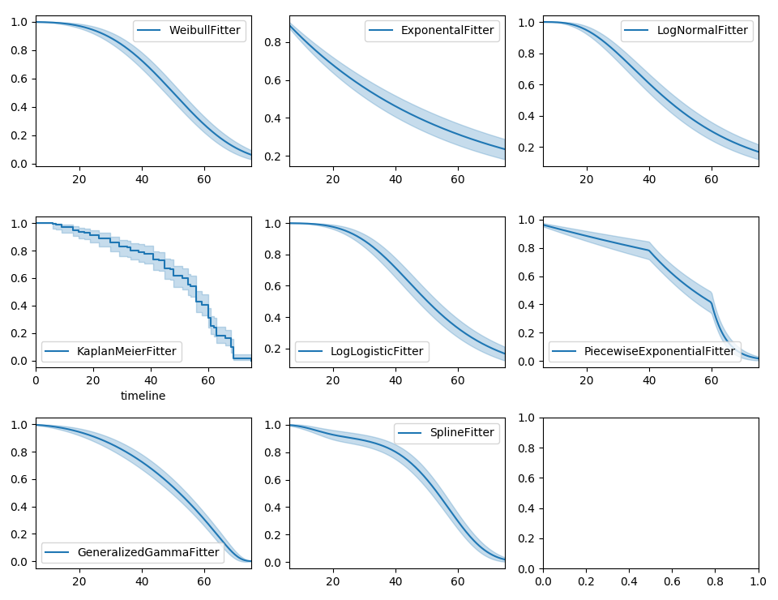
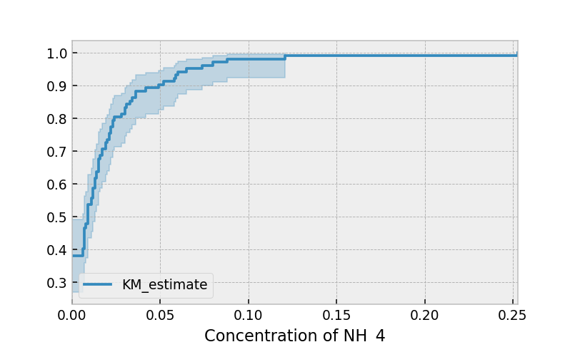

.. image:: http://i.imgur.com/EOowdSD.png

-------------------------------------

Estimating univariate models
=====================================

In the previous :doc:`section</Survival Analysis intro>`,
we introduced the use of survival analysis, the need, and the
mathematical objects on which it relies. In this article, we will work
with real data and the *lifelines* library to estimate these mathematical objects.

Estimating the survival function using Kaplan-Meier
''''''''''''''''''''''''''''''''''''''''''''''''''''''''''''''

For this example, we will be investigating the lifetimes of political
leaders around the world. A political leader, in this case, is defined by a single individual's
time in office who controls the ruling regime. This political leader could be an elected president,
unelected dictator, monarch, etc. The birth event is the start of the individual's tenure, and the death
event is the retirement of the individual. Censoring can occur if they are a) still in offices at the time
of dataset compilation (2008), or b) die while in power (this includes assassinations).

For example, the Bush regime began in 2000 and officially ended in 2008
upon his retirement, thus this regime's lifespan was eight years, and there was a
"death" event observed. On the other hand, the JFK regime lasted 2
years, from 1961 and 1963, and the regime's official death event *was
not* observed -- JFK died before his official retirement.

(This is an example that has gladly redefined the birth and death
events, and in fact completely flips the idea upside down by using deaths
as the censoring event. This is also an example where the current time
is not the only cause of censoring; there are the alternative events (e.g., death in office) that can
be the cause of censoring.

To estimate the survival function, we first will use the `Kaplan-Meier
Estimate <http://en.wikipedia.org/wiki/Kaplan%E2%80%93Meier_estimator>`__,
defined:

.. math:: \hat{S}(t) = \prod_{t_i \lt t} \frac{n_i - d_i}{n_i}

where :math:`d_i` are the number of death events at time :math:`t` and
:math:`n_i` is the number of subjects at risk of death just prior to time
:math:`t`.

Let's bring in our dataset.

.. code:: python

    from lifelines.datasets import load_dd

    data = load_dd()
    data.head()

.. table::

    +-----------+--------+----------+--------------+-----------------+---------------------+---------------------------------------------------------+-------------+-------------+----------+--------+--------+
    | ctryname  |cowcode2|politycode|un_region_name|un_continent_name|        ehead        |                     leaderspellreg                      |  democracy  |   regime    |start_year|duration|observed|
    +===========+========+==========+==============+=================+=====================+=========================================================+=============+=============+==========+========+========+
    |Afghanistan|     700|       700|Southern Asia |Asia             |Mohammad Zahir Shah  |Mohammad Zahir Shah.Afghanistan.1946.1952.Monarchy       |Non-democracy|Monarchy     |      1946|       7|       1|
    +-----------+--------+----------+--------------+-----------------+---------------------+---------------------------------------------------------+-------------+-------------+----------+--------+--------+
    |Afghanistan|     700|       700|Southern Asia |Asia             |Sardar Mohammad Daoud|Sardar Mohammad Daoud.Afghanistan.1953.1962.Civilian Dict|Non-democracy|Civilian Dict|      1953|      10|       1|
    +-----------+--------+----------+--------------+-----------------+---------------------+---------------------------------------------------------+-------------+-------------+----------+--------+--------+
    |Afghanistan|     700|       700|Southern Asia |Asia             |Mohammad Zahir Shah  |Mohammad Zahir Shah.Afghanistan.1963.1972.Monarchy       |Non-democracy|Monarchy     |      1963|      10|       1|
    +-----------+--------+----------+--------------+-----------------+---------------------+---------------------------------------------------------+-------------+-------------+----------+--------+--------+
    |Afghanistan|     700|       700|Southern Asia |Asia             |Sardar Mohammad Daoud|Sardar Mohammad Daoud.Afghanistan.1973.1977.Civilian Dict|Non-democracy|Civilian Dict|      1973|       5|       0|
    +-----------+--------+----------+--------------+-----------------+---------------------+---------------------------------------------------------+-------------+-------------+----------+--------+--------+
    |Afghanistan|     700|       700|Southern Asia |Asia             |Nur Mohammad Taraki  |Nur Mohammad Taraki.Afghanistan.1978.1978.Civilian Dict  |Non-democracy|Civilian Dict|      1978|       1|       0|
    +-----------+--------+----------+--------------+-----------------+---------------------+---------------------------------------------------------+-------------+-------------+----------+--------+--------+

From the *lifelines* library, we'll need the
:class:`~lifelines.fitters.kaplan_meier_fitter.KaplanMeierFitter` for this exercise:

.. code:: python

    from lifelines import KaplanMeierFitter
    kmf = KaplanMeierFitter()

..  note:: Other ways to estimate the survival function in *lifelines* are discussed below.

For this estimation, we need the duration each leader was/has been in
office, and whether or not they were observed to have left office
(leaders who died in office or were in office in 2008, the latest date
this data was record at, do not have observed death events)

We next use the :class:`~lifelines.fitters.kaplan_meier_fitter.KaplanMeierFitter` method :meth:`~lifelines.fitters.kaplan_meier_fitter.KaplanMeierFitter.fit` to fit the model to
the data. (This is similar to, and inspired by, `scikit-learn's <http://scikit-learn.org/stable/>`__ fit/predict API).

Below we fit our data with the :class:`~lifelines.fitters.kaplan_meier_fitter.KaplanMeierFitter`:

.. code:: python

    T = data["duration"]
    E = data["observed"]

    kmf.fit(T, event_observed=E)

After calling the :meth:`~lifelines.fitters.kaplan_meier_fitter.KaplanMeierFitter.fit` method, the :class:`~lifelines.fitters.kaplan_meier_fitter.KaplanMeierFitter` has a property
called :attr:`~lifelines.fitters.kaplan_meier_fitter.KaplanMeierFitter.survival_function_` (again, we follow the styling of
scikit-learn, and append an underscore to all properties that were computational estimated).
The property is a Pandas DataFrame, so we can call :meth:`~lifelines.fitters.kaplan_meier_fitter.KaplanMeierFitter.plot` on it:

.. code:: python

    kmf.survival_function_.plot()
    plt.title('Survival function of political regimes');

.. image:: images/lifelines_intro_kmf_curve.png

How do we interpret this? The y-axis represents the probability a leader is still
around after :math:`t` years, where :math:`t` years is on the x-axis. We
see that very few leaders make it past 20 years in office. Of course,
like all good stats, we need to report how uncertain we are about these
point estimates, i.e., we need confidence intervals. They are computed in
the call to :meth:`~lifelines.fitters.kaplan_meier_fitter.KaplanMeierFitter.fit`, and located under the :attr:`~lifelines.fitters.kaplan_meier_fitter.KaplanMeierFitter.confidence_interval_`
property. (The method uses exponential Greenwood confidence interval. The mathematics are found in `these notes <https://www.math.wustl.edu/%7Esawyer/handouts/greenwood.pdf>`_.)

.. math::  S(t) = Pr( T > t)

Alternatively, we can call :meth:`~lifelines.fitters.kaplan_meier_fitter.KaplanMeierFitter.plot` on the :class:`~lifelines.fitters.kaplan_meier_fitter.KaplanMeierFitter` itself to plot both the KM estimate and its confidence intervals:

.. code:: python

    kmf.plot()

.. image:: images/lifelines_intro_kmf_fitter.png

The median time in office, which defines the point in time where on
average 1/2 of the population has expired, is a property:

.. code:: python

    kmf.median_
    #   4.0

Interesting that it is only four years. That means, around the world, elected leaders
have a 50% chance of cessation in four years or less!

Let's segment on democratic regimes vs non-democratic regimes. Calling
``plot`` on either the estimate itself or the fitter object will return
an ``axis`` object, that can be used for plotting further estimates:

.. code:: python

    ax = plt.subplot(111)

    dem = (data["democracy"] == "Democracy")

    kmf.fit(T[dem], event_observed=E[dem], label="Democratic Regimes")
    kmf.plot(ax=ax)
    kmf.fit(T[~dem], event_observed=E[~dem], label="Non-democratic Regimes")
    kmf.plot(ax=ax)

    plt.ylim(0, 1);
    plt.title("Lifespans of different global regimes");

We might be interested in estimating the probabilities in between some
points. We can do that with the ``timeline`` argument. We specify the
times we are interested in and are returned a DataFrame with the
probabilities of survival at those points:

.. code:: python

    ax = plt.subplot(111)

    t = np.linspace(0, 50, 51)
    kmf.fit(T[dem], event_observed=E[dem], timeline=t, label="Democratic Regimes")
    ax = kmf.plot(ax=ax)
    print("Median survival time of democratic:", kmf.median_)

    kmf.fit(T[~dem], event_observed=E[~dem], timeline=t, label="Non-democratic Regimes")
    ax = kmf.plot(ax=ax)
    print("Median survival time of non-democratic:", kmf.median_)

    plt.ylim(0, 1)
    plt.title("Lifespans of different global regimes");

    """
    Median survival time of democratic: 3
    Median survival time of non-democratic: 6
    """

.. image:: images/lifelines_intro_multi_kmf_fitter_2.png

It is incredible how much longer these non-democratic regimes exist for.
A democratic regime does have a natural bias towards death though: both
via elections and natural limits (the US imposes a strict eight-year limit).
The median of a non-democratic is only about twice as large as a
democratic regime, but the difference is apparent in the tails:
if you're a non-democratic leader, and you've made it past the 10 year
mark, you probably have a long life ahead. Meanwhile, a democratic
leader rarely makes it past ten years, and then have a very short
lifetime past that.

Here the difference between survival functions is very obvious, and
performing a statistical test seems pedantic. If the curves are more
similar, or we possess less data, we may be interested in performing a
statistical test. In this case, *lifelines* contains routines in
:mod:`lifelines.statistics` to compare two survival functions. Below we
demonstrate this routine. The function :func:`lifelines.statistics.logrank_test` is a common
statistical test in survival analysis that compares two event series'
generators. If the value returned exceeds some pre-specified value, then
we rule that the series have different generators.

.. code:: python

    from lifelines.statistics import logrank_test

    results = logrank_test(T[dem], T[~dem], E[dem], E[~dem], alpha=.99)

    results.print_summary()

    """

    <lifelines.StatisticalResult>
                 t_0 = -1
    null_distribution = chi squared
    degrees_of_freedom = 1
               alpha = 0.99

    ---
    test_statistic      p  -log2(p)
           260.47  <0.005    192.23
    """"

Lets compare the different *types* of regimes present in the dataset:

.. code:: python

    regime_types = data['regime'].unique()

    for i, regime_type in enumerate(regime_types):
        ax = plt.subplot(2, 3, i + 1)

        ix = data['regime'] == regime_type
        kmf.fit(T[ix], E[ix], label=regime_type)
        kmf.plot(ax=ax, legend=False)

        plt.title(regime_type)
        plt.xlim(0, 50)

        if i==0:
            plt.ylabel('Frac. in power after $n$ years')

    plt.tight_layout()

.. image:: images/lifelines_intro_all_regimes.png

There are alternative (and sometimes better) tests of survival functions, and we explain more here: `Statistically compare two populations`_

--------------

Getting data into the right format
~~~~~~~~~~~~~~~~~~~~~~~~~~~~~~~~~~

*lifelines* data format is consistent across all estimator class and
functions: an array of individual durations, and the individuals
event observation (if any). These are often denoted ``T`` and ``E``
respectively. For example:

::

    T = [0,3,3,2,1,2]
    E = [1,1,0,0,1,1]
    kmf.fit(T, event_observed=E)

The raw data is not always available in this format -- *lifelines*
includes some helper functions to transform data formats to *lifelines*
format. These are located in the :mod:`lifelines.utils` sub-library. For
example, the function :func:`~lifelines.utils.datetimes_to_durations` accepts an array or
Pandas object of start times/dates, and an array or Pandas objects of
end times/dates (or ``None`` if not observed):

.. code:: python

    from lifelines.utils import datetimes_to_durations

    start_date = ['2013-10-10 0:00:00', '2013-10-09', '2013-10-10']
    end_date = ['2013-10-13', '2013-10-10', None]
    T, E = datetimes_to_durations(start_date, end_date, fill_date='2013-10-15')
    print('T (durations): ', T)
    print('E (event_observed): ', E)

.. parsed-literal::

    T (durations):  [ 3.  1.  5.]
    E (event_observed):  [ True  True False]

The function :func:`~lifelines.utils.datetimes_to_durations` is very flexible, and has many
keywords to tinker with.

Estimating hazard rates using Nelson-Aalen
''''''''''''''''''''''''''''''''''''''''''''''''''''''''''''''

The survival functions is a great way to summarize and visualize the
survival dataset, however it is not the only way. If we are curious about the hazard function :math:`h(t)` of a
population, we unfortunately cannot transform the Kaplan Meier estimate
-- statistics doesn't work quite that well. Fortunately, there is a
proper non-parametric estimator of the *cumulative* hazard function:

.. math::  H(t) =  \int_0^t \lambda(z) \;dz

The estimator for this quantity is called the Nelson Aalen estimator:

.. math:: \hat{H}(t) = \sum_{t_i \le t} \frac{d_i}{n_i}

where :math:`d_i` is the number of deaths at time :math:`t_i` and
:math:`n_i` is the number of susceptible individuals.

In *lifelines*, this estimator is available as the :class:`~lifelines.fitters.nelson_aalen_fitter.NelsonAalenFitter`. Let's use the regime dataset from above:

.. code:: python

    T = data["duration"]
    E = data["observed"]

    from lifelines import NelsonAalenFitter
    naf = NelsonAalenFitter()

    naf.fit(T,event_observed=E)

After fitting, the class exposes the property :meth:`~lifelines.fitters.nelson_aalen_fitter.NelsonAalenFitter.cumulative_hazard_`` as
a DataFrame:

.. code:: python

    print(naf.cumulative_hazard_.head())
    naf.plot()

.. parsed-literal::

       NA-estimate
    0     0.000000
    1     0.325912
    2     0.507356
    3     0.671251
    4     0.869867

    [5 rows x 1 columns]

.. image:: images/lifelines_intro_naf_fitter.png

The cumulative hazard has less obvious understanding than the survival
functions, but the hazard functions is the basis of more advanced techniques in
survival analysis. Recall that we are estimating *cumulative hazard
functions*, :math:`H(t)`. (Why? The sum of estimates is much more
stable than the point-wise estimates.) Thus we know the *rate of change*
of this curve is an estimate of the hazard function.

Looking at figure above, it looks like the hazard starts off high and
gets smaller (as seen by the decreasing rate of change). Let's break the
regimes down between democratic and non-democratic, during the first 20
years:

.. note::  We are using the ``loc`` argument in the call to ``plot`` here: it accepts a ``slice`` and plots only points within that slice.

.. code:: python

    naf.fit(T[dem], event_observed=E[dem], label="Democratic Regimes")
    ax = naf.plot(loc=slice(0, 20))

    naf.fit(T[~dem], event_observed=E[~dem], label="Non-democratic Regimes")
    naf.plot(ax=ax, loc=slice(0, 20))

    plt.title("Cumulative hazard function of different global regimes");

.. image:: images/lifelines_intro_naf_fitter_multi.png

Looking at the rates of change, I would say that both political
philosophies have a constant hazard, albeit democratic regimes have a
much *higher* constant hazard.

Smoothing the hazard function
~~~~~~~~~~~~~~~~~~~~~~~~~~~~~~~

Interpretation of the cumulative hazard function can be difficult -- it
is not how we usually interpret functions. On the other hand, most
survival analysis is done using the cumulative hazard function, so understanding
it is recommended.

Alternatively, we can derive the more-interpretable hazard function, but
there is a catch. The derivation involves a kernel smoother (to smooth
out the differences of the cumulative hazard function) , and this requires
us to specify a bandwidth parameter that controls the amount of
smoothing. This functionality is in the :meth:`~lifelines.fitters.nelson_aalen_fitter.NelsonAalenFitter.smoothed_hazard_`
and :meth:`~lifelines.fitters.nelson_aalen_fitter.NelsonAalenFitter.smoothed_hazard_confidence_intervals_` methods. Why methods?
They require an argument representing the bandwidth.

There is also a :meth:`~lifelines.fitters.nelson_aalen_fitter.NelsonAalenFitter.plot_hazard` function (that also requires a
``bandwidth`` keyword) that will plot the estimate plus the confidence
intervals, similar to the traditional :meth:`~lifelines.fitters.nelson_aalen_fitter.NelsonAalenFitter.plot` functionality.

.. code:: python

    bandwidth = 3.

    naf.fit(T[dem], event_observed=E[dem], label="Democratic Regimes")
    ax = naf.plot_hazard(bandwidth=bandwidth)

    naf.fit(T[~dem], event_observed=E[~dem], label="Non-democratic Regimes")
    naf.plot_hazard(ax=ax, bandwidth=bandwidth)

    plt.title("Hazard function of different global regimes | bandwidth=%.1f" % bandwidth);
    plt.ylim(0, 0.4)
    plt.xlim(0, 25);

.. image:: images/lifelines_intro_naf_smooth_multi.png

It is more clear here which group has the higher hazard, and Non-democratic regimes appear to have a constant hazard.

There is no obvious way to choose a bandwidth, and different
bandwidths produce different inferences, so it's best to be very careful
here. My advice: stick with the cumulative hazard function.

.. code:: python

    bandwidth = 8.0

    naf.fit(T[dem], event_observed=E[dem], label="Democratic Regimes")
    ax = naf.plot_hazard(bandwidth=bandwidth)

    naf.fit(T[~dem], event_observed=E[~dem], label="Non-democratic Regimes")
    naf.plot_hazard(ax=ax, bandwidth=bandwidth)

    plt.title("Hazard function of different global regimes | bandwidth=%.1f" % bandwidth);

.. image:: images/lifelines_intro_naf_smooth_multi_2.png

Estimating cumulative hazards using parametric models
''''''''''''''''''''''''''''''''''''''''''''''''''''''''''''''

Fitting to a Weibull model
~~~~~~~~~~~~~~~~~~~~~~~~~~~~~~~~

 .. note:: The parameterization of the Weibull and Exponential model changed in *lifelines 0.19.0*, released in Feb. 2019.

Another very popular model for survival data is the Weibull model. In contrast the the Nelson-Aalen estimator, this model is a *parametric model*, meaning it has a functional form with parameters that we are fitting the data to. (The Nelson-Aalen estimator has no parameters to fit to). The survival function looks like:

.. math::  S(t) = \exp\left(-\left(\frac{t}{\lambda}\right)^\rho\right),   \lambda >0, \rho > 0,

A priori, we do not know what :math:`\lambda` and :math:`\rho` are, but we use the data on hand to estimate these parameters. We model and estimate the cumulative hazard rate instead of the survival function (this is different than the Kaplan-Meier estimator):

.. math::  H(t) = \left(\frac{t}{\lambda}\right)^\rho

In lifelines, estimation is available using the :class:`lifelines.fitters.weibull_fitter.WeibullFitter` class. The :meth:`~lifelines.fitters.weibull_fitter.WeibullFitter.plot` method will plot the cumulative hazard.

.. code:: python

    from lifelines import WeibullFitter
    from lifelines.datasets import load_waltons

    data = load_waltons()

    T = data['T']
    E = data['E']

    wf = WeibullFitter().fit(T, E)

    wf.print_summary()
    wf.plot()

    """
    <lifelines.WeibullFitter: fitted with 163 observations, 7 censored>
    number of subjects = 163
      number of events = 156
        log-likelihood = -672.062
            hypothesis = lambda != 1, rho != 1

    ---
             coef  se(coef)  lower 0.95  upper 0.95      p  -log2(p)
    lambda_  0.02      0.00        0.02        0.02 <0.005       inf
    rho_     3.45      0.24        2.97        3.93 <0.005     76.83
    """

Other parametric models: Exponential, Log-Logistic & Log-Normal
~~~~~~~~~~~~~~~~~~~~~~~~~~~~~~~~~~~~~~~~~~~~~~~~~~~~~~~~~~~~~~~~~

Similarly, there are other parametric models in *lifelines*. Generally, which parametric model to choose is determined by either knowledge of the distribution of durations, or some sort of model goodness-of-fit. Below are the built-in parametric models, and the Nelson-Aalen nonparametric model, of the same data.

.. code:: python

    from lifelines import (WeibullFitter, ExponentialFitter,
    LogNormalFitter, LogLogisticFitter, NelsonAalenFitter,
    PiecewiseExponentialFitter, GeneralizedGammaFitter)

    from lifelines.datasets import load_waltons
    data = load_waltons()

    fig, axes = plt.subplots(3, 3, figsize=(10, 7.5))

    T = data['T']
    E = data['E']

    wbf = WeibullFitter().fit(T, E, label='WeibullFitter')
    exf = ExponentialFitter().fit(T, E, label='ExponentalFitter')
    lnf = LogNormalFitter().fit(T, E, label='LogNormalFitter')
    naf = NelsonAalenFitter().fit(T, E, label='NelsonAalenFitter')
    llf = LogLogisticFitter().fit(T, E, label='LogLogisticFitter')
    pwf = PiecewiseExponentialFitter([40, 60]).fit(T, E, label='PiecewiseExponentialFitter')
    gg = GeneralizedGammaFitter().fit(T, E, label='GeneralizedGammaFitter')

    wbf.plot_cumulative_hazard(ax=axes[0][0])
    exf.plot_cumulative_hazard(ax=axes[0][1])
    lnf.plot_cumulative_hazard(ax=axes[0][2])
    naf.plot_cumulative_hazard(ax=axes[1][0])
    llf.plot_cumulative_hazard(ax=axes[1][1])
    pwf.plot_cumulative_hazard(ax=axes[1][2])
    gg.plot_cumulative_hazard(ax=axes[2][0])

*lifelines* can also be used to define your own parametric model. There is a tutorial on this available, see `Piecewise Exponential Models and Creating Custom Models`_.

Parametric models can also be used to create and plot the survival function, too. Below we compare the parametric models versus the non-parametric Kaplan-Meier estimate:

.. code:: python

    from lifelines import KaplanMeierFitter

    fig, axes = plt.subplots(3, 3, figsize=(10, 7.5))

    T = data['T']
    E = data['E']

    kmf = KaplanMeierFitter().fit(T, E, label='KaplanMeierFitter')
    wbf = WeibullFitter().fit(T, E, label='WeibullFitter')
    exf = ExponentialFitter().fit(T, E, label='ExponentalFitter')
    lnf = LogNormalFitter().fit(T, E, label='LogNormalFitter')
    llf = LogLogisticFitter().fit(T, E, label='LogLogisticFitter')
    pwf = PiecewiseExponentialFitter([40, 60]).fit(T, E, label='PiecewiseExponentialFitter')
    gg = GeneralizedGammaFitter().fit(T, E, label='GeneralizedGammaFitter')

    wbf.plot_survival_function(ax=axes[0][0])
    exf.plot_survival_function(ax=axes[0][1])
    lnf.plot_survival_function(ax=axes[0][2])
    kmf.plot_survival_function(ax=axes[1][0])
    llf.plot_survival_function(ax=axes[1][1])
    pwf.plot_survival_function(ax=axes[1][2])
    gg.plot_survival_function(ax=axes[2][0])

With parametric models, we have a functional form that allows us to extend the survival function (or hazard or cumulative hazard) past our maximum observed duration. This is called extrapolation. We can do this in a few ways.

.. code:: python

    timeline = np.linspace(0, 100, 200)

    # directly compute the survival function, these return a pandas Series
    wbf = WeibullFitter().fit(T, E)
    wbf.survival_function_at_times(timeline)
    wbf.hazard_at_times(timeline)
    wbf.cumulative_hazard_at_times(timeline)

    # use the `timeline` kwarg in `fit`
    # by default, all functions and properties will use
    # these values provided
    wbf = WeibullFitter().fit(T, E, timeline=timeline)

    wbf.plot_survival_function()

To aid model selection, *lifelines* has provided qq-plots, `Selecting a parametric model using QQ plots`_.

Other types of censoring
''''''''''''''''''''''''''''''''''''''''''''''''''''''''''''''

Left censored data and non-detection
~~~~~~~~~~~~~~~~~~~~~~~~~~~~~~~~~~~~~~

We've mainly been focusing on *right-censoring*, which describes cases where we do not observe the death event.
This situation is the most common one. Alternatively, there are situations where we do not observe the *birth* event
occurring. Consider the case where a doctor sees a delayed onset of symptoms of an underlying disease. The doctor
is unsure *when* the disease was contracted (birth), but knows it was before the discovery.

Another situation where we have left-censored data is when measurements have only an upper bound, that is, the measurements
instruments could only detect the measurement was *less* than some upper bound. This bound is often called the limit of detection (LOD). In practice, there could be more than one LOD. One very important statistical lesson: don't "fill-in" this value naively. It's tempting to use something like one-half the LOD, but this will cause *lots* of bias in downstream analysis. An example dataset is below:

.. note:: The recommended API for modeling left-censored data using parametric models changed in version 0.21.0. Below is the recommended API.

.. code:: python

    from lifelines.datasets import load_nh4
    df = load_nh4()[['NH4.Orig.mg.per.L', 'NH4.mg.per.L', 'Censored']]
    print(df.head())

    """
      NH4.Orig.mg.per.L  NH4.mg.per.L  Censored
    1            <0.006         0.006      True
    2            <0.006         0.006      True
    3             0.006         0.006     False
    4             0.016         0.016     False
    5            <0.006         0.006      True
    """

*lifelines* has support for left-censored datasets in most univariate models, including the :class:`~lifelines.fitters.kaplan_meier_fitter.KaplanMeierFitter` class, by using the ``fit_left_censoring`` method.

.. code:: python

    T, E = df['NH4.mg.per.L'], ~df['Censored']

    kmf = KaplanMeierFitter()
    kmf.fit_left_censoring(T, E)

Instead of producing a survival function, left-censored data analysis is more interested in the cumulative density function. This is available as the ``cumulative_density_`` property after fitting the data.

.. code:: python

    print(kmf.cumulative_density_.head())

    kmf.plot() #will plot the CDF
    plt.xlabel("Concentration of NH_4")

    """
              KM_estimate
    timeline
    0.000        0.379897
    0.006        0.401002
    0.007        0.464319
    0.008        0.478828
    0.009        0.536868
    """

Alternatively, you can use a parametric model to model the data. This allows for you to "peer" below the LOD, however using a parametric model means you need to correctly specify the distribution. You can use plots like qq-plots to help invalidate some distributions, see `Selecting a parametric model using QQ plots`_.

.. code:: python

    from lifelines import *
    from lifelines.plotting import qq_plot

    fig, axes = plt.subplots(3, 2, figsize=(9, 9))
    timeline = np.linspace(0, 0.25, 100)

    wf = WeibullFitter().fit_left_censoring(T, E, label="Weibull", timeline=timeline)
    lnf = LogNormalFitter().fit_left_censoring(T, E, label="Log Normal", timeline=timeline)
    lgf = LogLogisticFitter().fit_left_censoring(T, E, label="Log Logistic", timeline=timeline)

    # plot what we just fit, along with the KMF estimate
    kmf.plot_cumulative_density(ax=axes[0][0], ci_show=False)
    wf.plot_cumulative_density(ax=axes[0][0], ci_show=False)
    qq_plot(wf, ax=axes[0][1])

    kmf.plot_cumulative_density(ax=axes[1][0], ci_show=False)
    lnf.plot_cumulative_density(ax=axes[1][0], ci_show=False)
    qq_plot(lnf, ax=axes[1][1])

    kmf.plot_cumulative_density(ax=axes[2][0], ci_show=False)
    lgf.plot_cumulative_density(ax=axes[2][0], ci_show=False)
    qq_plot(lgf, ax=axes[2][1])

Based on the above, the log-normal distribution seems to fit well, and the Weibull not very well at all.

Interval censored data
~~~~~~~~~~~~~~~~~~~~~~~~~~~~~~~

Data can also be interval censored. An example of this is periodically recording the population of micro-organisms as they die-off. Their deaths are interval censored because you know a subject died between two observations periods. New to lifelines in version 0.21.0, all parametric models have support for interval censored data.

.. note:: The API for ``fit_interval_censoring`` is different than right and left censored data.

.. code:: python

    from lifelines.datasets import load_diabetes

    df = load_diabetes()

    wf = WeibullFitter().fit_interval_censoring(lower_bound=df['left'], upper_bound=df['right'])

Another example of using lifelines for interval censored data is located `here <https://dataorigami.net/blogs/napkin-folding/counting-and-interval-censoring>`_.

Left truncated (late entry) data
~~~~~~~~~~~~~~~~~~~~~~~~~~~~~~~~~~~

Another form of bias that is introduced into a dataset is called left-truncation (or late entry). Left-truncation can occur in many situations. One situation is when individuals may have the opportunity to die before entering into the study. For example, if you are measuring time to death of prisoners in prison, the prisoners will enter the study at different ages. So it's possible there are some counter-factual individuals who *would* have entered into your study (that is, went to prison), but instead died early.

All univariate fitters, like :class:`~lifelines.fitters.kaplan_meier_fitter.KaplanMeierFitter` and any parametric models, have an optional argument for ``entry``, which is an array of equal size to the duration array. It describes the time between actual "birth" (or "exposure") to entering the study.

 .. note:: Nothing changes in the duration array: it still measures time from "birth" to time exited study (either by death or censoring). That is, durations refers to the absolute death time rather than a duration relative to the study entry.

Another situation with left-truncation occurs when subjects are exposed before entry into study. For example, a study of time to all-cause mortality of AIDS patients that recruited individuals previously diagnosed with AIDS, possibly years before. In our example below we will use a dataset like this, called the Multicenter Aids Cohort Study. In the figure below, we plot the lifetimes of subjects. A solid line is when the subject was under our observation, and a dashed line represents the unobserved period between diagnosis and study entry. A solid dot at the end of the line represents death.

.. code:: python

    from lifelines.datasets import load_multicenter_aids_cohort_study
    from lifelines.plotting import plot_lifetimes

    df = load_multicenter_aids_cohort_study()

    plot_lifetimes(
        df["T"] - df["W"],
        event_observed=df["D"],
        entry=df["W"],
        event_observed_color="#383838",
        event_censored_color="#383838",
        left_truncated=True,
    )
    plt.ylabel("Patient Number")
    plt.xlabel("Years from AIDS diagnosis")

So subject #77, the subject at the top, was diagnosed with AIDS 7.5 years ago, but wasn't in our study for the first 4.5 years. From this point-of-view, why can't we "fill in" the dashed lines and say, for example, "subject #77 lived for 7.5 years"? If we did this, we would severely underestimate chance of dying early on after diagnosis. Why? It's possible that there were individuals who were diagnosed and then died shortly after, and never had a chance to enter our study. If we did manage to observe them however, they would have depressed the survival function early on. Thus, "filling in" the dashed lines makes us over confident about what occurs in the early period after diagnosis. We can see this below when we model the survival function with and without taking into account late entries.

.. code:: python

        from lifelines import KaplanMeierFitter

        kmf = KaplanMeierFitter()
        kmf.fit(df["T"], event_observed=df["D"], entry=df["W"], label='modeling late entries')
        ax = kmf.plot()

        kmf.fit(df["T"], event_observed=df["D"], label='ignoring late entries')
        kmf.plot(ax=ax)

.. _Piecewise Exponential Models and Creating Custom Models: jupyter_notebooks/Piecewise%20Exponential%20Models%20and%20Creating%20Custom%20Models.html
.. _Statistically compare two populations: Examples.html#statistically-compare-two-populations
.. _Selecting a parametric model using QQ plots: Examples.html#selecting-a-parametric-model-using-qq-plots
