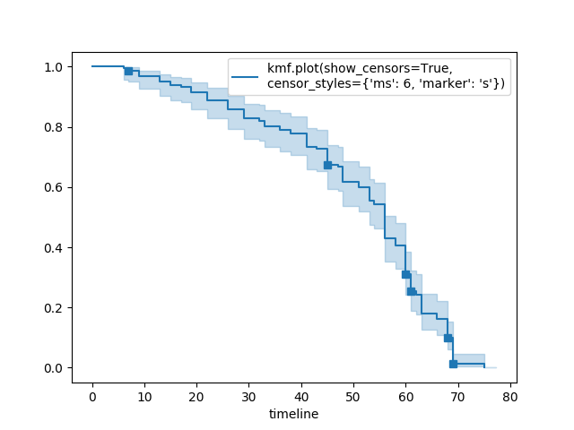
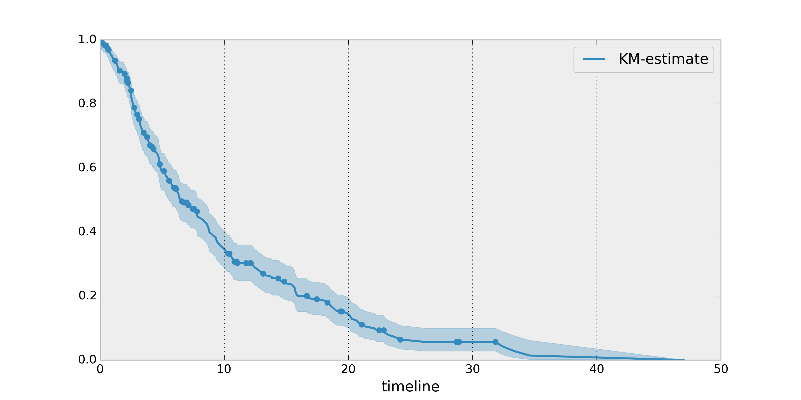

More examples and recipes
==================================

This section goes through some examples and recipes to help you use *lifelines*. 

Getting survival-table data into *lifelines* format
#####################################################

*lifelines* classes are designed for lists or arrays that represent one individual per element. If you instead have data in 
a *survival table* format, there exists a utility method to get it into *lifelines* format.

**Example:** Suppose you have a csv file with data that looks like this:

=========================   ==================    ============
time (months, days, ...)      observed deaths       censored                      
=========================   ==================    ============
0                               7                    0 
1                               1                    1
2                               2                    0
3                               1                    2
4                               5                    2
...                             ...                 ...
=========================   ==================    ============

.. code-block:: python
    
    import pandas as pd
    
    # your argument in the function call below will be different
    df = pd.read_csv('file.csv', index_cols=[0], columns = ['observed deaths', 'censored'] )

    from lifelines.utils import survival_events_from_table

    T,C = survival_events_from_table(df, observed_deaths_col='observed deaths', censored_col='censoreds')
    print T # np.array([0,0,0,0,0,0,0,1,2,2, ...])
    print C # np.array([1,1,1,1,1,1,1,0,1,1, ...])

Plotting multiple figures on an plot 
##############################################

When `.plot` is called, an `axis` object is returned which can be passed into future calls of `.plot`:

.. code-block:: python
    
    kmf.fit(data1)
    ax = kmf.plot()

    kmf.fit(data2)
    ax = kmf.plot(ax=ax)

If you have a pandas `DataFrame` with columns "group", "T", and "C", then something like the following would work:

.. code-block:: python
    
    from lifelines import KaplanMeierFitter
    from matplotlib import pyplot as plt
    
    ax = plt.subplot(111)

    #group the data by column 'group'
    grouped_data = df.groupby("group")

    #iterate over the groups and plot the estimate + 95% intervals.
    unique_groups = grouped_data.groups.keys()
    unique_groups.sort()

    kmf = KaplanMeierFitter()
    for i, group in enumerate(unique_groups):
        data = grouped_data.get_group(group)
        kmf.fit(data["T"], data["C"], label=group)
        kmf.plot(ax=ax)
    

Plotting options and styles
##############################################

There are many styles of lifelines plots you may want, depending on your tastes:

Standard
^^^^^^^^^^^^^^^^^^^^^^^^^^^^^^^^^^^^^^^^^^^^^^^

.. code-block:: python
    
    kmf = KaplanMeierFitter()
    kmf.fit(T,C,label="kmf.plot()")
    kmf.plot()

.. image:: /images/normal_plot.png 
   :height: 300

R-style
^^^^^^^^^^^^^^^^^^^^^^^^^^^^^^^^^^^^^^^^^^^^^^^

.. code-block:: python

    kmf.fit(T,C,label="kmf.plot(flat=True)")
    kmf.plot(flat=True)

Show censorships
^^^^^^^^^^^^^^^^^^^^^^^^^^^^^^^^^^^^^^^^^^^^^^^

.. code-block:: python

    kmf.fit(T,C,label="kmf.plot(show_censors=True)")
    kmf.plot(show_censors=True)

Hide confidence intervals
^^^^^^^^^^^^^^^^^^^^^^^^^^^^^^^^^^^^^^^^^^^^^^^

.. code-block:: python

    kmf.fit(T,C,label="kmf.plot(ci_show=False)")
    kmf.plot(ci_show=False)

.. image:: /images/ci_show_plot.png 
   :height: 300

Compare two Kaplan-Meier Estimates
##############################################

(though this applies just as well to Nelson-Aalen estimates). Often researchers want to compare
survival curves between different populations. Here are some techniques to do that: 

Subtract the difference between survival curves
^^^^^^^^^^^^^^^^^^^^^^^^^^^^^^^^^^^^^^^^^^^^^^^

If you are interested in taking the difference between two survival curves, simply trying to 
subtract the ``survival_function_`` will likely fail if the timelines are not equal. Fortunately, 
the ``KaplanMeierFitter`` and ``NelsonAalenFitter`` have a built in ``subtract`` method: 

.. code-block:: python
    
    kmf1.subtract(kmf2)

will produce the difference at every relevant time point. A similar function exists for division: ``divide``.

Compare using a hypothesis test
^^^^^^^^^^^^^^^^^^^^^^^^^^^^^^^^^^^^^^^^^^^^^^^

For rigorous testing of differences, lifelines comes with a statistics library. The ``logrank_test`` function
compares whether the "death" generation process of the two populations are equal:

.. code-block:: python
    
    from lifelines.statistics import logrank_test

    summary, p_value, test_result = logrank_test(T1, T2, event_observed_A=C1, event_observed_B=C2)

    print summary

    """
    Results
        df: 1
       alpha: 0.95
       t 0: -1
       test: logrank
       null distribution: chi squared

       __ p-value ___|__ test statistic __|__ test results __
             0.46759 |              0.528 |     None
   """

   print p_value     # 0.46759 
   print test_result # None

If you have more than two populations, you can use ``pairwise_logrank_test`` (which compares
each pair in the same manner as above), or ``multivariate_logrank_test`` (which tests the 
hypothesis that all the populations have the same "death" generation process).

Set the index/timeline of a estimate
##############################################

Suppose your dataset has lifetimes grouped near time 60, thus after fitting
`KaplanMeierFitter`, you survival function might look something like:

.. code-block:: python
    
    print kmf.survival_function_ 

        KM-estimate
    0          1.00
    47         0.99
    49         0.97
    50         0.96
    51         0.95
    52         0.91
    53         0.86
    54         0.84
    55         0.79
    56         0.74
    57         0.71
    58         0.67
    59         0.58
    60         0.49
    61         0.41
    62         0.31
    63         0.24
    64         0.19
    65         0.14
    66         0.10
    68         0.07
    69         0.04
    70         0.02
    71         0.01
    74         0.00

What you would really like is to have a predictable and full index from 40 to 75. (Notice that
in the above index, the last two time points are not adjacent -- this is caused by observing no lifetimes
existing for at times 72 or 73) This is especially useful for comparing multiple survival functions at specific time points. To do this, all fitter methods accept a `timeline` argument: 

.. code-block:: python

    naf.fit( T, timeline=range(40,75))
    print kmf.survival_function_ 

        KM-estimate
    40         1.00
    41         1.00
    42         1.00
    43         1.00
    44         1.00
    45         1.00
    46         1.00
    47         0.99
    48         0.99
    49         0.97
    50         0.96
    51         0.95
    52         0.91
    53         0.86
    54         0.84
    55         0.79
    56         0.74
    57         0.71
    58         0.67
    59         0.58
    60         0.49
    61         0.41
    62         0.31
    63         0.24
    64         0.19
    65         0.14
    66         0.10
    67         0.10
    68         0.07
    69         0.04
    70         0.02
    71         0.01
    72         0.01
    73         0.01
    74         0.00

lifelines will intelligently forward-fill the estimates to unseen time points.

Example SQL query to get data from a table
##############################################

Below is a way to get an example dataset from a relation database (this may vary depending on your database):

.. code-block:: mysql

    SELECT 
      id, 
      DATEDIFF('dd', started_at, COALESCE(ended_at, CURRENT_DATE) ) AS "T", 
      (ended_at IS NOT NULL) AS "C" 
    FROM some_tables

Explaination
^^^^^^^^^^^^^^^^^^^^^^^^^^^^^^^^^^^^^^^^^^^^^^^

Each row is an `id`, a duration, and a boolean indicating whether the event occured or not. Recall that we denote a 
"True" if the event *did* occur, that is, `ended_at` is filled in (we observed the `ended_at`). Ex: 

==================   ============   ============
id                   T                      C
==================   ============   ============
10                   40                 True
11                   42                 False
12                   42                 False 
13                   36                 True
14                   33                 True
==================   ============   ============

