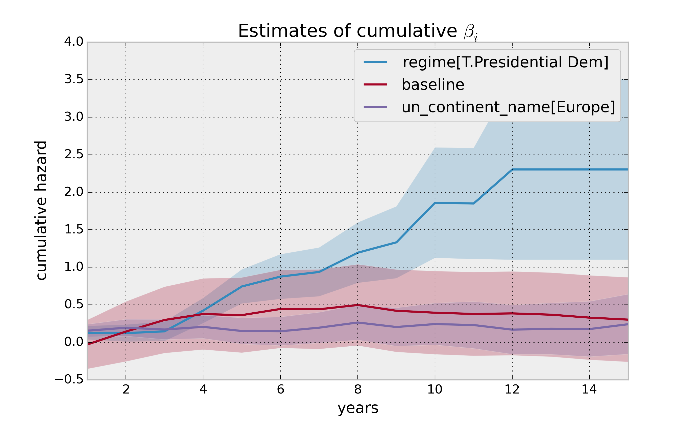

Survival regression
=====================================

Often we have additional data aside from the durations, and if
applicable any censorships that occured. In the regime dataset, we have
the type of government the political leader was part of, the country
they were head of, and the year they were elected. Can we use this data
in survival analysis?

Yes, the technique is called *survival regression* -- the name implies
we regress covariates (eg: year elected, country, etc.) against a
another variable -- in this case durations and lifetimes. Similar to the
logic in the first part of this tutorial, we cannot use traditional
methods like linear regression.

There are two popular competing techniques in survival regression: Cox's
model and Aalen's additive model. Both models attemps to model the
hazard rate :math:`\lambda(t)`. In Cox's model, the relationship is
defined:

.. math:: \lambda(t) = b_0(t)\exp\left( b_1x_1 + ... + b_Nx_n\right)

On the other hand, Aalen's additive model assumes the following form:

.. math:: \lambda(t) = b_0(t) + b_1(t)x_1 + ... + b_N(t)x_T

Currently, *lifelines* implements Aalen's additive model (mostly because
the original authors only were interested in this model). In both
models, we attempt to fit the :math:`b` coefficients best to the data --
notice that in Aalen's additive model has time varying coefficients.

Aalen's Additive model
~~~~~~~~~~~~~~~~~~~~~~~~~~~~~~~~~~~~~~

.. warning:: This is still experimental.

The estimator to fit unknown coefficients in Aalen's additive model is
located in ``estimators`` under ``AalenAdditiveFitter``. For this
exercise, we will use the regime dataset and include the catagorical
variables ``un_continent_name`` (eg: Asia, North America,...), the
``regime`` type (eg: monarchy, civilan,...) and the year the regime
started in, ``start_year``.

Aalens additive model typically does not estimate the individual
:math:`b_i(t)` but instead estimates :math:`\int_0^t b_i(s) \; ds`
(similar to estimate of the hazard rate using ``NelsonAalenFitter``
above). This is important to keep in mind when analzying the output.

.. code:: python

    from lifelines import AalenAdditiveFitter
    data.head()

.. raw:: html

    

    <table border="1" class="dataframe">
      <thead>
        <tr style="text-align: right;">
          <th></th>
          <th>ctryname</th>
          <th>cowcode2</th>
          <th>politycode</th>
          <th>un_region_name</th>
          <th>un_continent_name</th>
          <th>ehead</th>
          <th>leaderspellreg</th>
          <th>democracy</th>
          <th>regime</th>
          <th>start_year</th>
          <th>duration</th>
          <th>observed</th>
        </tr>
      </thead>
      <tbody>
        <tr>
          <th>1</th>
          <td> Afghanistan</td>
          <td> 700</td>
          <td> 700</td>
          <td> Southern Asia</td>
          <td> Asia</td>
          <td>   Mohammad Zahir Shah</td>
          <td> Mohammad Zahir Shah.Afghanistan.1946.1952.Mona...</td>
          <td> Non-democracy</td>
          <td>      Monarchy</td>
          <td> 1946</td>
          <td>  7</td>
          <td> 1</td>
        </tr>
        <tr>
          <th>2</th>
          <td> Afghanistan</td>
          <td> 700</td>
          <td> 700</td>
          <td> Southern Asia</td>
          <td> Asia</td>
          <td> Sardar Mohammad Daoud</td>
          <td> Sardar Mohammad Daoud.Afghanistan.1953.1962.Ci...</td>
          <td> Non-democracy</td>
          <td> Civilian Dict</td>
          <td> 1953</td>
          <td> 10</td>
          <td> 1</td>
        </tr>
        <tr>
          <th>3</th>
          <td> Afghanistan</td>
          <td> 700</td>
          <td> 700</td>
          <td> Southern Asia</td>
          <td> Asia</td>
          <td>   Mohammad Zahir Shah</td>
          <td> Mohammad Zahir Shah.Afghanistan.1963.1972.Mona...</td>
          <td> Non-democracy</td>
          <td>      Monarchy</td>
          <td> 1963</td>
          <td> 10</td>
          <td> 1</td>
        </tr>
        <tr>
          <th>4</th>
          <td> Afghanistan</td>
          <td> 700</td>
          <td> 700</td>
          <td> Southern Asia</td>
          <td> Asia</td>
          <td> Sardar Mohammad Daoud</td>
          <td> Sardar Mohammad Daoud.Afghanistan.1973.1977.Ci...</td>
          <td> Non-democracy</td>
          <td> Civilian Dict</td>
          <td> 1973</td>
          <td>  5</td>
          <td> 0</td>
        </tr>
        <tr>
          <th>5</th>
          <td> Afghanistan</td>
          <td> 700</td>
          <td> 700</td>
          <td> Southern Asia</td>
          <td> Asia</td>
          <td>   Nur Mohammad Taraki</td>
          <td> Nur Mohammad Taraki.Afghanistan.1978.1978.Civi...</td>
          <td> Non-democracy</td>
          <td> Civilian Dict</td>
          <td> 1978</td>
          <td>  1</td>
          <td> 0</td>
        </tr>
      </tbody>
    </table>
    
5 rows × 12 columns

    

I'm using the lovely library ``patsy`` <https://github.com/pydata/patsy>`__ here to create a
covaritate matrix from my original dataframe.

.. code:: python

    import patsy
    # the '-1' term 
    # refers to not adding an intercept column (a column of all 1s).
    # It can be added to the Fitter class.
    X = patsy.dmatrix('un_continent_name + regime + start_year -1', data, return_type='dataframe') 

.. code:: python

    X.columns

.. parsed-literal::

    ['un_continent_name[Africa]',
     'un_continent_name[Americas]',
     'un_continent_name[Asia]',
     'un_continent_name[Europe]',
     'un_continent_name[Oceania]',
     'regime[T.Military Dict]',
     'regime[T.Mixed Dem]',
     'regime[T.Monarchy]',
     'regime[T.Parliamentary Dem]',
     'regime[T.Presidential Dem]',
     'start_year']

Below we create our Fitter class. Since we did not supply an intercept
column in our patsy we have included the keyword ``fit_intercept=True``
(``True`` by default) which will append the column of ones to our
matrix. (Sidenote: the intercept term, :math:`b_0(t)` in survival
regression is often referred to as the *baseline* hazard.)

We have also included the ``penalizer`` option. During the estimation, a
linear regression is computed at each step. Often the regression can be
unstable (due to high
`co-linearity <http://camdp.com/blogs/machine-learning-counter-examples-pt1>`__
or small sample sizes) -- adding a penalizer term controls the stability. I recommend alway starting with a small penalizer term -- if
the estimates still appear to be too unstable, try increasing it.

.. code:: python

    aaf = AalenAdditiveFitter(penalizer=1.0, fit_intercept=True)

Like the API syntax above, an instance of ``AalenAdditiveFitter``
includes a ``fit`` method that performs the inference on the coefficients. This method accepts a pandas DataFrame: each row is an individual and columns are the covarites and 
two special columns: a *duration* column and a boolean *event occured* column (where event occured refers to the event of interest - expulsion from government in this case)

.. code:: python

    X['T'] = data['duration']
    X['E'] = data['observed'] 

**The api for .fit was different prior to lifelines 0.3, below refers to the 0.3+ versions**

.. code:: python

    aaf.fit(X, duration_col='T', event_col='E')

After fitting, the instance exposes a ``cumulative_hazards_`` DataFrame
containing the estimates of :math:`\int_0^t b_i(s) \; ds`:

.. code:: python

    figsize(12.5,8)
    aaf.cumulative_hazards_.head()

.. raw:: html

    

    <table border="1" class="dataframe">
      <thead>
        <tr style="text-align: right;">
          <th></th>
          <th>un_continent_name[Africa]</th>
          <th>un_continent_name[Americas]</th>
          <th>un_continent_name[Asia]</th>
          <th>un_continent_name[Europe]</th>
          <th>un_continent_name[Oceania]</th>
          <th>regime[T.Military Dict]</th>
          <th>regime[T.Mixed Dem]</th>
          <th>regime[T.Monarchy]</th>
          <th>regime[T.Parliamentary Dem]</th>
          <th>regime[T.Presidential Dem]</th>
          <th>start_year</th>
          <th>baseline</th>
        </tr>
      </thead>
      <tbody>
        <tr>
          <th>1</th>
          <td>-0.051595</td>
          <td>-0.082406</td>
          <td> 0.010666</td>
          <td> 0.154493</td>
          <td>-0.060438</td>
          <td> 0.075333</td>
          <td> 0.086274</td>
          <td>-0.133938</td>
          <td> 0.048077</td>
          <td> 0.127171</td>
          <td> 0.000116</td>
          <td>-0.029280</td>
        </tr>
        <tr>
          <th>2</th>
          <td>-0.014713</td>
          <td>-0.039471</td>
          <td> 0.095668</td>
          <td> 0.194251</td>
          <td>-0.092696</td>
          <td> 0.115033</td>
          <td> 0.358702</td>
          <td>-0.226233</td>
          <td> 0.168783</td>
          <td> 0.121862</td>
          <td> 0.000053</td>
          <td> 0.143039</td>
        </tr>
        <tr>
          <th>3</th>
          <td> 0.007389</td>
          <td>-0.064758</td>
          <td> 0.115121</td>
          <td> 0.170549</td>
          <td> 0.069371</td>
          <td> 0.161490</td>
          <td> 0.677347</td>
          <td>-0.271183</td>
          <td> 0.328483</td>
          <td> 0.146234</td>
          <td> 0.000004</td>
          <td> 0.297672</td>
        </tr>
        <tr>
          <th>4</th>
          <td>-0.058418</td>
          <td> 0.011399</td>
          <td> 0.091784</td>
          <td> 0.205824</td>
          <td> 0.125722</td>
          <td> 0.220028</td>
          <td> 0.932674</td>
          <td>-0.294900</td>
          <td> 0.365604</td>
          <td> 0.422617</td>
          <td> 0.000002</td>
          <td> 0.376311</td>
        </tr>
        <tr>
          <th>5</th>
          <td>-0.099282</td>
          <td> 0.106641</td>
          <td> 0.112083</td>
          <td> 0.150708</td>
          <td> 0.091900</td>
          <td> 0.241575</td>
          <td> 1.123860</td>
          <td>-0.391103</td>
          <td> 0.536185</td>
          <td> 0.743913</td>
          <td> 0.000057</td>
          <td> 0.362049</td>
        </tr>
      </tbody>
    </table>
    

``AalenAdditiveFitter`` also has built in plotting:

.. code:: python

  aaf.plot( columns=[ 'regime[T.Presidential Dem]', 'baseline', 'un_continent_name[Europe]' ], ix=slice(1,15) )

Regression is most interesting if we use it on data we have not yet
seen, i.e. prediction! We can use what we have learned to predict
individual hazard rates, survival functions, and median survival time.
The dataset we are using is limited to 2008, so let's use this data to
predict the (though already partly seen) possible duration of Canadian
Prime Minister Stephen Harper.

.. code:: python

    ix = (data['ctryname'] == 'Canada')
    harper = X[ix,:][-1,:][None,:]
    harper[0,-1] = 2003
    print "Harper's unique data point"

.. parsed-literal::

    Harper's unique data point

.. parsed-literal::

    array([[    0.,     0.,     1.,     0.,     0.,     0.,     0.,     1.,
                0.,     0.,  2003.]])

.. code:: python

    ax = plt.subplot(2,1,1)

    aaf.predict_cumulative_hazard(harper, columns=["Harper's hazard rate"]).plot(ax=ax)
    ax = plt.subplot(2,1,2)

    aaf.predict_survival_function(harper, columns=["Harper's survival function"]).plot(ax=ax);

.. image:: Introtolifelines_files/Introtolifelines_57_2.png
